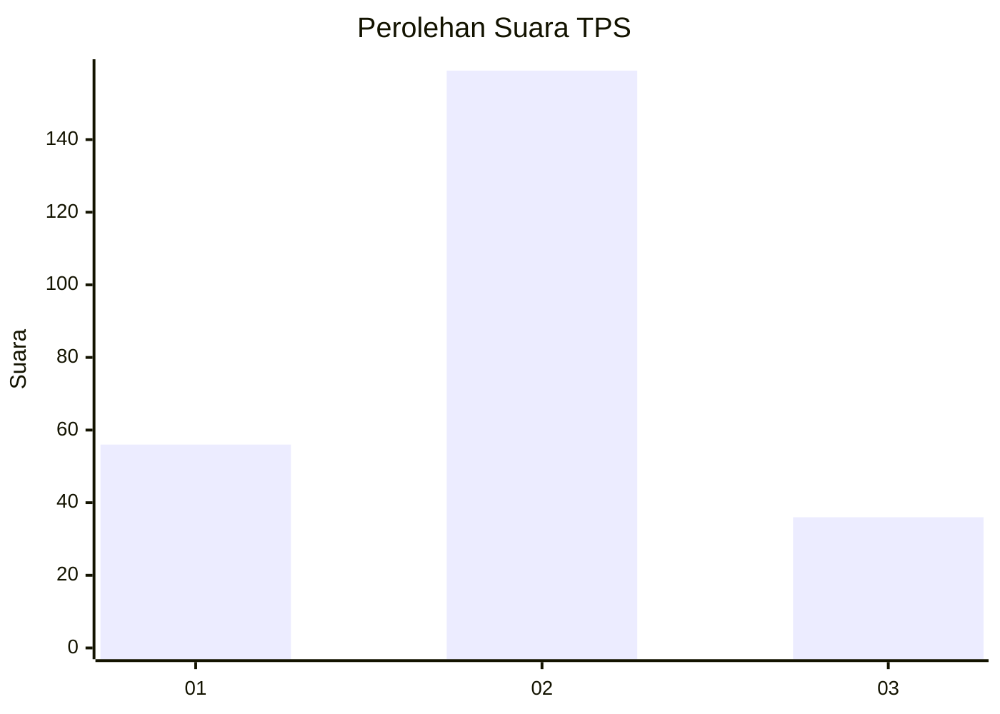
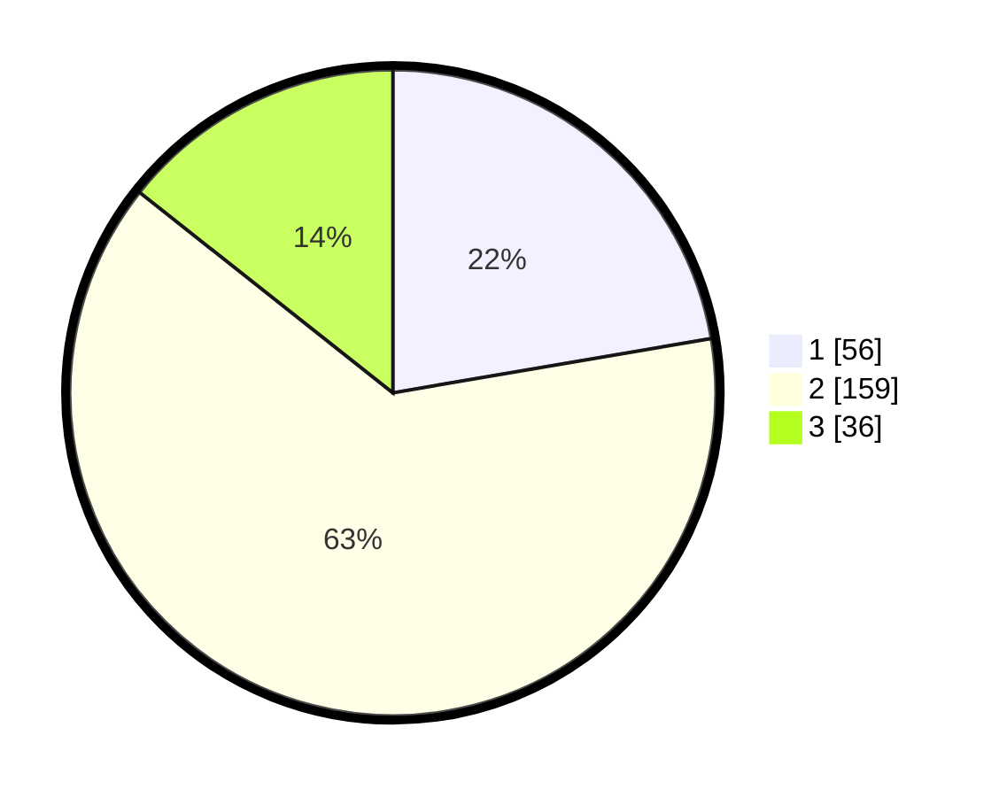

# Hasil

## Grafik

## Tabel

| No. | Nama Paslon    | Suara | Suara (raw) | Persentase |
|:--- |:-------------- | -----:| -----------:| ----------:|
| 1   | ANIES MUHAIMIN | 56    | [56][p-1]   | 22,31      |
| 2   | PRABOWO GIBRAN | 159   | [159][p-2]  | 63,35      |
| 3   | GANJAR MAHFUD  | 36    | [36][p-3]   | 14,34      |

[p-1]: https://github.com/gigit-pemilu/pemilu-2024-35-jawa-timur/blob/main/pilpres/hitung-suara/sub/35-jawa-timur/sub/02-ponorogo/sub/08-mlarak/sub/2005-siwalan/sub/003-tps/sub/paslon-1.txt
[p-2]: https://github.com/gigit-pemilu/pemilu-2024-35-jawa-timur/blob/main/pilpres/hitung-suara/sub/35-jawa-timur/sub/02-ponorogo/sub/08-mlarak/sub/2005-siwalan/sub/003-tps/sub/paslon-2.txt
[p-3]: https://github.com/gigit-pemilu/pemilu-2024-35-jawa-timur/blob/main/pilpres/hitung-suara/sub/35-jawa-timur/sub/02-ponorogo/sub/08-mlarak/sub/2005-siwalan/sub/003-tps/sub/paslon-3.txt

## Foto C Plano

https://sirekap-obj-formc.kpu.go.id/c2df/pemilu/ppwp/35/02/08/20/05/3502082005003-20240215-001814--c9274feb-b324-4a89-9353-458f83853187.jpg

https://sirekap-obj-formc.kpu.go.id/c2df/pemilu/ppwp/35/02/08/20/05/3502082005003-20240215-001910--512f877e-1107-4deb-a45b-ec0fbd0e867b.jpg

https://sirekap-obj-formc.kpu.go.id/c2df/pemilu/ppwp/35/02/08/20/05/3502082005003-20240215-001959--d9e51795-ca6e-46a5-a68c-6068b47b0ee7.jpg

## Metadata

| Key        | Value               |
| ---------- | ------------------- |
| Time Stamp | 2024-02-15 15:00:29 |

