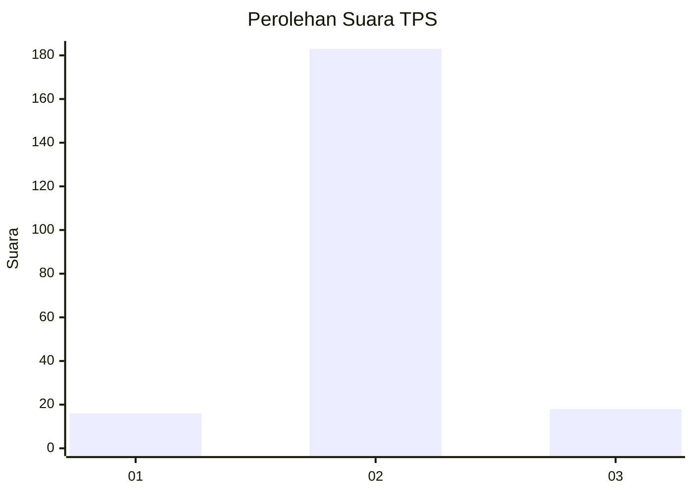
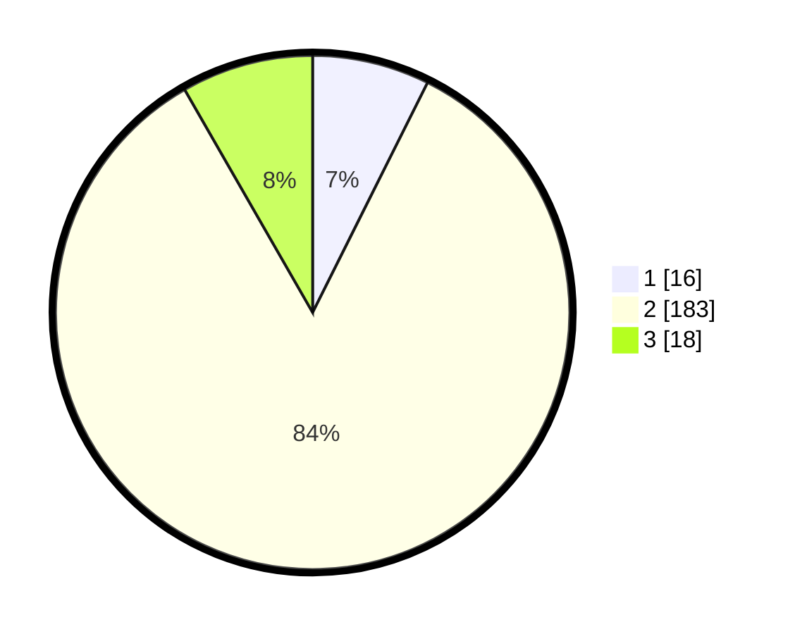

# Hasil

## Grafik

## Tabel

| No. | Nama Paslon    | Suara | Suara (raw) | Persentase |
|:--- |:-------------- | -----:| -----------:| ----------:|
| 1   | ANIES MUHAIMIN | 16    | [16][p-1]   | 7,37       |
| 2   | PRABOWO GIBRAN | 183   | [183][p-2]  | 84,33      |
| 3   | GANJAR MAHFUD  | 18    | [18][p-3]   | 8,29       |

[p-1]: https://github.com/gigit-pemilu/pemilu-2024/blob/main/pilpres/hitung-suara/sub/35-jawa-timur/sub/02-ponorogo/sub/08-mlarak/sub/2005-siwalan/sub/007-tps/sub/paslon-1.txt
[p-2]: https://github.com/gigit-pemilu/pemilu-2024/blob/main/pilpres/hitung-suara/sub/35-jawa-timur/sub/02-ponorogo/sub/08-mlarak/sub/2005-siwalan/sub/007-tps/sub/paslon-2.txt
[p-3]: https://github.com/gigit-pemilu/pemilu-2024/blob/main/pilpres/hitung-suara/sub/35-jawa-timur/sub/02-ponorogo/sub/08-mlarak/sub/2005-siwalan/sub/007-tps/sub/paslon-3.txt

## Foto C Plano

https://sirekap-obj-formc.kpu.go.id/bc04/pemilu/ppwp/35/02/08/20/05/3502082005007-20240215-063456--67e62f4a-c568-4cde-b0da-1c26a177f91f.jpg

https://sirekap-obj-formc.kpu.go.id/bc04/pemilu/ppwp/35/02/08/20/05/3502082005007-20240215-063540--c252a0d9-af20-430e-a8c9-28e1a97388b3.jpg

https://sirekap-obj-formc.kpu.go.id/bc04/pemilu/ppwp/35/02/08/20/05/3502082005007-20240215-063630--82a51f79-9f3d-4eb7-94b6-0cb7a8d2974a.jpg

## Metadata

| Key        | Value               |
| ---------- | ------------------- |
| Time Stamp | 2024-02-16 12:51:22 |

