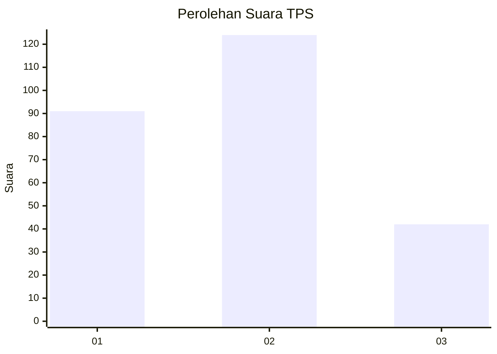
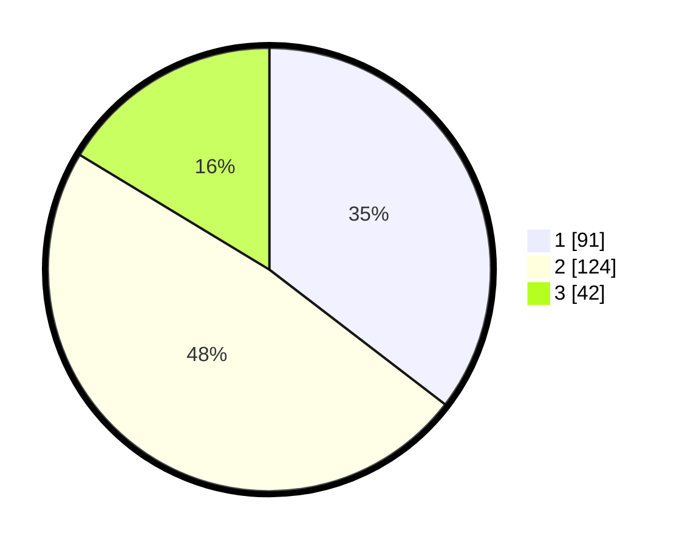

# Hasil

## Grafik

## Tabel

| No. | Nama Paslon    | Suara | Suara (raw) | Persentase |
|:--- |:-------------- | -----:| -----------:| ----------:|
| 1   | ANIES MUHAIMIN | 91    | [91][p-1]   | 35,41      |
| 2   | PRABOWO GIBRAN | 124   | [124][p-2]  | 48,25      |
| 3   | GANJAR MAHFUD  | 42    | [42][p-3]   | 16,34      |

[p-1]: https://github.com/gigit-pemilu/pemilu-2024-35-jawa-timur/blob/main/pilpres/hitung-suara/sub/35-jawa-timur/sub/02-ponorogo/sub/08-mlarak/sub/2007-nglumpang/sub/004-tps/sub/paslon-1.txt
[p-2]: https://github.com/gigit-pemilu/pemilu-2024-35-jawa-timur/blob/main/pilpres/hitung-suara/sub/35-jawa-timur/sub/02-ponorogo/sub/08-mlarak/sub/2007-nglumpang/sub/004-tps/sub/paslon-2.txt
[p-3]: https://github.com/gigit-pemilu/pemilu-2024-35-jawa-timur/blob/main/pilpres/hitung-suara/sub/35-jawa-timur/sub/02-ponorogo/sub/08-mlarak/sub/2007-nglumpang/sub/004-tps/sub/paslon-3.txt

## Foto C Plano

https://sirekap-obj-formc.kpu.go.id/f569/pemilu/ppwp/35/02/08/20/07/3502082007004-20240217-100409--c97b8188-b80d-439f-910d-ecffcb473aea.jpg

https://sirekap-obj-formc.kpu.go.id/f569/pemilu/ppwp/35/02/08/20/07/3502082007004-20240217-100506--284c3f01-9f4d-480b-832d-fa542dd79f52.jpg

https://sirekap-obj-formc.kpu.go.id/f569/pemilu/ppwp/35/02/08/20/07/3502082007004-20240217-100557--e4a274b2-a6e5-4f4d-8559-bba5357a5800.jpg

## Metadata

| Key        | Value               |
| ---------- | ------------------- |
| Time Stamp | 2024-02-17 10:30:03 |

## DATA PEMILIH TETAP

Jumlah pemilih dalam DPT: **268**.
 * L: **117**.
 * P: **151**.

## DATA PENGGUNA HAK PILIH

Jumlah pengguna hak pilih dalam DPT: **242**.
 * L: **103**.
 * P: **139**.

Jumlah pengguna hak pilih dalam DPTb: **19**.
 * L: **7**.
 * P: **12**.

Jumlah pengguna hak pilih dalam DPK: **0**.
 * L: **0**.
 * P: **0**.

Jumlah pengguna hak pilih: **261**.
 * L: **110**.
 * P: **151**.

## JUMLAH SUARA SAH DAN TIDAK SAH

JUMLAH SELURUH SUARA SAH: **257**.

JUMLAH SUARA TIDAK SAH: **4**.

JUMLAH SELURUH SUARA SAH DAN SUARA TIDAK SAH: **261**.

