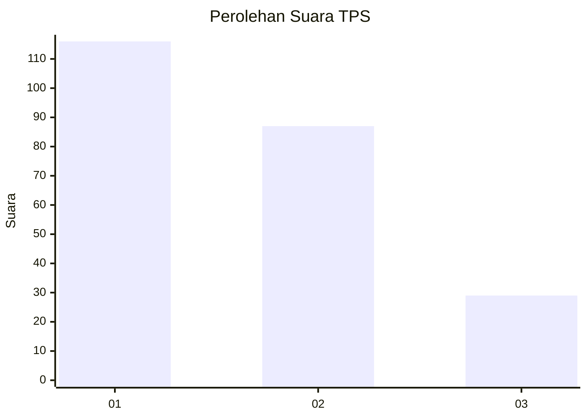
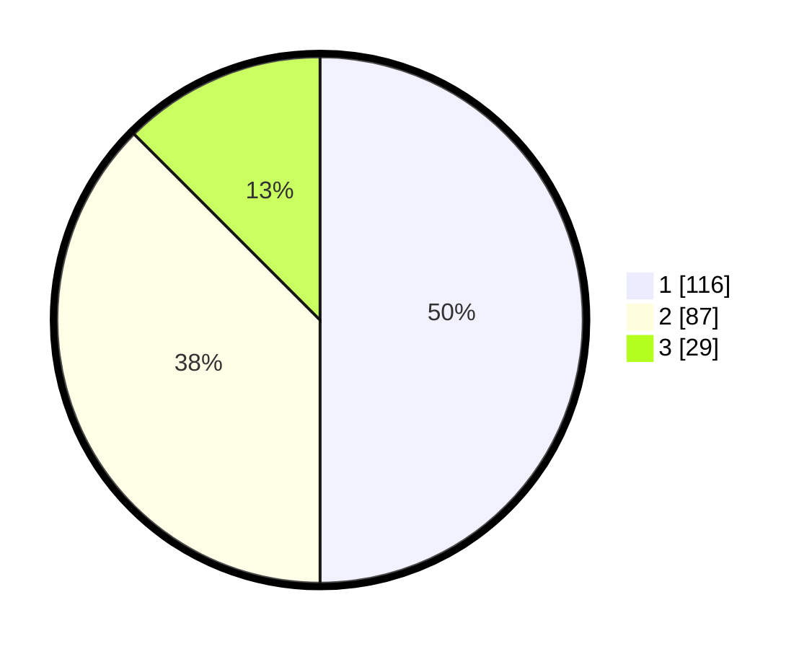

# Hasil

## Grafik

## Tabel

| No. | Nama Paslon    | Suara | Suara (raw) | Persentase |
|:--- |:-------------- | -----:| -----------:| ----------:|
| 1   | ANIES MUHAIMIN | 116   | [116][p-1]  | 50,00      |
| 2   | PRABOWO GIBRAN | 87    | [87][p-2]   | 37,50      |
| 3   | GANJAR MAHFUD  | 29    | [29][p-3]   | 12,50      |

[p-1]: https://github.com/gigit-pemilu/pemilu-2024/blob/main/pilpres/hitung-suara/sub/35-jawa-timur/sub/02-ponorogo/sub/08-mlarak/sub/2008-gontor/sub/004-tps/sub/paslon-1.txt
[p-2]: https://github.com/gigit-pemilu/pemilu-2024/blob/main/pilpres/hitung-suara/sub/35-jawa-timur/sub/02-ponorogo/sub/08-mlarak/sub/2008-gontor/sub/004-tps/sub/paslon-2.txt
[p-3]: https://github.com/gigit-pemilu/pemilu-2024/blob/main/pilpres/hitung-suara/sub/35-jawa-timur/sub/02-ponorogo/sub/08-mlarak/sub/2008-gontor/sub/004-tps/sub/paslon-3.txt

## Foto C Plano

https://sirekap-obj-formc.kpu.go.id/3624/pemilu/ppwp/35/02/08/20/08/3502082008004-20240217-154300--a05c4fa9-55e9-43f4-9b91-8ddb4de88b3a.jpg

https://sirekap-obj-formc.kpu.go.id/3624/pemilu/ppwp/35/02/08/20/08/3502082008004-20240217-155142--d1110b35-a90a-4efc-87fa-27048dd59101.jpg

https://sirekap-obj-formc.kpu.go.id/3624/pemilu/ppwp/35/02/08/20/08/3502082008004-20240217-155225--873b5626-9028-4016-b3ec-0017ce24f20d.jpg

## Metadata

| Key        | Value               |
| ---------- | ------------------- |
| Time Stamp | 2024-02-17 16:52:47 |

## DATA PEMILIH TETAP

Jumlah pemilih dalam DPT: **275**.
 * L: **147**.
 * P: **128**.

## DATA PENGGUNA HAK PILIH

Jumlah pengguna hak pilih dalam DPT: **217**.
 * L: **118**.
 * P: **99**.

Jumlah pengguna hak pilih dalam DPTb: **19**.
 * L: **19**.
 * P: **0**.

Jumlah pengguna hak pilih dalam DPK: **1**.
 * L: **0**.
 * P: **1**.

Jumlah pengguna hak pilih: **237**.
 * L: **137**.
 * P: **100**.

## JUMLAH SUARA SAH DAN TIDAK SAH

JUMLAH SELURUH SUARA SAH: **232**.

JUMLAH SUARA TIDAK SAH: **5**.

JUMLAH SELURUH SUARA SAH DAN SUARA TIDAK SAH: **237**.

