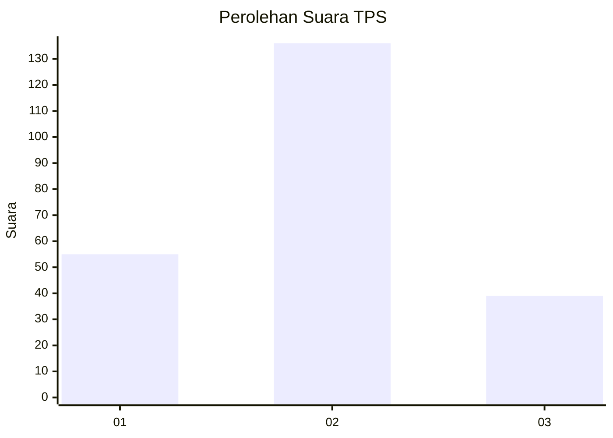

# Hasil

## Grafik

## Tabel

| No. | Nama Paslon    | Suara | Suara (raw) | Persentase |
|:--- |:-------------- | -----:| -----------:| ----------:|
| 1   | ANIES MUHAIMIN | 55    | [55][p-1]   | 23,91      |
| 2   | PRABOWO GIBRAN | 136   | [136][p-2]  | 59,13      |
| 3   | GANJAR MAHFUD  | 39    | [39][p-3]   | 16,96      |

[p-1]: https://github.com/gigit-pemilu/pemilu-2024/blob/main/pilpres/hitung-suara/sub/35-jawa-timur/sub/02-ponorogo/sub/08-mlarak/sub/2011-bajang/sub/004-tps/sub/paslon-1.txt
[p-2]: https://github.com/gigit-pemilu/pemilu-2024/blob/main/pilpres/hitung-suara/sub/35-jawa-timur/sub/02-ponorogo/sub/08-mlarak/sub/2011-bajang/sub/004-tps/sub/paslon-2.txt
[p-3]: https://github.com/gigit-pemilu/pemilu-2024/blob/main/pilpres/hitung-suara/sub/35-jawa-timur/sub/02-ponorogo/sub/08-mlarak/sub/2011-bajang/sub/004-tps/sub/paslon-3.txt

## Foto C Plano

https://sirekap-obj-formc.kpu.go.id/7b90/pemilu/ppwp/35/02/08/20/11/3502082011004-20240216-052333--0b108da4-dd76-4fe5-899d-d0f0c73980c3.jpg

https://sirekap-obj-formc.kpu.go.id/7b90/pemilu/ppwp/35/02/08/20/11/3502082011004-20240216-052337--cf752127-5b20-4392-af16-0040e5e9bb1a.jpg

https://sirekap-obj-formc.kpu.go.id/7b90/pemilu/ppwp/35/02/08/20/11/3502082011004-20240216-052335--6c8c6d3e-5641-4f0c-98fe-63e96cd4b1c0.jpg

## Metadata

| Key        | Value               |
| ---------- | ------------------- |
| Time Stamp | 2024-02-16 11:00:29 |

## DATA PEMILIH TETAP

Jumlah pemilih dalam DPT: **262**.
 * L: **123**.
 * P: **139**.

## DATA PENGGUNA HAK PILIH

Jumlah pengguna hak pilih dalam DPT: **215**.
 * L: **97**.
 * P: **118**.

Jumlah pengguna hak pilih dalam DPTb: **24**.
 * L: **7**.
 * P: **17**.

Jumlah pengguna hak pilih dalam DPK: **0**.
 * L: **0**.
 * P: **0**.

Jumlah pengguna hak pilih: **239**.
 * L: **104**.
 * P: **135**.

## JUMLAH SUARA SAH DAN TIDAK SAH

JUMLAH SELURUH SUARA SAH: **230**.

JUMLAH SUARA TIDAK SAH: **9**.

JUMLAH SELURUH SUARA SAH DAN SUARA TIDAK SAH: **239**.

