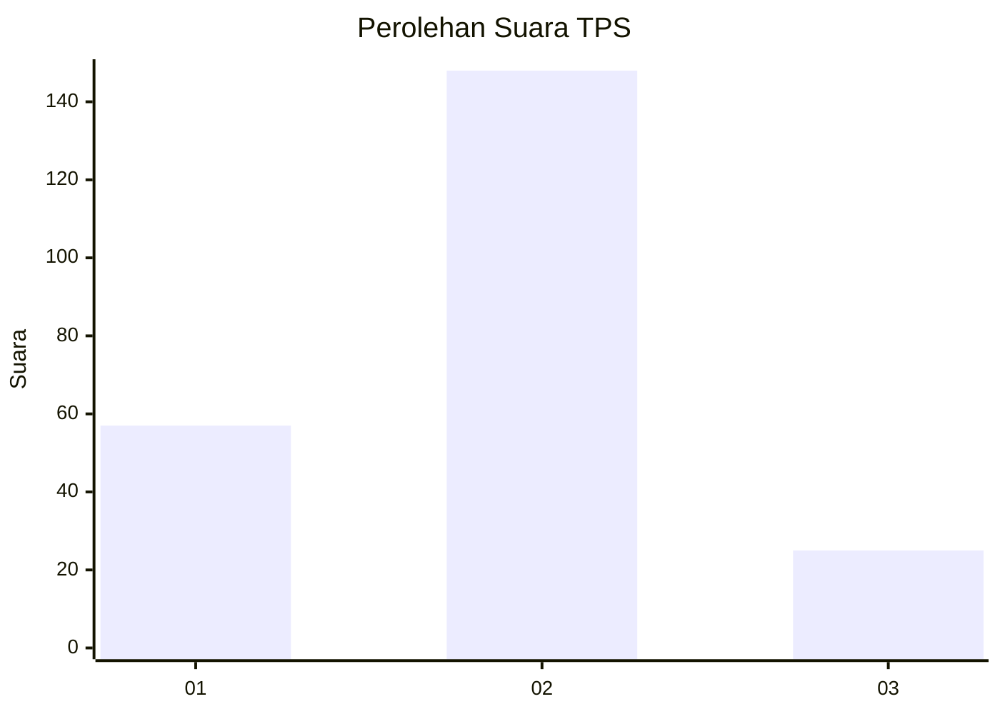
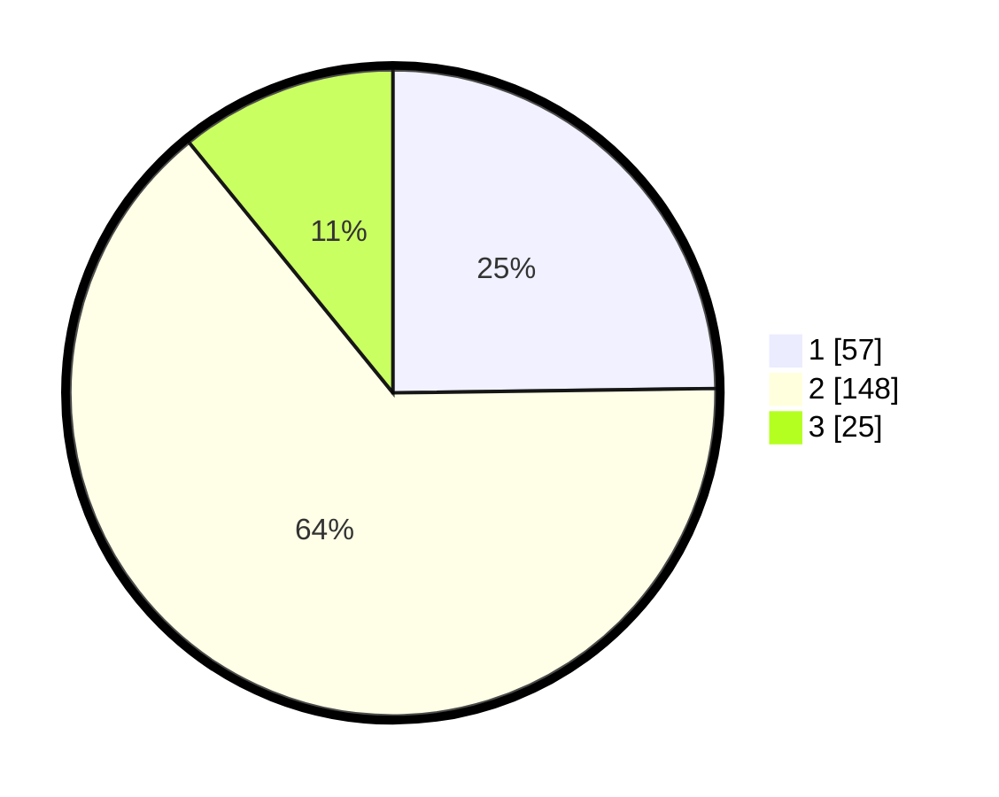

# Hasil

## Grafik

## Tabel

| No. | Nama Paslon    | Suara | Suara (raw) | Persentase |
|:--- |:-------------- | -----:| -----------:| ----------:|
| 1   | ANIES MUHAIMIN | 57    | [57][p-1]   | 24,78      |
| 2   | PRABOWO GIBRAN | 148   | [148][p-2]  | 64,35      |
| 3   | GANJAR MAHFUD  | 25    | [25][p-3]   | 10,87      |

[p-1]: https://github.com/gigit-pemilu/pemilu-2024/blob/main/pilpres/hitung-suara/sub/35-jawa-timur/sub/02-ponorogo/sub/08-mlarak/sub/2011-bajang/sub/005-tps/sub/paslon-1.txt
[p-2]: https://github.com/gigit-pemilu/pemilu-2024/blob/main/pilpres/hitung-suara/sub/35-jawa-timur/sub/02-ponorogo/sub/08-mlarak/sub/2011-bajang/sub/005-tps/sub/paslon-2.txt
[p-3]: https://github.com/gigit-pemilu/pemilu-2024/blob/main/pilpres/hitung-suara/sub/35-jawa-timur/sub/02-ponorogo/sub/08-mlarak/sub/2011-bajang/sub/005-tps/sub/paslon-3.txt

## Foto C Plano

https://sirekap-obj-formc.kpu.go.id/c455/pemilu/ppwp/35/02/08/20/11/3502082011005-20240215-021654--c381c701-4890-44c7-ac4c-e3240321e09d.jpg

https://sirekap-obj-formc.kpu.go.id/c455/pemilu/ppwp/35/02/08/20/11/3502082011005-20240215-021741--0097082b-da38-4bab-bab2-8a5e20808495.jpg

https://sirekap-obj-formc.kpu.go.id/c455/pemilu/ppwp/35/02/08/20/11/3502082011005-20240215-021852--008984be-acd6-4eca-a797-89cd5efcead7.jpg

## Metadata

| Key        | Value               |
| ---------- | ------------------- |
| Time Stamp | 2024-02-16 11:00:29 |

