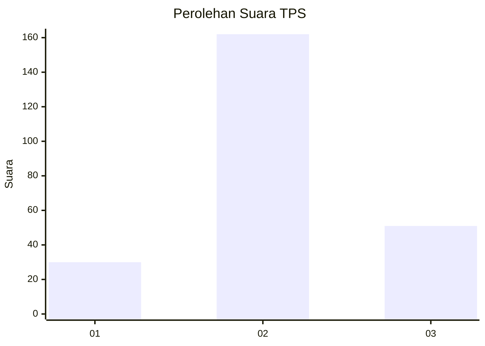
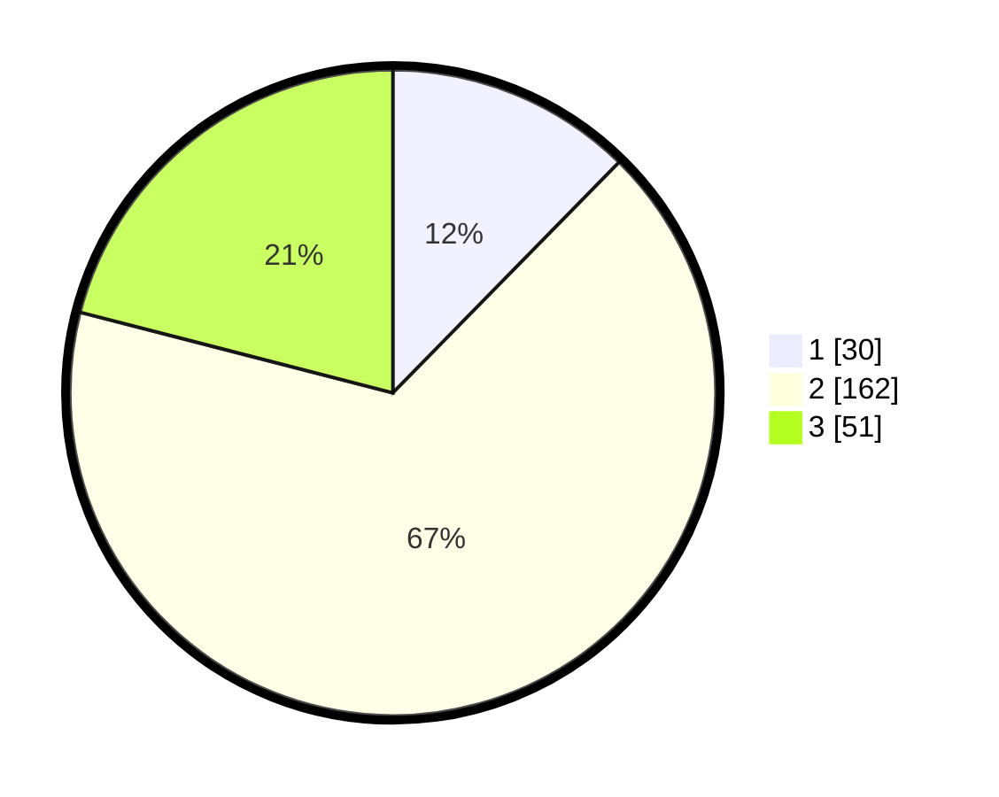

# Hasil

## Grafik

## Tabel

| No. | Nama Paslon    | Suara | Suara (raw) | Persentase |
|:--- |:-------------- | -----:| -----------:| ----------:|
| 1   | ANIES MUHAIMIN | 30    | [30][p-1]   | 12,35      |
| 2   | PRABOWO GIBRAN | 162   | [162][p-2]  | 66,67      |
| 3   | GANJAR MAHFUD  | 51    | [51][p-3]   | 20,99      |

[p-1]: https://github.com/gigit-pemilu/pemilu-2024-35-jawa-timur/blob/main/pilpres/hitung-suara/sub/35-jawa-timur/sub/02-ponorogo/sub/08-mlarak/sub/2013-serangan/sub/001-tps/sub/paslon-1.txt
[p-2]: https://github.com/gigit-pemilu/pemilu-2024-35-jawa-timur/blob/main/pilpres/hitung-suara/sub/35-jawa-timur/sub/02-ponorogo/sub/08-mlarak/sub/2013-serangan/sub/001-tps/sub/paslon-2.txt
[p-3]: https://github.com/gigit-pemilu/pemilu-2024-35-jawa-timur/blob/main/pilpres/hitung-suara/sub/35-jawa-timur/sub/02-ponorogo/sub/08-mlarak/sub/2013-serangan/sub/001-tps/sub/paslon-3.txt

## Foto C Plano

https://sirekap-obj-formc.kpu.go.id/fa17/pemilu/ppwp/35/02/08/20/13/3502082013001-20240215-080347--b025b85e-bd3b-4490-b947-7cfb6390626c.jpg

https://sirekap-obj-formc.kpu.go.id/fa17/pemilu/ppwp/35/02/08/20/13/3502082013001-20240215-080436--3decbb45-d137-4339-b68c-df10d8034e3c.jpg

https://sirekap-obj-formc.kpu.go.id/fa17/pemilu/ppwp/35/02/08/20/13/3502082013001-20240215-080522--a24857dc-4097-4c0f-a268-bdfb1c0e5204.jpg

## Metadata

| Key        | Value               |
| ---------- | ------------------- |
| Time Stamp | 2024-02-16 21:01:00 |

