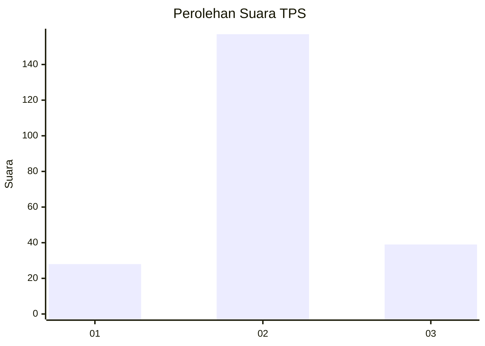
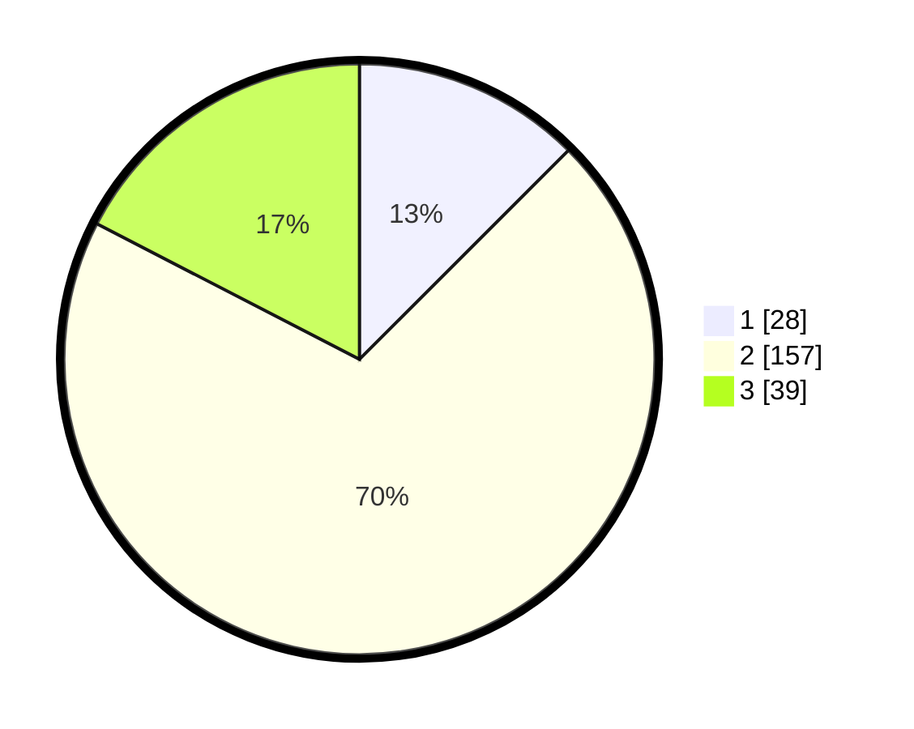

# Hasil

## Grafik

## Tabel

| No. | Nama Paslon    | Suara | Suara (raw) | Persentase |
|:--- |:-------------- | -----:| -----------:| ----------:|
| 1   | ANIES MUHAIMIN | 28    | [28][p-1]   | 12,50      |
| 2   | PRABOWO GIBRAN | 157   | [157][p-2]  | 70,09      |
| 3   | GANJAR MAHFUD  | 39    | [39][p-3]   | 17,41      |

[p-1]: https://github.com/gigit-pemilu/pemilu-2024-35-jawa-timur/blob/main/pilpres/hitung-suara/sub/35-jawa-timur/sub/02-ponorogo/sub/08-mlarak/sub/2013-serangan/sub/002-tps/sub/paslon-1.txt
[p-2]: https://github.com/gigit-pemilu/pemilu-2024-35-jawa-timur/blob/main/pilpres/hitung-suara/sub/35-jawa-timur/sub/02-ponorogo/sub/08-mlarak/sub/2013-serangan/sub/002-tps/sub/paslon-2.txt
[p-3]: https://github.com/gigit-pemilu/pemilu-2024-35-jawa-timur/blob/main/pilpres/hitung-suara/sub/35-jawa-timur/sub/02-ponorogo/sub/08-mlarak/sub/2013-serangan/sub/002-tps/sub/paslon-3.txt

## Foto C Plano

https://sirekap-obj-formc.kpu.go.id/0181/pemilu/ppwp/35/02/08/20/13/3502082013002-20240217-143216--b6eff12e-4168-4cec-825e-486d16c98221.jpg

https://sirekap-obj-formc.kpu.go.id/0181/pemilu/ppwp/35/02/08/20/13/3502082013002-20240217-143418--db677f7b-f66e-4321-84bc-2a2602da613b.jpg

https://sirekap-obj-formc.kpu.go.id/0181/pemilu/ppwp/35/02/08/20/13/3502082013002-20240217-160214--6841b2a2-9784-4430-a09b-ebd5d49692fd.jpg

## Metadata

| Key        | Value               |
| ---------- | ------------------- |
| Time Stamp | 2024-02-17 16:36:25 |

