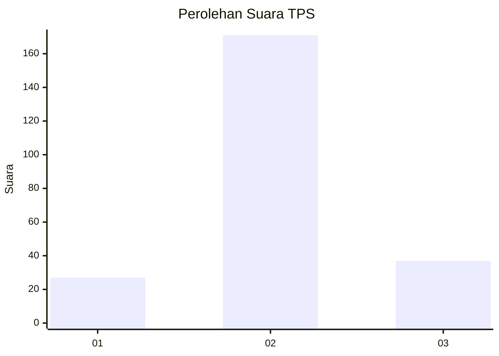
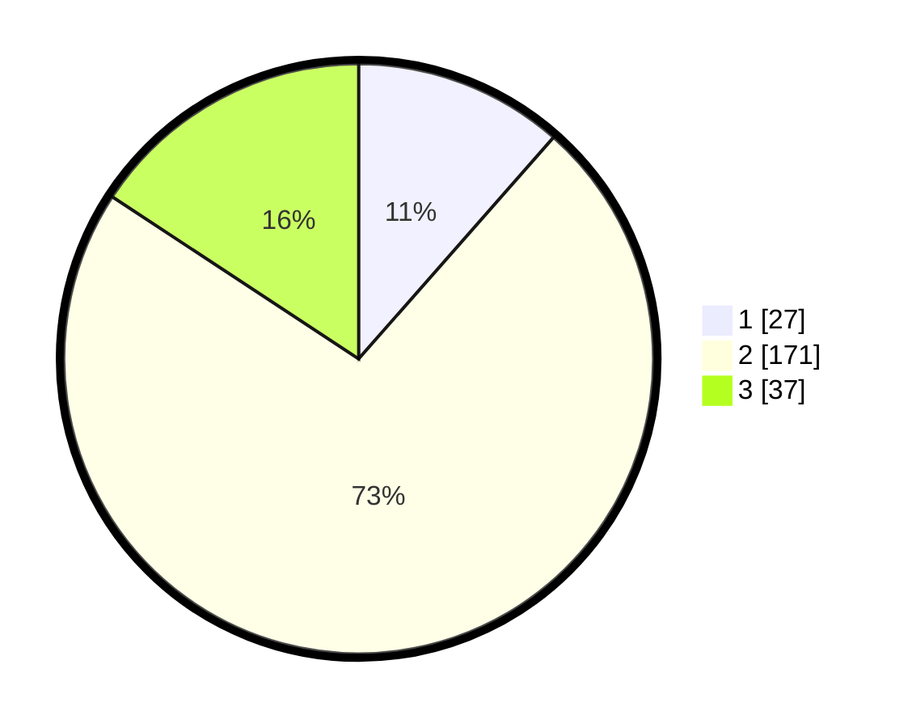

# Hasil

## Grafik

## Tabel

| No. | Nama Paslon    | Suara | Suara (raw) | Persentase |
|:--- |:-------------- | -----:| -----------:| ----------:|
| 1   | ANIES MUHAIMIN | 27    | [27][p-1]   | 11,49      |
| 2   | PRABOWO GIBRAN | 171   | [171][p-2]  | 72,77      |
| 3   | GANJAR MAHFUD  | 37    | [37][p-3]   | 15,74      |

[p-1]: https://github.com/gigit-pemilu/pemilu-2024/blob/main/pilpres/hitung-suara/sub/35-jawa-timur/sub/02-ponorogo/sub/09-jetis/sub/2001-ngasinan/sub/005-tps/sub/paslon-1.txt
[p-2]: https://github.com/gigit-pemilu/pemilu-2024/blob/main/pilpres/hitung-suara/sub/35-jawa-timur/sub/02-ponorogo/sub/09-jetis/sub/2001-ngasinan/sub/005-tps/sub/paslon-2.txt
[p-3]: https://github.com/gigit-pemilu/pemilu-2024/blob/main/pilpres/hitung-suara/sub/35-jawa-timur/sub/02-ponorogo/sub/09-jetis/sub/2001-ngasinan/sub/005-tps/sub/paslon-3.txt

## Foto C Plano

https://sirekap-obj-formc.kpu.go.id/59dc/pemilu/ppwp/35/02/09/20/01/3502092001005-20240219-122042--993a16f8-a0ad-4852-905e-7bdf538e0d80.jpg

https://sirekap-obj-formc.kpu.go.id/59dc/pemilu/ppwp/35/02/09/20/01/3502092001005-20240219-122226--cd4fbda5-7fcf-4ffb-adca-5e5829922b73.jpg

https://sirekap-obj-formc.kpu.go.id/59dc/pemilu/ppwp/35/02/09/20/01/3502092001005-20240219-122514--945b3589-f59e-491d-8b87-2ffd8e20c3b9.jpg

## Metadata

| Key        | Value               |
| ---------- | ------------------- |
| Time Stamp | 2024-02-19 16:00:00 |

## DATA PEMILIH TETAP

Jumlah pemilih dalam DPT: **284**.
 * L: **139**.
 * P: **145**.

## DATA PENGGUNA HAK PILIH

Jumlah pengguna hak pilih dalam DPT: **238**.
 * L: **118**.
 * P: **120**.

Jumlah pengguna hak pilih dalam DPTb: **0**.
 * L: **0**.
 * P: **0**.

Jumlah pengguna hak pilih dalam DPK: **1**.
 * L: **0**.
 * P: **1**.

Jumlah pengguna hak pilih: **239**.
 * L: **118**.
 * P: **121**.

## JUMLAH SUARA SAH DAN TIDAK SAH

JUMLAH SELURUH SUARA SAH: **235**.

JUMLAH SUARA TIDAK SAH: **4**.

JUMLAH SELURUH SUARA SAH DAN SUARA TIDAK SAH: **239**.

