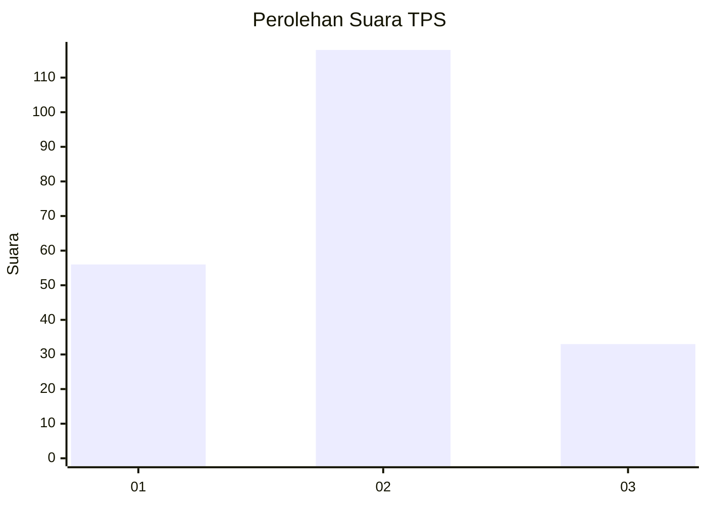
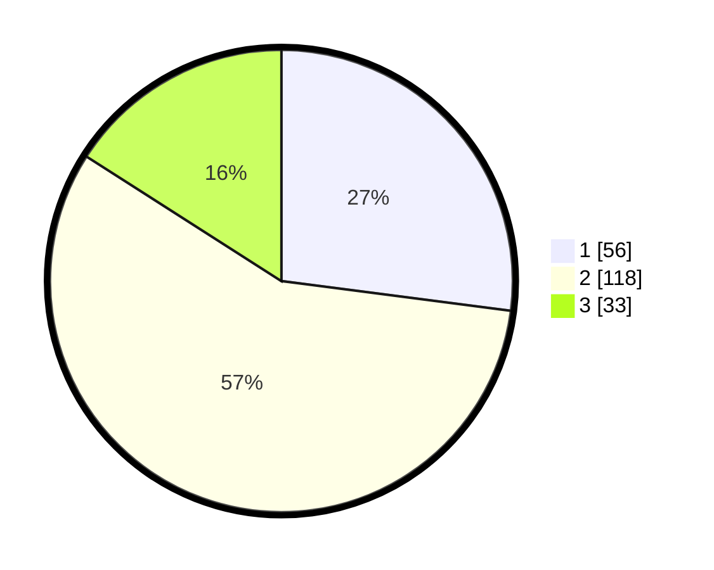

# Hasil

## Grafik

## Tabel

| No. | Nama Paslon    | Suara | Suara (raw) | Persentase |
|:--- |:-------------- | -----:| -----------:| ----------:|
| 1   | ANIES MUHAIMIN | 56    | [56][p-1]   | 27,05      |
| 2   | PRABOWO GIBRAN | 118   | [118][p-2]  | 57,00      |
| 3   | GANJAR MAHFUD  | 33    | [33][p-3]   | 15,94      |

[p-1]: https://github.com/gigit-pemilu/pemilu-2024-35-jawa-timur/blob/main/pilpres/hitung-suara/sub/35-jawa-timur/sub/02-ponorogo/sub/09-jetis/sub/2002-kutu-kulon/sub/002-tps/sub/paslon-1.txt
[p-2]: https://github.com/gigit-pemilu/pemilu-2024-35-jawa-timur/blob/main/pilpres/hitung-suara/sub/35-jawa-timur/sub/02-ponorogo/sub/09-jetis/sub/2002-kutu-kulon/sub/002-tps/sub/paslon-2.txt
[p-3]: https://github.com/gigit-pemilu/pemilu-2024-35-jawa-timur/blob/main/pilpres/hitung-suara/sub/35-jawa-timur/sub/02-ponorogo/sub/09-jetis/sub/2002-kutu-kulon/sub/002-tps/sub/paslon-3.txt

## Foto C Plano

https://sirekap-obj-formc.kpu.go.id/312c/pemilu/ppwp/35/02/09/20/02/3502092002002-20240219-214809--b5547c02-5d63-4a8d-a975-37285a95fd9f.jpg

https://sirekap-obj-formc.kpu.go.id/312c/pemilu/ppwp/35/02/09/20/02/3502092002002-20240220-104252--f1c2748f-8f92-4ddc-bc27-c1bdca7f6a79.jpg

https://sirekap-obj-formc.kpu.go.id/312c/pemilu/ppwp/35/02/09/20/02/3502092002002-20240220-104734--a18d2644-8a40-4ad5-aa04-0bbc95fd24a4.jpg

## Metadata

| Key        | Value               |
| ---------- | ------------------- |
| Time Stamp | 2024-02-20 16:00:00 |

