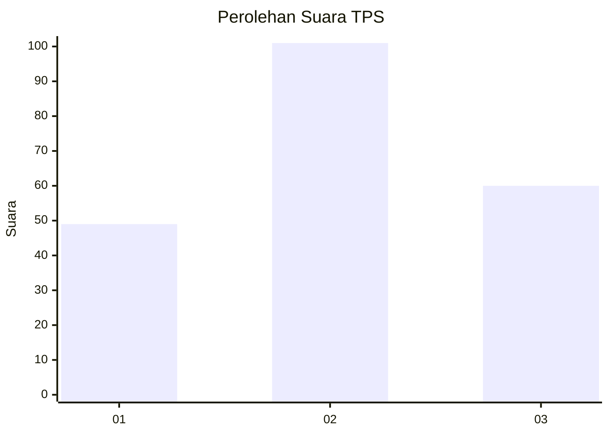
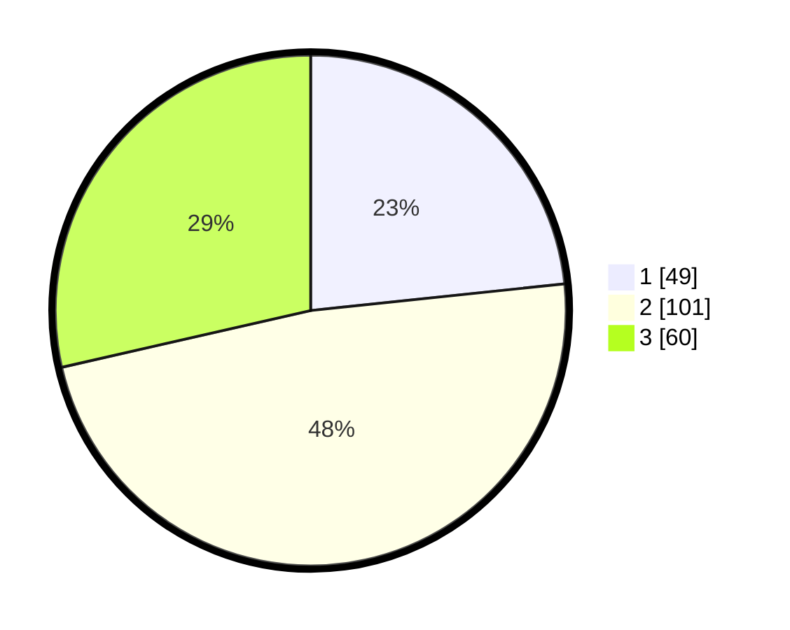

# Hasil

## Grafik

## Tabel

| No. | Nama Paslon    | Suara | Suara (raw) | Persentase |
|:--- |:-------------- | -----:| -----------:| ----------:|
| 1   | ANIES MUHAIMIN | 49    | [49][p-1]   | 23,33      |
| 2   | PRABOWO GIBRAN | 101   | [101][p-2]  | 48,10      |
| 3   | GANJAR MAHFUD  | 60    | [60][p-3]   | 28,57      |

[p-1]: https://github.com/gigit-pemilu/pemilu-2024/blob/main/pilpres/hitung-suara/sub/35-jawa-timur/sub/02-ponorogo/sub/09-jetis/sub/2003-kutu-wetan/sub/002-tps/sub/paslon-1.txt
[p-2]: https://github.com/gigit-pemilu/pemilu-2024/blob/main/pilpres/hitung-suara/sub/35-jawa-timur/sub/02-ponorogo/sub/09-jetis/sub/2003-kutu-wetan/sub/002-tps/sub/paslon-2.txt
[p-3]: https://github.com/gigit-pemilu/pemilu-2024/blob/main/pilpres/hitung-suara/sub/35-jawa-timur/sub/02-ponorogo/sub/09-jetis/sub/2003-kutu-wetan/sub/002-tps/sub/paslon-3.txt

## Foto C Plano

https://sirekap-obj-formc.kpu.go.id/4f8b/pemilu/ppwp/35/02/09/20/03/3502092003002-20240215-015449--dae14017-8deb-4bb2-b755-507327897c72.jpg

https://sirekap-obj-formc.kpu.go.id/4f8b/pemilu/ppwp/35/02/09/20/03/3502092003002-20240215-015552--07ca8e1a-2af0-4ff9-95fe-932266a3cf4a.jpg

## Metadata

| Key        | Value               |
| ---------- | ------------------- |
| Time Stamp | 2024-02-15 07:00:44 |

