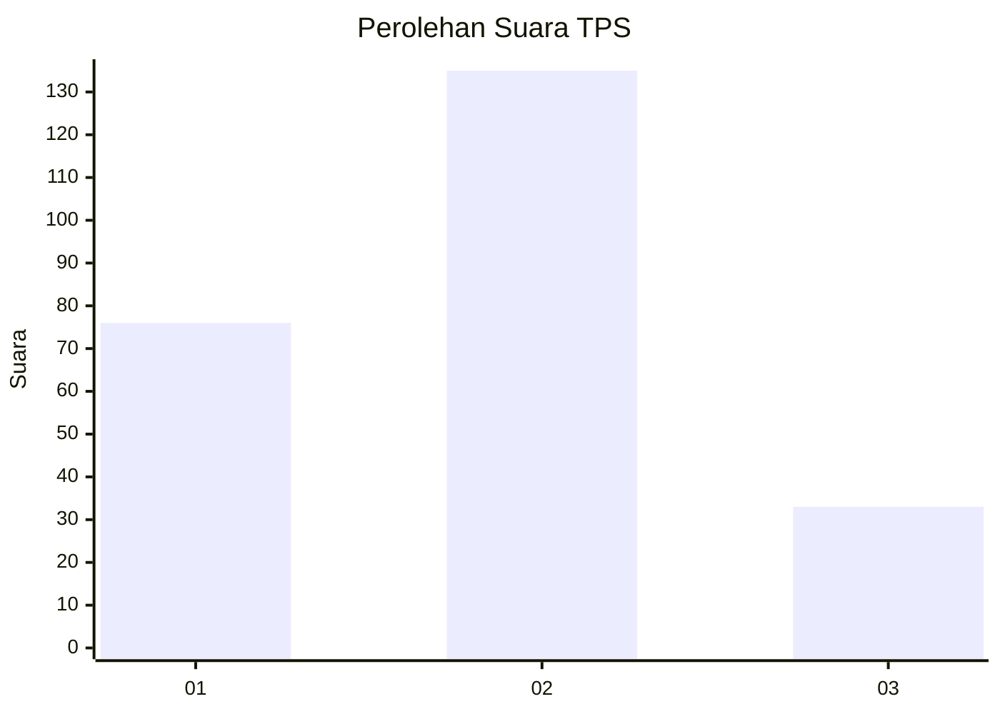
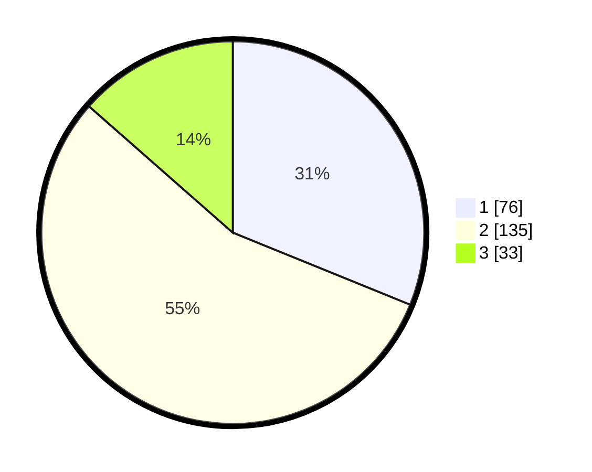

# Hasil

## Grafik

## Tabel

| No. | Nama Paslon    | Suara | Suara (raw) | Persentase |
|:--- |:-------------- | -----:| -----------:| ----------:|
| 1   | ANIES MUHAIMIN | 76    | [76][p-1]   | 31,15      |
| 2   | PRABOWO GIBRAN | 135   | [135][p-2]  | 55,33      |
| 3   | GANJAR MAHFUD  | 33    | [33][p-3]   | 13,52      |

[p-1]: https://github.com/gigit-pemilu/pemilu-2024-35-jawa-timur/blob/main/pilpres/hitung-suara/sub/35-jawa-timur/sub/02-ponorogo/sub/09-jetis/sub/2006-coper/sub/004-tps/sub/paslon-1.txt
[p-2]: https://github.com/gigit-pemilu/pemilu-2024-35-jawa-timur/blob/main/pilpres/hitung-suara/sub/35-jawa-timur/sub/02-ponorogo/sub/09-jetis/sub/2006-coper/sub/004-tps/sub/paslon-2.txt
[p-3]: https://github.com/gigit-pemilu/pemilu-2024-35-jawa-timur/blob/main/pilpres/hitung-suara/sub/35-jawa-timur/sub/02-ponorogo/sub/09-jetis/sub/2006-coper/sub/004-tps/sub/paslon-3.txt

## Foto C Plano

https://sirekap-obj-formc.kpu.go.id/eccb/pemilu/ppwp/35/02/09/20/06/3502092006004-20240214-211302--8de80d9c-b886-47f4-86b9-eadc436129bd.jpg

https://sirekap-obj-formc.kpu.go.id/eccb/pemilu/ppwp/35/02/09/20/06/3502092006004-20240214-211359--bc94e19c-a9ae-4ed1-b240-b14d76a54716.jpg

https://sirekap-obj-formc.kpu.go.id/eccb/pemilu/ppwp/35/02/09/20/06/3502092006004-20240214-213657--72233b71-7afe-4100-b98f-54cde5e86c20.jpg

## Metadata

| Key        | Value               |
| ---------- | ------------------- |
| Time Stamp | 2024-02-15 15:30:25 |

