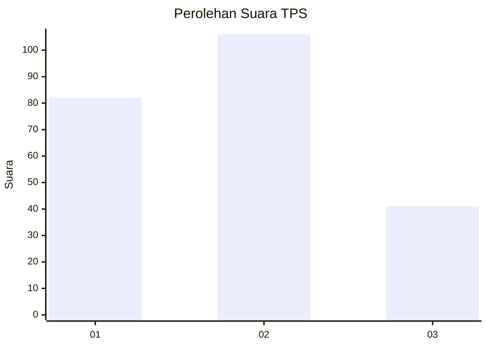
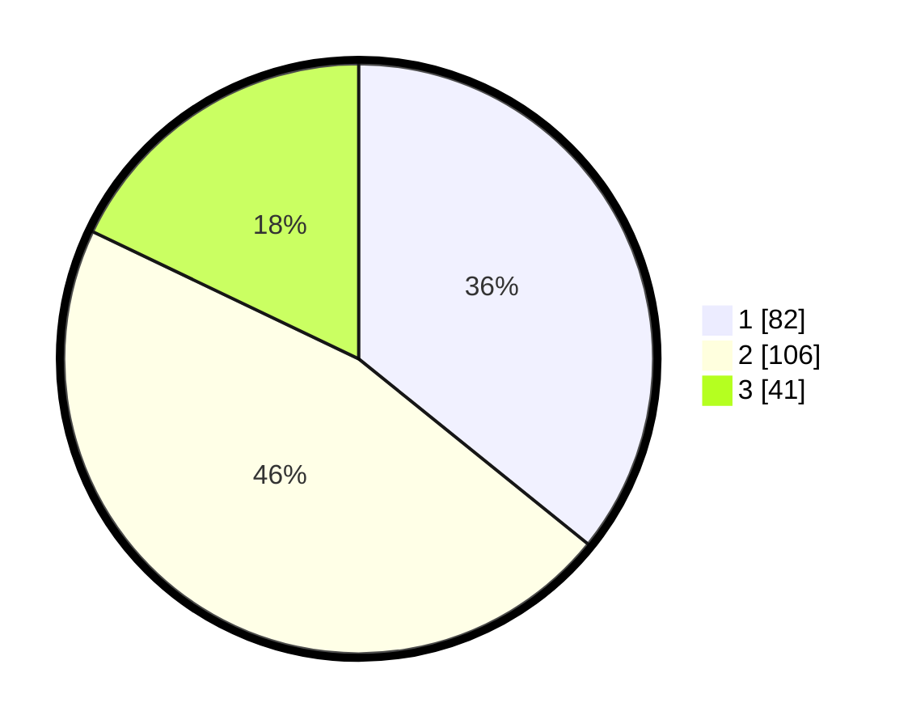

# Hasil

## Grafik

## Tabel

| No. | Nama Paslon    | Suara | Suara (raw) | Persentase |
|:--- |:-------------- | -----:| -----------:| ----------:|
| 1   | ANIES MUHAIMIN | 82    | [82][p-1]   | 35,81      |
| 2   | PRABOWO GIBRAN | 106   | [106][p-2]  | 46,29      |
| 3   | GANJAR MAHFUD  | 41    | [41][p-3]   | 17,90      |

[p-1]: https://github.com/gigit-pemilu/pemilu-2024/blob/main/pilpres/hitung-suara/sub/35-jawa-timur/sub/02-ponorogo/sub/09-jetis/sub/2007-mojorejo/sub/002-tps/sub/paslon-1.txt
[p-2]: https://github.com/gigit-pemilu/pemilu-2024/blob/main/pilpres/hitung-suara/sub/35-jawa-timur/sub/02-ponorogo/sub/09-jetis/sub/2007-mojorejo/sub/002-tps/sub/paslon-2.txt
[p-3]: https://github.com/gigit-pemilu/pemilu-2024/blob/main/pilpres/hitung-suara/sub/35-jawa-timur/sub/02-ponorogo/sub/09-jetis/sub/2007-mojorejo/sub/002-tps/sub/paslon-3.txt

## Foto C Plano

https://sirekap-obj-formc.kpu.go.id/18ad/pemilu/ppwp/35/02/09/20/07/3502092007002-20240215-022126--47cfb47d-1253-4fd2-845a-2074d2055cd1.jpg

https://sirekap-obj-formc.kpu.go.id/18ad/pemilu/ppwp/35/02/09/20/07/3502092007002-20240215-022211--9e17b9fd-1c1b-4060-886c-0605aaef3021.jpg

https://sirekap-obj-formc.kpu.go.id/18ad/pemilu/ppwp/35/02/09/20/07/3502092007002-20240215-022306--85a2c781-5528-4791-b33e-a5be75f4c544.jpg

## Metadata

| Key        | Value               |
| ---------- | ------------------- |
| Time Stamp | 2024-02-19 06:16:00 |

