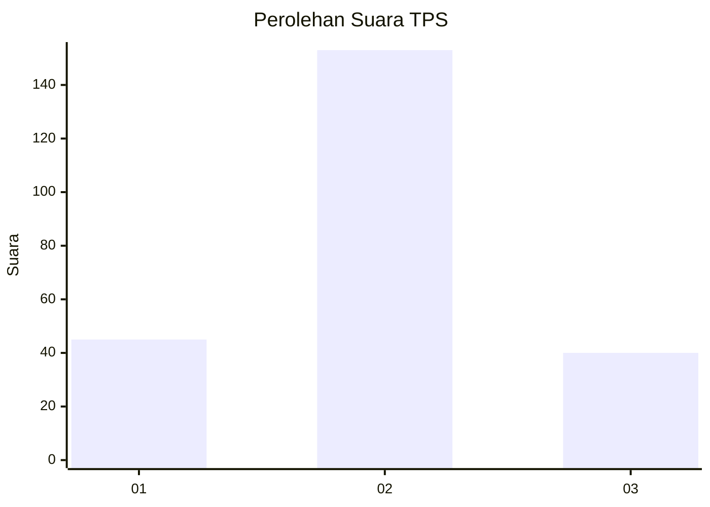
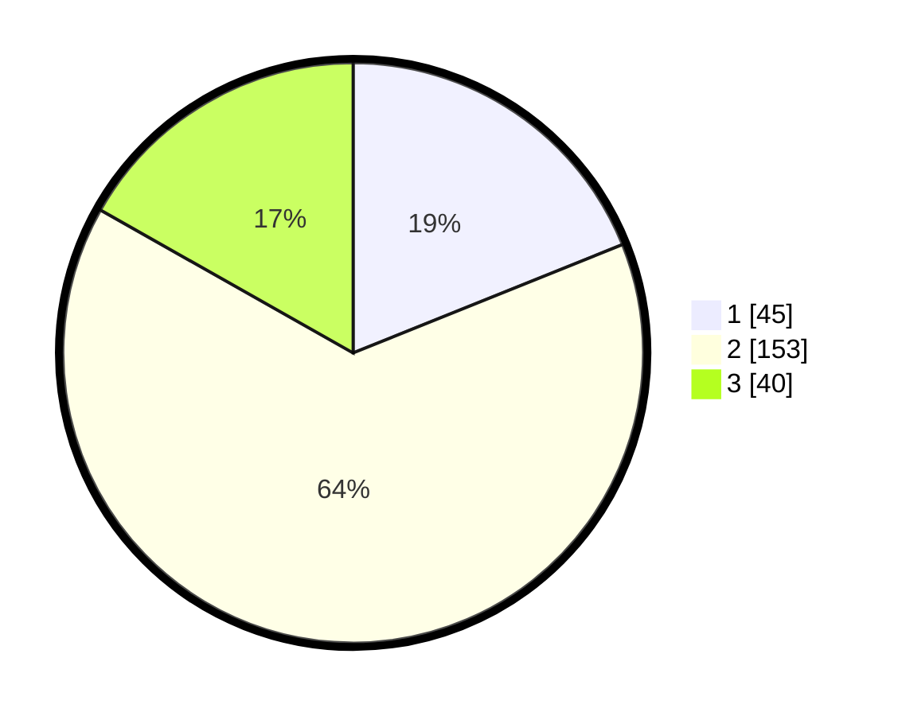

# Hasil

## Grafik

## Tabel

| No. | Nama Paslon    | Suara | Suara (raw) | Persentase |
|:--- |:-------------- | -----:| -----------:| ----------:|
| 1   | ANIES MUHAIMIN | 45    | [45][p-1]   | 18,91      |
| 2   | PRABOWO GIBRAN | 153   | [153][p-2]  | 64,29      |
| 3   | GANJAR MAHFUD  | 40    | [40][p-3]   | 16,81      |

[p-1]: https://github.com/gigit-pemilu/pemilu-2024/blob/main/pilpres/hitung-suara/sub/35-jawa-timur/sub/02-ponorogo/sub/09-jetis/sub/2008-karanggebang/sub/002-tps/sub/paslon-1.txt
[p-2]: https://github.com/gigit-pemilu/pemilu-2024/blob/main/pilpres/hitung-suara/sub/35-jawa-timur/sub/02-ponorogo/sub/09-jetis/sub/2008-karanggebang/sub/002-tps/sub/paslon-2.txt
[p-3]: https://github.com/gigit-pemilu/pemilu-2024/blob/main/pilpres/hitung-suara/sub/35-jawa-timur/sub/02-ponorogo/sub/09-jetis/sub/2008-karanggebang/sub/002-tps/sub/paslon-3.txt

## Foto C Plano

https://sirekap-obj-formc.kpu.go.id/351f/pemilu/ppwp/35/02/09/20/08/3502092008002-20240219-095006--5ae88531-50ce-47cf-b502-da81d0961150.jpg

https://sirekap-obj-formc.kpu.go.id/351f/pemilu/ppwp/35/02/09/20/08/3502092008002-20240219-095101--9b836150-4571-4bb6-9211-3b0e72b2551c.jpg

https://sirekap-obj-formc.kpu.go.id/351f/pemilu/ppwp/35/02/09/20/08/3502092008002-20240219-095229--9c3ffe3b-4d99-46d3-aa74-e51134e6479e.jpg

## Metadata

| Key        | Value               |
| ---------- | ------------------- |
| Time Stamp | 2024-02-19 13:00:00 |

