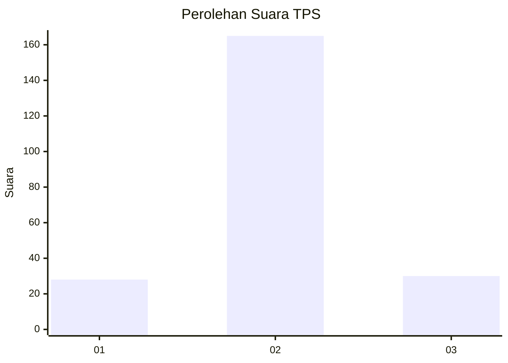
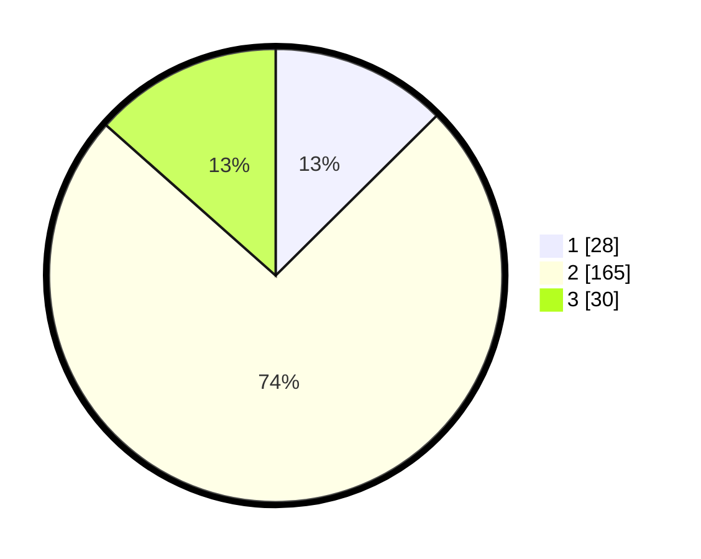

# Hasil

## Grafik

## Tabel

| No. | Nama Paslon    | Suara | Suara (raw) | Persentase |
|:--- |:-------------- | -----:| -----------:| ----------:|
| 1   | ANIES MUHAIMIN | 28    | [28][p-1]   | 12,56      |
| 2   | PRABOWO GIBRAN | 165   | [165][p-2]  | 73,99      |
| 3   | GANJAR MAHFUD  | 30    | [30][p-3]   | 13,45      |

[p-1]: https://github.com/gigit-pemilu/pemilu-2024/blob/main/pilpres/hitung-suara/sub/35-jawa-timur/sub/02-ponorogo/sub/09-jetis/sub/2008-karanggebang/sub/007-tps/sub/paslon-1.txt
[p-2]: https://github.com/gigit-pemilu/pemilu-2024/blob/main/pilpres/hitung-suara/sub/35-jawa-timur/sub/02-ponorogo/sub/09-jetis/sub/2008-karanggebang/sub/007-tps/sub/paslon-2.txt
[p-3]: https://github.com/gigit-pemilu/pemilu-2024/blob/main/pilpres/hitung-suara/sub/35-jawa-timur/sub/02-ponorogo/sub/09-jetis/sub/2008-karanggebang/sub/007-tps/sub/paslon-3.txt

## Foto C Plano

https://sirekap-obj-formc.kpu.go.id/8a17/pemilu/ppwp/35/02/09/20/08/3502092008007-20240219-101806--541b4785-efa3-4921-8bde-51fe4994d8e6.jpg

https://sirekap-obj-formc.kpu.go.id/8a17/pemilu/ppwp/35/02/09/20/08/3502092008007-20240219-112016--b963b904-2a4a-45a8-942c-8a62416aa9e6.jpg

https://sirekap-obj-formc.kpu.go.id/8a17/pemilu/ppwp/35/02/09/20/08/3502092008007-20240219-111921--ad44c028-8a28-4f6f-b09b-34bfd81b1b73.jpg

## Metadata

| Key        | Value               |
| ---------- | ------------------- |
| Time Stamp | 2024-02-19 13:00:00 |

