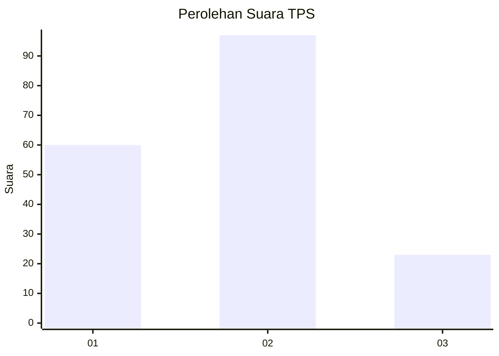
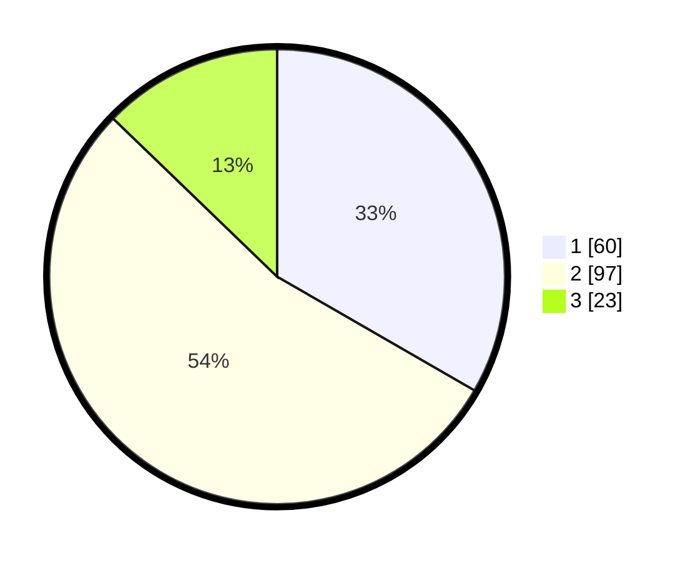

# Hasil

## Grafik

## Tabel

| No. | Nama Paslon    | Suara | Suara (raw) | Persentase |
|:--- |:-------------- | -----:| -----------:| ----------:|
| 1   | ANIES MUHAIMIN | 60    | [60][p-1]   | 33,33      |
| 2   | PRABOWO GIBRAN | 97    | [97][p-2]   | 53,89      |
| 3   | GANJAR MAHFUD  | 23    | [23][p-3]   | 12,78      |

[p-1]: https://github.com/gigit-pemilu/pemilu-2024-35-jawa-timur/blob/main/pilpres/hitung-suara/sub/35-jawa-timur/sub/02-ponorogo/sub/09-jetis/sub/2008-karanggebang/sub/008-tps/sub/paslon-1.txt
[p-2]: https://github.com/gigit-pemilu/pemilu-2024-35-jawa-timur/blob/main/pilpres/hitung-suara/sub/35-jawa-timur/sub/02-ponorogo/sub/09-jetis/sub/2008-karanggebang/sub/008-tps/sub/paslon-2.txt
[p-3]: https://github.com/gigit-pemilu/pemilu-2024-35-jawa-timur/blob/main/pilpres/hitung-suara/sub/35-jawa-timur/sub/02-ponorogo/sub/09-jetis/sub/2008-karanggebang/sub/008-tps/sub/paslon-3.txt

## Foto C Plano

https://sirekap-obj-formc.kpu.go.id/7b0a/pemilu/ppwp/35/02/09/20/08/3502092008008-20240219-103259--1f2a6478-ce48-4ab3-8123-7be4d177f25e.jpg

https://sirekap-obj-formc.kpu.go.id/7b0a/pemilu/ppwp/35/02/09/20/08/3502092008008-20240219-112515--502be245-3e18-44e7-873f-cca2a0fe0369.jpg

https://sirekap-obj-formc.kpu.go.id/7b0a/pemilu/ppwp/35/02/09/20/08/3502092008008-20240219-103016--b85b79cd-2614-472b-911c-8447b42bfd8b.jpg

## Metadata

| Key        | Value               |
| ---------- | ------------------- |
| Time Stamp | 2024-02-19 13:00:00 |

