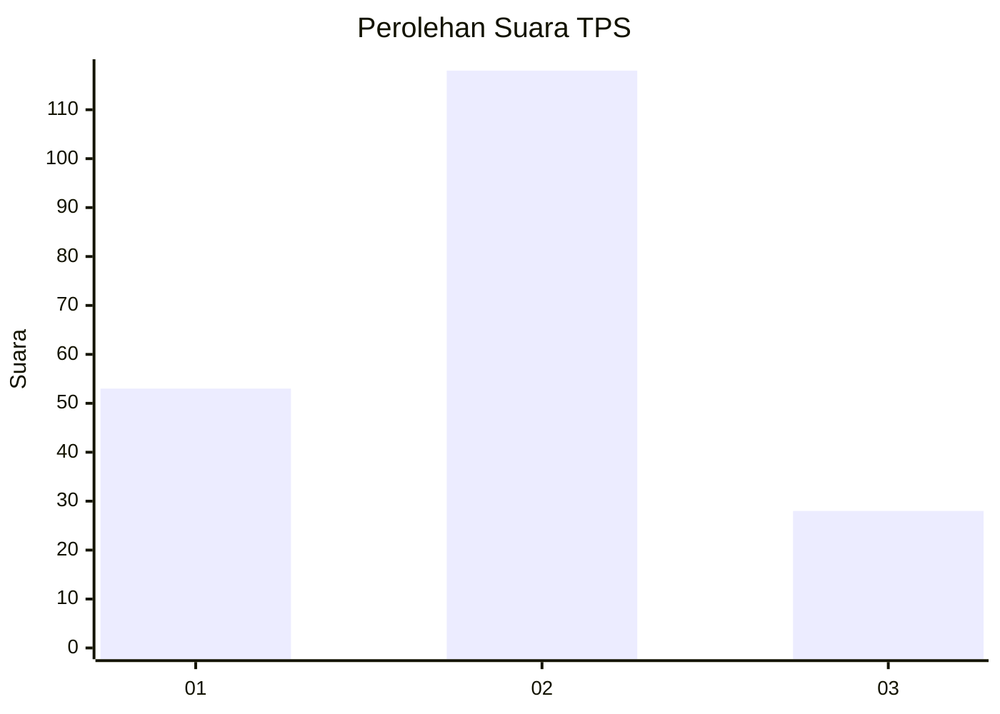
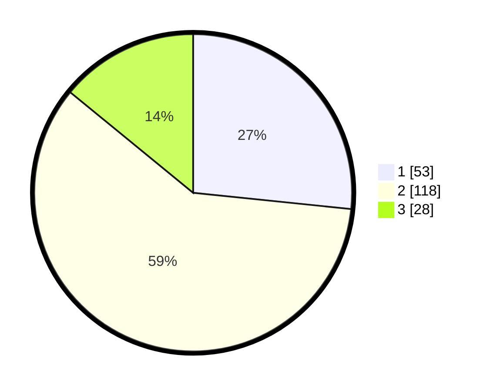

# Hasil

## Grafik

## Tabel

| No. | Nama Paslon    | Suara | Suara (raw) | Persentase |
|:--- |:-------------- | -----:| -----------:| ----------:|
| 1   | ANIES MUHAIMIN | 53    | [53][p-1]   | 26,63      |
| 2   | PRABOWO GIBRAN | 118   | [118][p-2]  | 59,30      |
| 3   | GANJAR MAHFUD  | 28    | [28][p-3]   | 14,07      |

[p-1]: https://github.com/gigit-pemilu/pemilu-2024-35-jawa-timur/blob/main/pilpres/hitung-suara/sub/35-jawa-timur/sub/02-ponorogo/sub/09-jetis/sub/2009-jetis/sub/001-tps/sub/paslon-1.txt
[p-2]: https://github.com/gigit-pemilu/pemilu-2024-35-jawa-timur/blob/main/pilpres/hitung-suara/sub/35-jawa-timur/sub/02-ponorogo/sub/09-jetis/sub/2009-jetis/sub/001-tps/sub/paslon-2.txt
[p-3]: https://github.com/gigit-pemilu/pemilu-2024-35-jawa-timur/blob/main/pilpres/hitung-suara/sub/35-jawa-timur/sub/02-ponorogo/sub/09-jetis/sub/2009-jetis/sub/001-tps/sub/paslon-3.txt

## Foto C Plano

https://sirekap-obj-formc.kpu.go.id/5d16/pemilu/ppwp/35/02/09/20/09/3502092009001-20240214-184935--7791eee6-37c9-4641-a2a1-5c11c815d025.jpg

https://sirekap-obj-formc.kpu.go.id/5d16/pemilu/ppwp/35/02/09/20/09/3502092009001-20240214-191222--91a81e10-28f4-4c51-90ea-1cdfd3a9703d.jpg

https://sirekap-obj-formc.kpu.go.id/5d16/pemilu/ppwp/35/02/09/20/09/3502092009001-20240214-201912--081edff5-70ed-40b0-be03-0bc772c71dd4.jpg

## Metadata

| Key        | Value               |
| ---------- | ------------------- |
| Time Stamp | 2024-02-15 00:41:44 |

