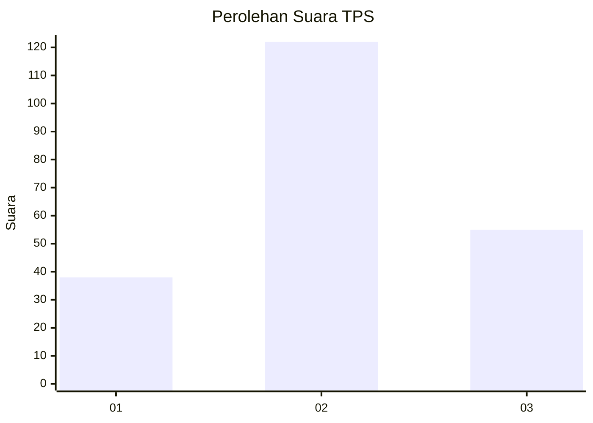
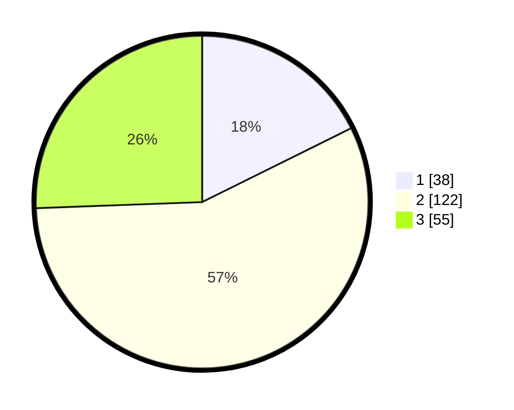

# Hasil

## Grafik

## Tabel

| No. | Nama Paslon    | Suara | Suara (raw) | Persentase |
|:--- |:-------------- | -----:| -----------:| ----------:|
| 1   | ANIES MUHAIMIN | 38    | [38][p-1]   | 17,67      |
| 2   | PRABOWO GIBRAN | 122   | [122][p-2]  | 56,74      |
| 3   | GANJAR MAHFUD  | 55    | [55][p-3]   | 25,58      |

[p-1]: https://github.com/gigit-pemilu/pemilu-2024/blob/main/pilpres/hitung-suara/sub/35-jawa-timur/sub/02-ponorogo/sub/09-jetis/sub/2009-jetis/sub/003-tps/sub/paslon-1.txt
[p-2]: https://github.com/gigit-pemilu/pemilu-2024/blob/main/pilpres/hitung-suara/sub/35-jawa-timur/sub/02-ponorogo/sub/09-jetis/sub/2009-jetis/sub/003-tps/sub/paslon-2.txt
[p-3]: https://github.com/gigit-pemilu/pemilu-2024/blob/main/pilpres/hitung-suara/sub/35-jawa-timur/sub/02-ponorogo/sub/09-jetis/sub/2009-jetis/sub/003-tps/sub/paslon-3.txt

## Foto C Plano

https://sirekap-obj-formc.kpu.go.id/2823/pemilu/ppwp/35/02/09/20/09/3502092009003-20240214-235712--4a29d8b3-4446-4e47-a7bd-c4b0e7a431f3.jpg

https://sirekap-obj-formc.kpu.go.id/2823/pemilu/ppwp/35/02/09/20/09/3502092009003-20240215-000612--7cb3cf1e-fff9-4064-a562-37211752e3fa.jpg

https://sirekap-obj-formc.kpu.go.id/2823/pemilu/ppwp/35/02/09/20/09/3502092009003-20240215-000743--62a3cc8f-f57d-4884-ae28-5b049c4b02a7.jpg

## Metadata

| Key        | Value               |
| ---------- | ------------------- |
| Time Stamp | 2024-02-15 16:00:26 |

