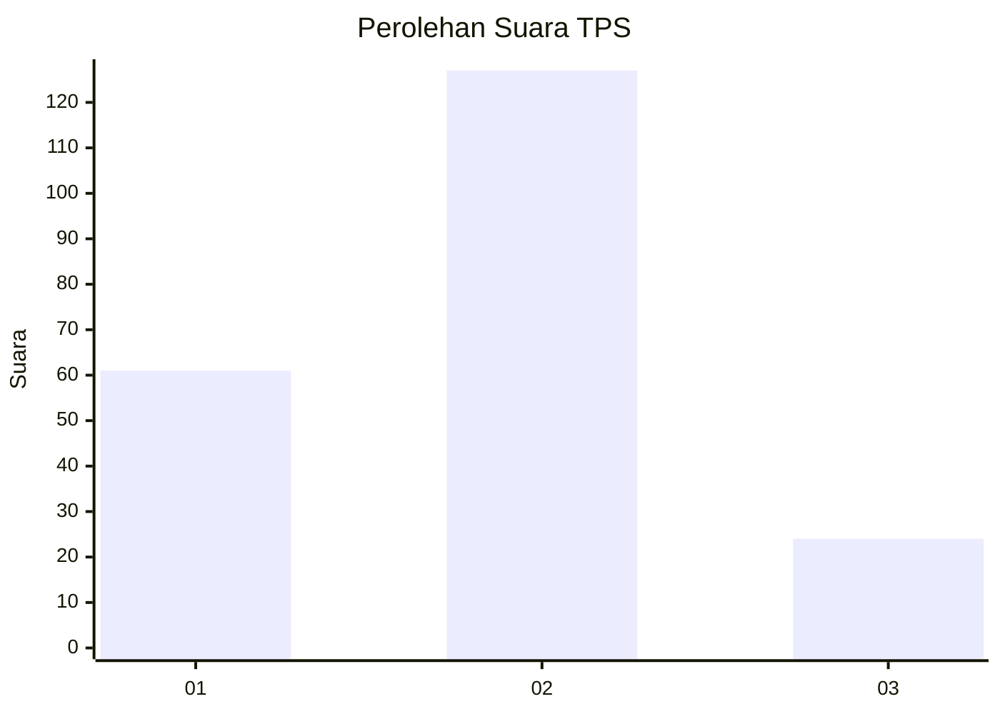
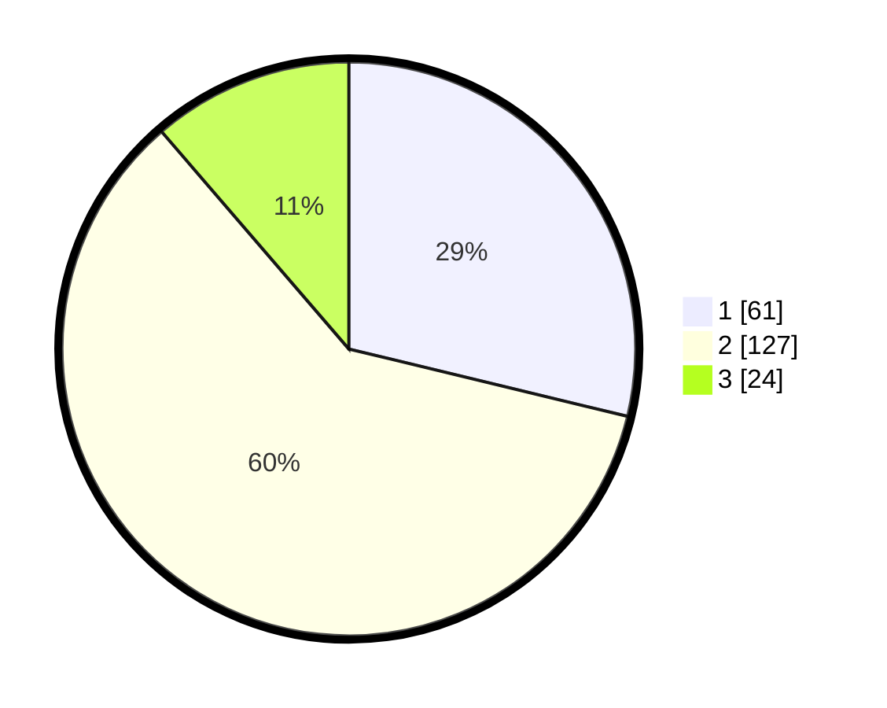

# Hasil

## Grafik

## Tabel

| No. | Nama Paslon    | Suara | Suara (raw) | Persentase |
|:--- |:-------------- | -----:| -----------:| ----------:|
| 1   | ANIES MUHAIMIN | 61    | [61][p-1]   | 28,77      |
| 2   | PRABOWO GIBRAN | 127   | [127][p-2]  | 59,91      |
| 3   | GANJAR MAHFUD  | 24    | [24][p-3]   | 11,32      |

[p-1]: https://github.com/gigit-pemilu/pemilu-2024-35-jawa-timur/blob/main/pilpres/hitung-suara/sub/35-jawa-timur/sub/02-ponorogo/sub/09-jetis/sub/2010-tegalsari/sub/004-tps/sub/paslon-1.txt
[p-2]: https://github.com/gigit-pemilu/pemilu-2024-35-jawa-timur/blob/main/pilpres/hitung-suara/sub/35-jawa-timur/sub/02-ponorogo/sub/09-jetis/sub/2010-tegalsari/sub/004-tps/sub/paslon-2.txt
[p-3]: https://github.com/gigit-pemilu/pemilu-2024-35-jawa-timur/blob/main/pilpres/hitung-suara/sub/35-jawa-timur/sub/02-ponorogo/sub/09-jetis/sub/2010-tegalsari/sub/004-tps/sub/paslon-3.txt

## Foto C Plano

https://sirekap-obj-formc.kpu.go.id/9dfb/pemilu/ppwp/35/02/09/20/10/3502092010004-20240219-114617--31471e6f-766f-450f-a5f8-017fcf292bcc.jpg

https://sirekap-obj-formc.kpu.go.id/9dfb/pemilu/ppwp/35/02/09/20/10/3502092010004-20240219-114721--87f7a8c6-303b-49c8-8092-5efd70f536c7.jpg

https://sirekap-obj-formc.kpu.go.id/9dfb/pemilu/ppwp/35/02/09/20/10/3502092010004-20240219-114808--57dbd57d-4704-4cf5-bcf1-75661831fc73.jpg

## Metadata

| Key        | Value               |
| ---------- | ------------------- |
| Time Stamp | 2024-02-19 13:00:00 |

