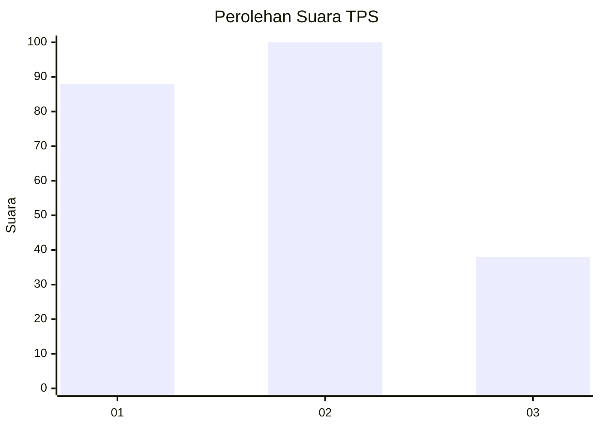
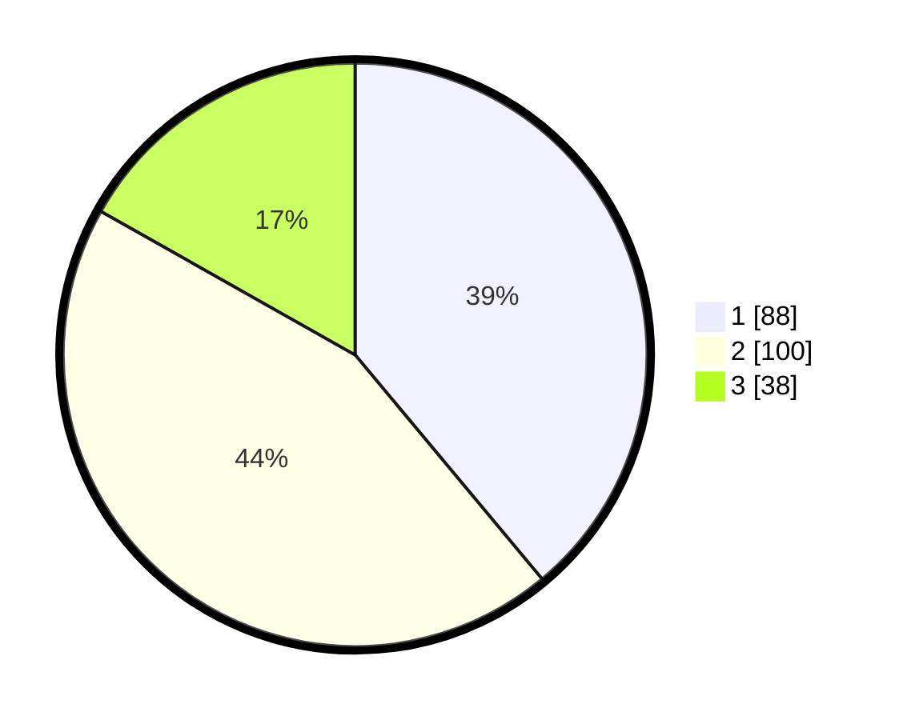

# Hasil

## Grafik

## Tabel

| No. | Nama Paslon    | Suara | Suara (raw) | Persentase |
|:--- |:-------------- | -----:| -----------:| ----------:|
| 1   | ANIES MUHAIMIN | 88    | [88][p-1]   | 38,94      |
| 2   | PRABOWO GIBRAN | 100   | [100][p-2]  | 44,25      |
| 3   | GANJAR MAHFUD  | 38    | [38][p-3]   | 16,81      |

[p-1]: https://github.com/gigit-pemilu/pemilu-2024/blob/main/pilpres/hitung-suara/sub/35-jawa-timur/sub/02-ponorogo/sub/09-jetis/sub/2010-tegalsari/sub/005-tps/sub/paslon-1.txt
[p-2]: https://github.com/gigit-pemilu/pemilu-2024/blob/main/pilpres/hitung-suara/sub/35-jawa-timur/sub/02-ponorogo/sub/09-jetis/sub/2010-tegalsari/sub/005-tps/sub/paslon-2.txt
[p-3]: https://github.com/gigit-pemilu/pemilu-2024/blob/main/pilpres/hitung-suara/sub/35-jawa-timur/sub/02-ponorogo/sub/09-jetis/sub/2010-tegalsari/sub/005-tps/sub/paslon-3.txt

## Foto C Plano

https://sirekap-obj-formc.kpu.go.id/37f3/pemilu/ppwp/35/02/09/20/10/3502092010005-20240219-115703--836edb42-eff9-4e35-960c-5c6c2df9d8a1.jpg

https://sirekap-obj-formc.kpu.go.id/37f3/pemilu/ppwp/35/02/09/20/10/3502092010005-20240219-115808--671ea6ff-9176-4572-b866-f74b35a7ada2.jpg

https://sirekap-obj-formc.kpu.go.id/37f3/pemilu/ppwp/35/02/09/20/10/3502092010005-20240219-115912--6a9d594c-b6bd-4a13-b5de-8263572fa237.jpg

## Metadata

| Key        | Value               |
| ---------- | ------------------- |
| Time Stamp | 2024-02-19 14:00:00 |

