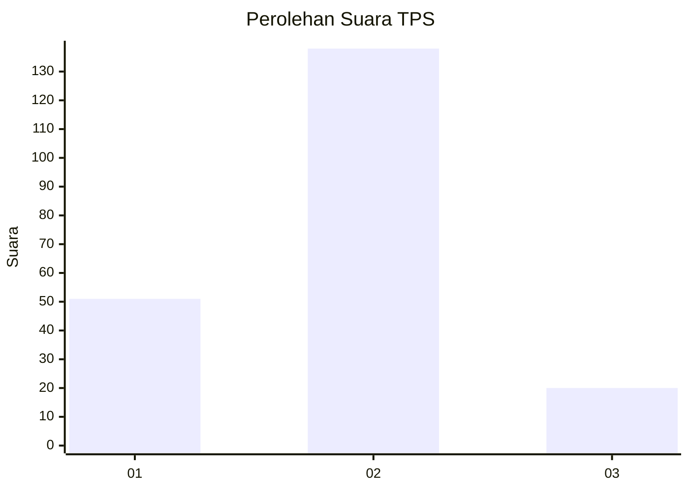

# Hasil

## Grafik

## Tabel

| No. | Nama Paslon    | Suara | Suara (raw) | Persentase |
|:--- |:-------------- | -----:| -----------:| ----------:|
| 1   | ANIES MUHAIMIN | 51    | [51][p-1]   | 24,40      |
| 2   | PRABOWO GIBRAN | 138   | [138][p-2]  | 66,03      |
| 3   | GANJAR MAHFUD  | 20    | [20][p-3]   | 9,57       |

[p-1]: https://github.com/gigit-pemilu/pemilu-2024/blob/main/pilpres/hitung-suara/sub/35-jawa-timur/sub/02-ponorogo/sub/09-jetis/sub/2013-turi/sub/003-tps/sub/paslon-1.txt
[p-2]: https://github.com/gigit-pemilu/pemilu-2024/blob/main/pilpres/hitung-suara/sub/35-jawa-timur/sub/02-ponorogo/sub/09-jetis/sub/2013-turi/sub/003-tps/sub/paslon-2.txt
[p-3]: https://github.com/gigit-pemilu/pemilu-2024/blob/main/pilpres/hitung-suara/sub/35-jawa-timur/sub/02-ponorogo/sub/09-jetis/sub/2013-turi/sub/003-tps/sub/paslon-3.txt

## Foto C Plano

https://sirekap-obj-formc.kpu.go.id/4ee6/pemilu/ppwp/35/02/09/20/13/3502092013003-20240219-112916--89d4eda4-6e0a-4e77-a406-58172bfa9d1a.jpg

https://sirekap-obj-formc.kpu.go.id/4ee6/pemilu/ppwp/35/02/09/20/13/3502092013003-20240219-113002--aab5a570-bb17-4587-95a1-d4b996eea635.jpg

https://sirekap-obj-formc.kpu.go.id/4ee6/pemilu/ppwp/35/02/09/20/13/3502092013003-20240219-113035--31ae6e2f-0f48-4400-8ac1-f4da31074728.jpg

## Metadata

| Key        | Value               |
| ---------- | ------------------- |
| Time Stamp | 2024-02-19 14:00:00 |

