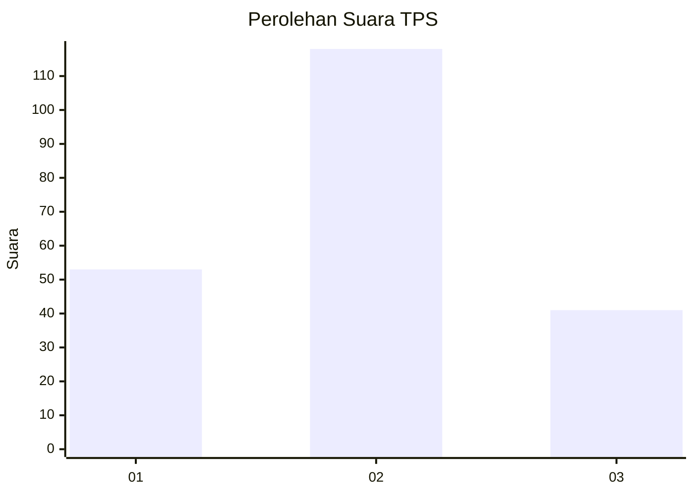
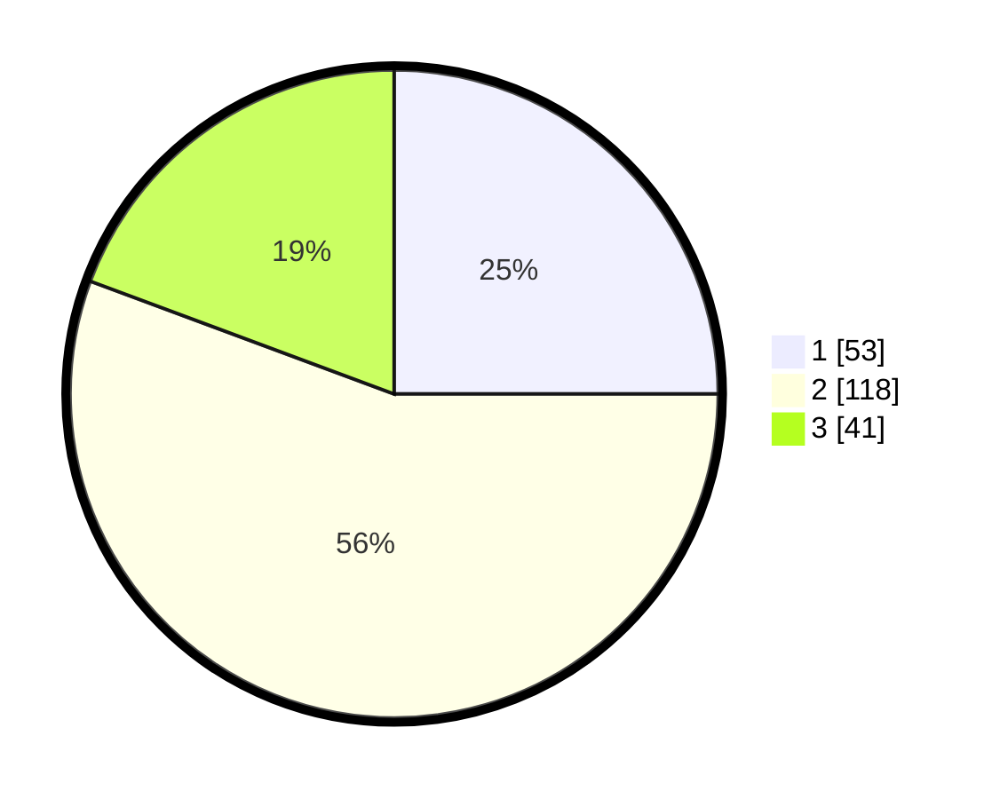

# Hasil

## Grafik

## Tabel

| No. | Nama Paslon    | Suara | Suara (raw) | Persentase |
|:--- |:-------------- | -----:| -----------:| ----------:|
| 1   | ANIES MUHAIMIN | 53    | [53][p-1]   | 25,00      |
| 2   | PRABOWO GIBRAN | 118   | [118][p-2]  | 55,66      |
| 3   | GANJAR MAHFUD  | 41    | [41][p-3]   | 19,34      |

[p-1]: https://github.com/gigit-pemilu/pemilu-2024/blob/main/pilpres/hitung-suara/sub/35-jawa-timur/sub/02-ponorogo/sub/09-jetis/sub/2013-turi/sub/008-tps/sub/paslon-1.txt
[p-2]: https://github.com/gigit-pemilu/pemilu-2024/blob/main/pilpres/hitung-suara/sub/35-jawa-timur/sub/02-ponorogo/sub/09-jetis/sub/2013-turi/sub/008-tps/sub/paslon-2.txt
[p-3]: https://github.com/gigit-pemilu/pemilu-2024/blob/main/pilpres/hitung-suara/sub/35-jawa-timur/sub/02-ponorogo/sub/09-jetis/sub/2013-turi/sub/008-tps/sub/paslon-3.txt

## Foto C Plano

https://sirekap-obj-formc.kpu.go.id/6e60/pemilu/ppwp/35/02/09/20/13/3502092013008-20240214-221451--92146e31-e4ad-43be-9437-d311c531047d.jpg

https://sirekap-obj-formc.kpu.go.id/6e60/pemilu/ppwp/35/02/09/20/13/3502092013008-20240215-004740--27383765-6c42-489b-8b5e-6d82d61ae4ec.jpg

https://sirekap-obj-formc.kpu.go.id/6e60/pemilu/ppwp/35/02/09/20/13/3502092013008-20240215-004828--492d015b-aa22-4954-854c-ba3c66428f31.jpg

## Metadata

| Key        | Value               |
| ---------- | ------------------- |
| Time Stamp | 2024-02-19 06:16:00 |

