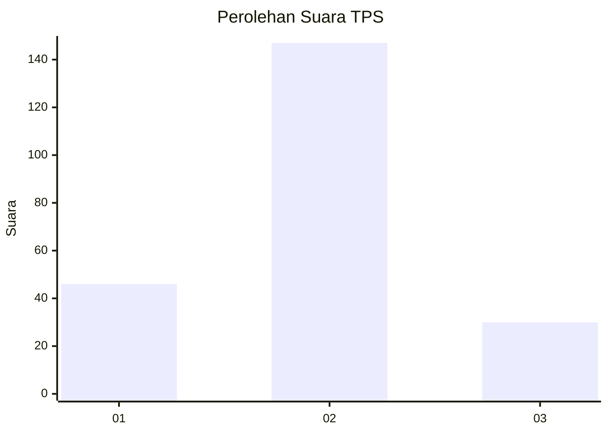
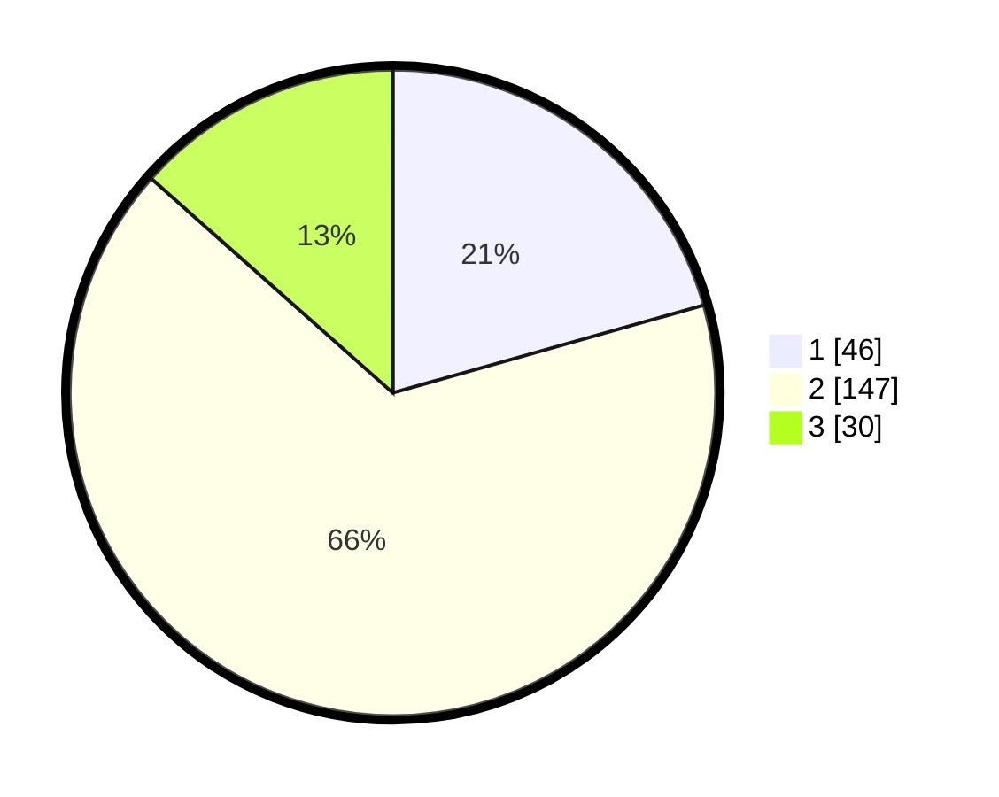

# Hasil

## Grafik

## Tabel

| No. | Nama Paslon    | Suara | Suara (raw) | Persentase |
|:--- |:-------------- | -----:| -----------:| ----------:|
| 1   | ANIES MUHAIMIN | 46    | [46][p-1]   | 20,63      |
| 2   | PRABOWO GIBRAN | 147   | [147][p-2]  | 65,92      |
| 3   | GANJAR MAHFUD  | 30    | [30][p-3]   | 13,45      |

[p-1]: https://github.com/gigit-pemilu/pemilu-2024/blob/main/pilpres/hitung-suara/sub/35-jawa-timur/sub/02-ponorogo/sub/09-jetis/sub/2014-winong/sub/004-tps/sub/paslon-1.txt
[p-2]: https://github.com/gigit-pemilu/pemilu-2024/blob/main/pilpres/hitung-suara/sub/35-jawa-timur/sub/02-ponorogo/sub/09-jetis/sub/2014-winong/sub/004-tps/sub/paslon-2.txt
[p-3]: https://github.com/gigit-pemilu/pemilu-2024/blob/main/pilpres/hitung-suara/sub/35-jawa-timur/sub/02-ponorogo/sub/09-jetis/sub/2014-winong/sub/004-tps/sub/paslon-3.txt

## Foto C Plano

https://sirekap-obj-formc.kpu.go.id/43f0/pemilu/ppwp/35/02/09/20/14/3502092014004-20240218-171026--f5f6dc6d-df59-4779-901d-000c3ab108b4.jpg

https://sirekap-obj-formc.kpu.go.id/43f0/pemilu/ppwp/35/02/09/20/14/3502092014004-20240218-171218--81d21672-7ef3-4a1f-9d34-1c09f26f12bf.jpg

https://sirekap-obj-formc.kpu.go.id/43f0/pemilu/ppwp/35/02/09/20/14/3502092014004-20240218-171409--ac007f66-8b60-413f-b7a7-5e9643c7b21a.jpg

## Metadata

| Key        | Value               |
| ---------- | ------------------- |
| Time Stamp | 2024-02-19 06:16:00 |

