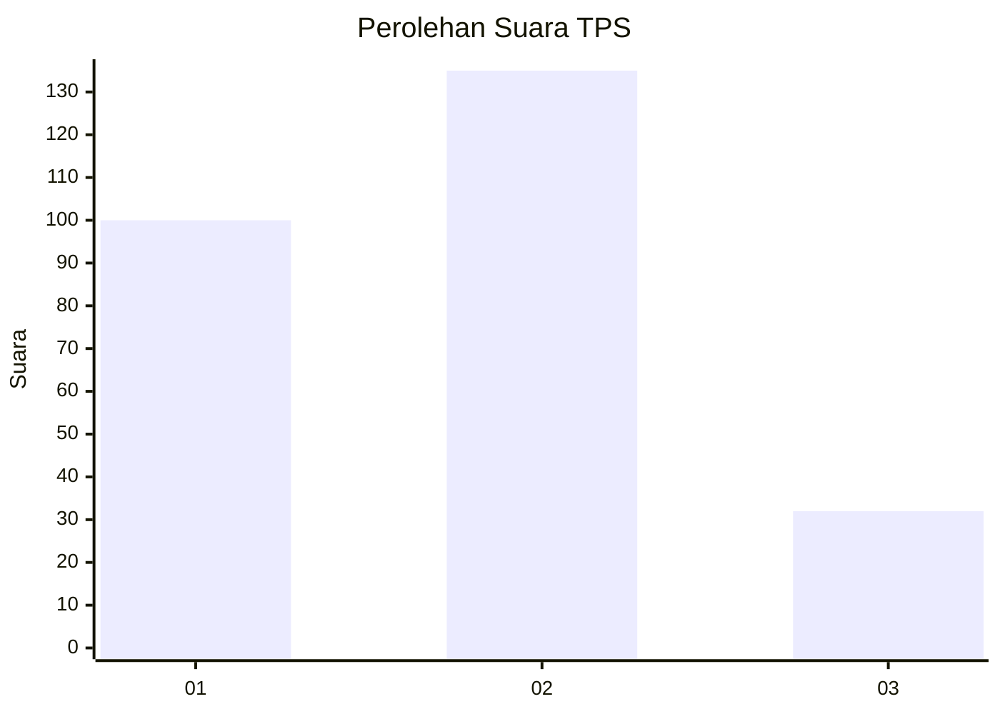
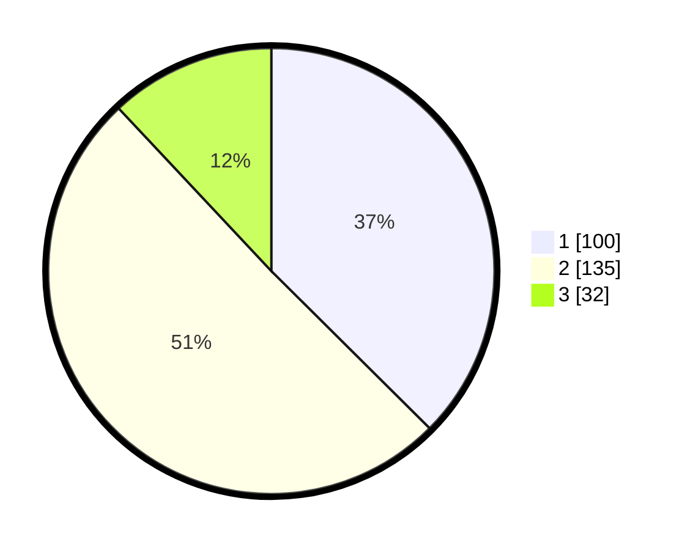

# Hasil

## Grafik

## Tabel

| No. | Nama Paslon    | Suara | Suara (raw) | Persentase |
|:--- |:-------------- | -----:| -----------:| ----------:|
| 1   | ANIES MUHAIMIN | 100   | [100][p-1]  | 37,45      |
| 2   | PRABOWO GIBRAN | 135   | [135][p-2]  | 50,56      |
| 3   | GANJAR MAHFUD  | 32    | [32][p-3]   | 11,99      |

[p-1]: https://github.com/gigit-pemilu/pemilu-2024-35-jawa-timur/blob/main/pilpres/hitung-suara/sub/35-jawa-timur/sub/02-ponorogo/sub/10-siman/sub/1017-ronowijayan/sub/002-tps/sub/paslon-1.txt
[p-2]: https://github.com/gigit-pemilu/pemilu-2024-35-jawa-timur/blob/main/pilpres/hitung-suara/sub/35-jawa-timur/sub/02-ponorogo/sub/10-siman/sub/1017-ronowijayan/sub/002-tps/sub/paslon-2.txt
[p-3]: https://github.com/gigit-pemilu/pemilu-2024-35-jawa-timur/blob/main/pilpres/hitung-suara/sub/35-jawa-timur/sub/02-ponorogo/sub/10-siman/sub/1017-ronowijayan/sub/002-tps/sub/paslon-3.txt

## Foto C Plano

https://sirekap-obj-formc.kpu.go.id/7ee0/pemilu/ppwp/35/02/10/10/17/3502101017002-20240218-163450--3ae4a95a-d10c-4fff-918c-f636ba4c2ac6.jpg

https://sirekap-obj-formc.kpu.go.id/7ee0/pemilu/ppwp/35/02/10/10/17/3502101017002-20240214-230755--d88ada45-a0e5-4e31-b33d-5914d7dc02f4.jpg

https://sirekap-obj-formc.kpu.go.id/7ee0/pemilu/ppwp/35/02/10/10/17/3502101017002-20240214-230833--5c0f55a0-a282-43a1-b2e1-ac4682ce240a.jpg

## Metadata

| Key        | Value               |
| ---------- | ------------------- |
| Time Stamp | 2024-02-19 06:16:00 |

