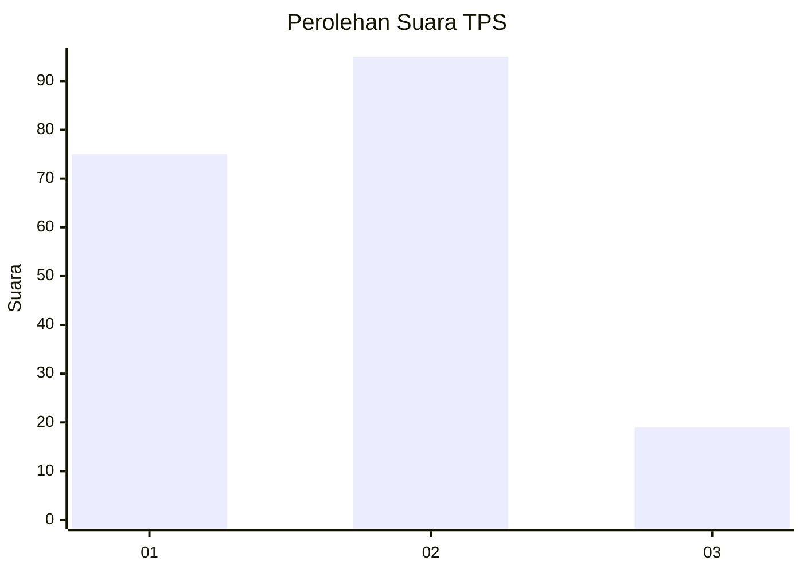
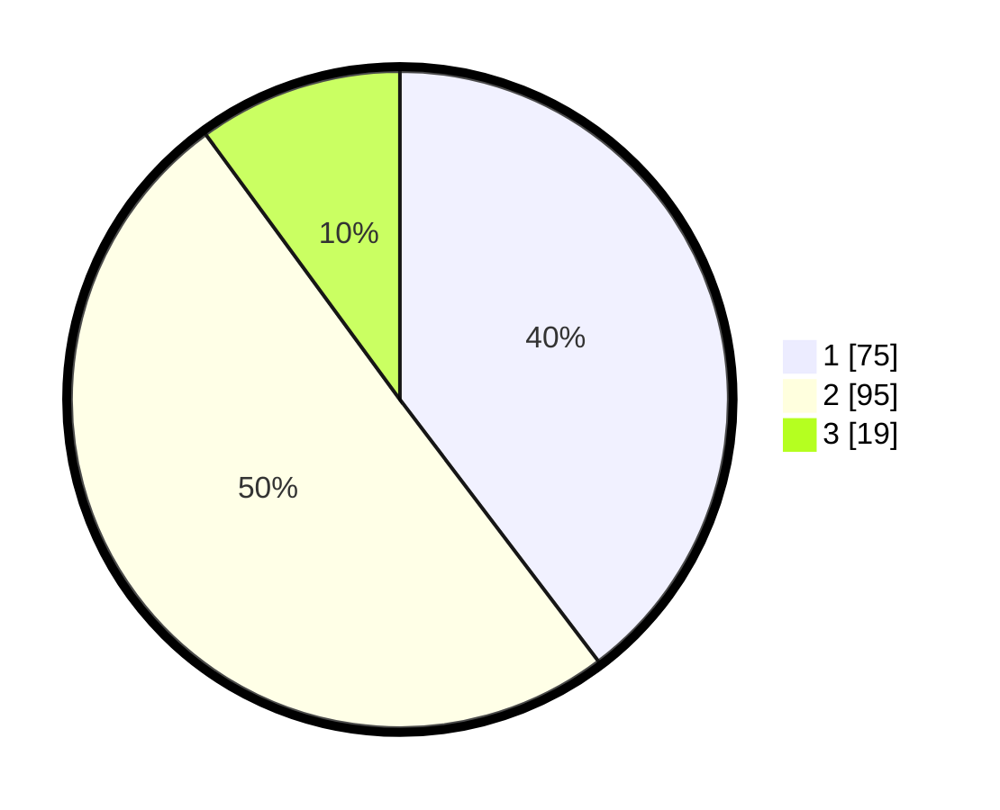

# Hasil

## Grafik

## Tabel

| No. | Nama Paslon    | Suara | Suara (raw) | Persentase |
|:--- |:-------------- | -----:| -----------:| ----------:|
| 1   | ANIES MUHAIMIN | 75    | [75][p-1]   | 39,68      |
| 2   | PRABOWO GIBRAN | 95    | [95][p-2]   | 50,26      |
| 3   | GANJAR MAHFUD  | 19    | [19][p-3]   | 10,05      |

[p-1]: https://github.com/gigit-pemilu/pemilu-2024-35-jawa-timur/blob/main/pilpres/hitung-suara/sub/35-jawa-timur/sub/02-ponorogo/sub/10-siman/sub/1017-ronowijayan/sub/004-tps/sub/paslon-1.txt
[p-2]: https://github.com/gigit-pemilu/pemilu-2024-35-jawa-timur/blob/main/pilpres/hitung-suara/sub/35-jawa-timur/sub/02-ponorogo/sub/10-siman/sub/1017-ronowijayan/sub/004-tps/sub/paslon-2.txt
[p-3]: https://github.com/gigit-pemilu/pemilu-2024-35-jawa-timur/blob/main/pilpres/hitung-suara/sub/35-jawa-timur/sub/02-ponorogo/sub/10-siman/sub/1017-ronowijayan/sub/004-tps/sub/paslon-3.txt

## Foto C Plano

https://sirekap-obj-formc.kpu.go.id/d47d/pemilu/ppwp/35/02/10/10/17/3502101017004-20240214-234227--48996ba9-092b-40da-884a-11f03b209e25.jpg

https://sirekap-obj-formc.kpu.go.id/d47d/pemilu/ppwp/35/02/10/10/17/3502101017004-20240214-234350--85586930-9925-4b3b-b11b-308faed1ec01.jpg

https://sirekap-obj-formc.kpu.go.id/d47d/pemilu/ppwp/35/02/10/10/17/3502101017004-20240214-234440--258d14d9-4d03-4d94-a43f-8febe8e2fed8.jpg

## Metadata

| Key        | Value               |
| ---------- | ------------------- |
| Time Stamp | 2024-02-15 18:00:26 |

