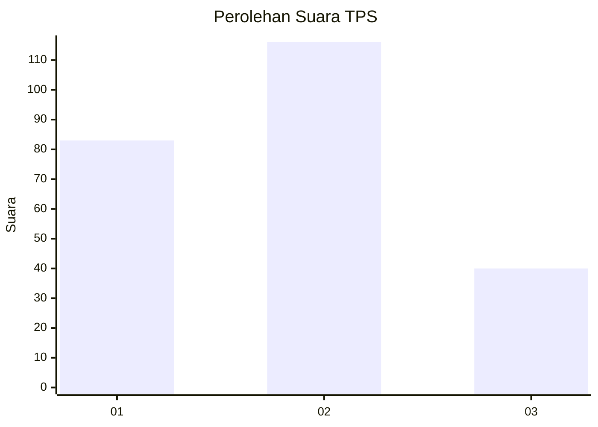
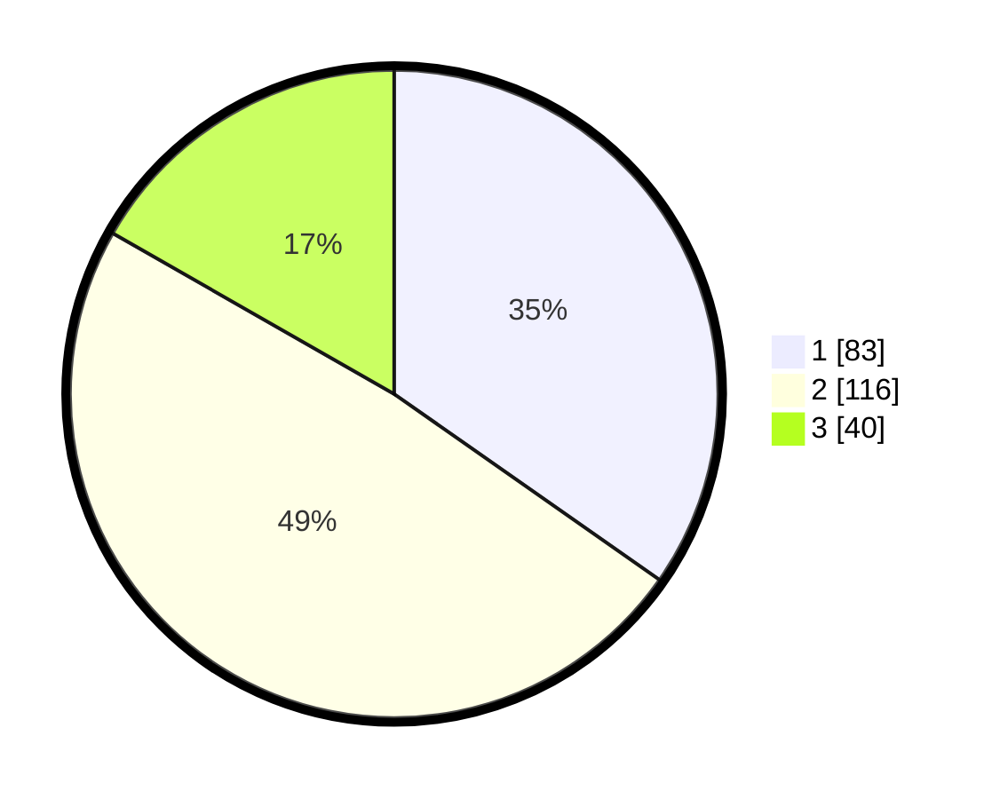

# Hasil

## Grafik

## Tabel

| No. | Nama Paslon    | Suara | Suara (raw) | Persentase |
|:--- |:-------------- | -----:| -----------:| ----------:|
| 1   | ANIES MUHAIMIN | 83    | [83][p-1]   | 34,73      |
| 2   | PRABOWO GIBRAN | 116   | [116][p-2]  | 48,54      |
| 3   | GANJAR MAHFUD  | 40    | [40][p-3]   | 16,74      |

[p-1]: https://github.com/gigit-pemilu/pemilu-2024/blob/main/pilpres/hitung-suara/sub/35-jawa-timur/sub/02-ponorogo/sub/10-siman/sub/1017-ronowijayan/sub/005-tps/sub/paslon-1.txt
[p-2]: https://github.com/gigit-pemilu/pemilu-2024/blob/main/pilpres/hitung-suara/sub/35-jawa-timur/sub/02-ponorogo/sub/10-siman/sub/1017-ronowijayan/sub/005-tps/sub/paslon-2.txt
[p-3]: https://github.com/gigit-pemilu/pemilu-2024/blob/main/pilpres/hitung-suara/sub/35-jawa-timur/sub/02-ponorogo/sub/10-siman/sub/1017-ronowijayan/sub/005-tps/sub/paslon-3.txt

## Foto C Plano

https://sirekap-obj-formc.kpu.go.id/50ba/pemilu/ppwp/35/02/10/10/17/3502101017005-20240223-145036--6fd28a0d-bcf0-4211-9f43-af2672e3cee8.jpg

https://sirekap-obj-formc.kpu.go.id/50ba/pemilu/ppwp/35/02/10/10/17/3502101017005-20240223-143540--dab4e6d5-d0de-4f66-83a1-349f72dd8219.jpg

https://sirekap-obj-formc.kpu.go.id/50ba/pemilu/ppwp/35/02/10/10/17/3502101017005-20240223-143838--e3077942-a04f-4eda-b2aa-346f1d4706b0.jpg

## Metadata

| Key        | Value               |
| ---------- | ------------------- |
| Time Stamp | 2024-02-27 22:00:00 |

