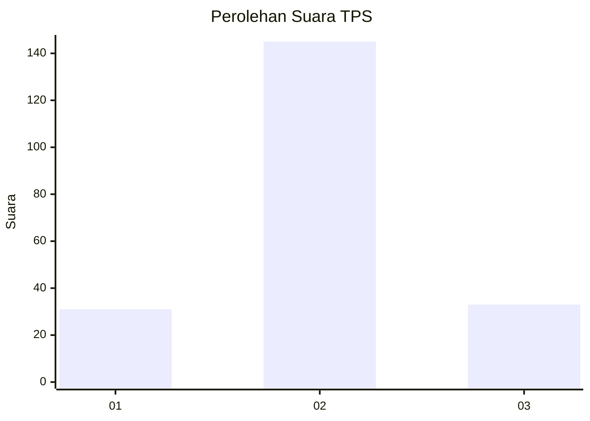

# Hasil

## Grafik

## Tabel

| No. | Nama Paslon    | Suara | Suara (raw) | Persentase |
|:--- |:-------------- | -----:| -----------:| ----------:|
| 1   | ANIES MUHAIMIN | 31    | [31][p-1]   | 14,83      |
| 2   | PRABOWO GIBRAN | 145   | [145][p-2]  | 69,38      |
| 3   | GANJAR MAHFUD  | 33    | [33][p-3]   | 15,79      |

[p-1]: https://github.com/gigit-pemilu/pemilu-2024/blob/main/pilpres/hitung-suara/sub/35-jawa-timur/sub/02-ponorogo/sub/10-siman/sub/1017-ronowijayan/sub/007-tps/sub/paslon-1.txt
[p-2]: https://github.com/gigit-pemilu/pemilu-2024/blob/main/pilpres/hitung-suara/sub/35-jawa-timur/sub/02-ponorogo/sub/10-siman/sub/1017-ronowijayan/sub/007-tps/sub/paslon-2.txt
[p-3]: https://github.com/gigit-pemilu/pemilu-2024/blob/main/pilpres/hitung-suara/sub/35-jawa-timur/sub/02-ponorogo/sub/10-siman/sub/1017-ronowijayan/sub/007-tps/sub/paslon-3.txt

## Foto C Plano

https://sirekap-obj-formc.kpu.go.id/f002/pemilu/ppwp/35/02/10/10/17/3502101017007-20240214-200722--0e639287-033c-4617-9be0-36cca5f879c9.jpg

https://sirekap-obj-formc.kpu.go.id/f002/pemilu/ppwp/35/02/10/10/17/3502101017007-20240214-202320--3ef847f9-dea3-4fef-99f3-4897503c0762.jpg

https://sirekap-obj-formc.kpu.go.id/f002/pemilu/ppwp/35/02/10/10/17/3502101017007-20240214-201041--61cdbe57-ea9a-474d-a1f0-d974b22c5c4b.jpg

## Metadata

| Key        | Value               |
| ---------- | ------------------- |
| Time Stamp | 2024-02-15 00:41:44 |

