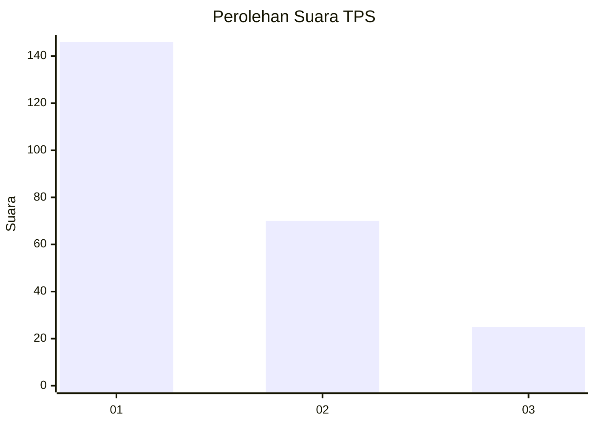
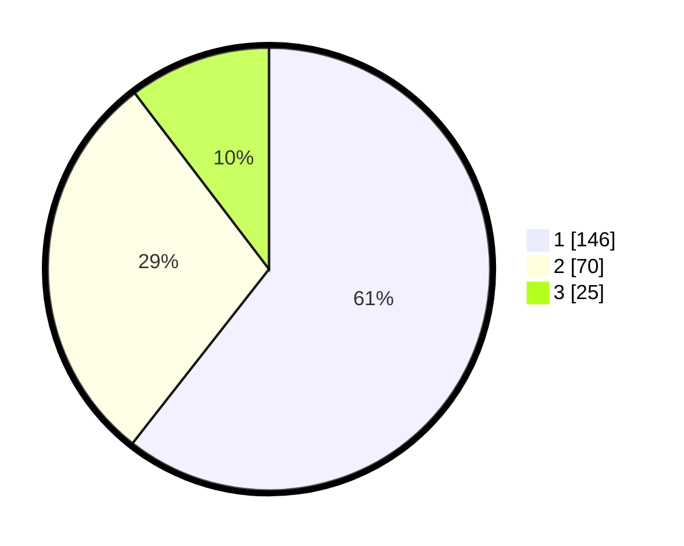

# Hasil

## Grafik

## Tabel

| No. | Nama Paslon    | Suara | Suara (raw) | Persentase |
|:--- |:-------------- | -----:| -----------:| ----------:|
| 1   | ANIES MUHAIMIN | 146   | [146][p-1]  | 60,58      |
| 2   | PRABOWO GIBRAN | 70    | [70][p-2]   | 29,05      |
| 3   | GANJAR MAHFUD  | 25    | [25][p-3]   | 10,37      |

[p-1]: https://github.com/gigit-pemilu/pemilu-2024/blob/main/pilpres/hitung-suara/sub/35-jawa-timur/sub/02-ponorogo/sub/10-siman/sub/2002-ngabar/sub/001-tps/sub/paslon-1.txt
[p-2]: https://github.com/gigit-pemilu/pemilu-2024/blob/main/pilpres/hitung-suara/sub/35-jawa-timur/sub/02-ponorogo/sub/10-siman/sub/2002-ngabar/sub/001-tps/sub/paslon-2.txt
[p-3]: https://github.com/gigit-pemilu/pemilu-2024/blob/main/pilpres/hitung-suara/sub/35-jawa-timur/sub/02-ponorogo/sub/10-siman/sub/2002-ngabar/sub/001-tps/sub/paslon-3.txt

## Foto C Plano

https://sirekap-obj-formc.kpu.go.id/5640/pemilu/ppwp/35/02/10/20/02/3502102002001-20240215-014224--86eb459c-887c-4743-a108-17c6b80a94d4.jpg

https://sirekap-obj-formc.kpu.go.id/5640/pemilu/ppwp/35/02/10/20/02/3502102002001-20240218-210156--8598c6a1-900c-4d2b-b4e6-e8525219632b.jpg

https://sirekap-obj-formc.kpu.go.id/5640/pemilu/ppwp/35/02/10/20/02/3502102002001-20240218-210406--64c68e6d-c8a4-419d-a935-dd1eba41fe6f.jpg

## Metadata

| Key        | Value               |
| ---------- | ------------------- |
| Time Stamp | 2024-02-19 06:16:00 |

## DATA PEMILIH TETAP

Jumlah pemilih dalam DPT: **265**.
 * L: **125**.
 * P: **140**.

## DATA PENGGUNA HAK PILIH

Jumlah pengguna hak pilih dalam DPT: **227**.
 * L: **104**.
 * P: **123**.

Jumlah pengguna hak pilih dalam DPTb: **17**.
 * L: **2**.
 * P: **15**.

Jumlah pengguna hak pilih dalam DPK: **0**.
 * L: **0**.
 * P: **0**.

Jumlah pengguna hak pilih: **244**.
 * L: **106**.
 * P: **138**.

## JUMLAH SUARA SAH DAN TIDAK SAH

JUMLAH SELURUH SUARA SAH: **241**.

JUMLAH SUARA TIDAK SAH: **3**.

JUMLAH SELURUH SUARA SAH DAN SUARA TIDAK SAH: **244**.

