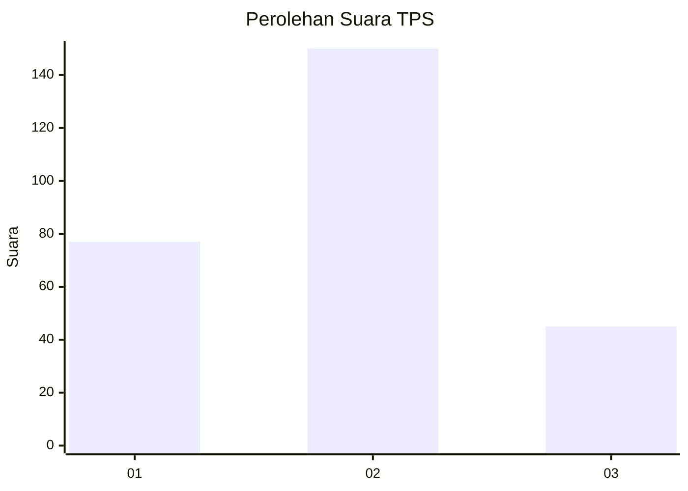
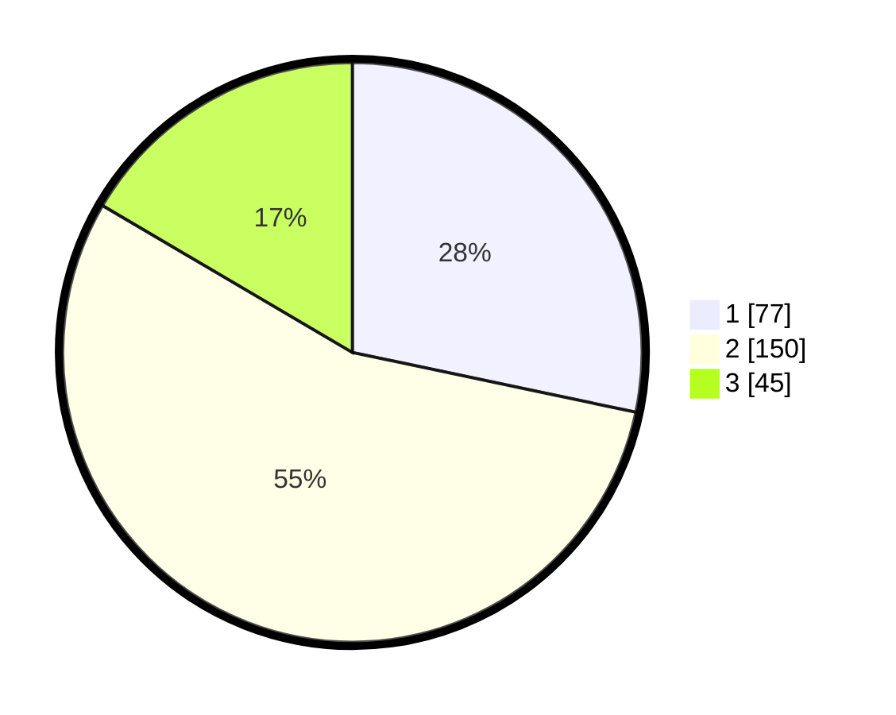

# Hasil

## Grafik

## Tabel

| No. | Nama Paslon    | Suara | Suara (raw) | Persentase |
|:--- |:-------------- | -----:| -----------:| ----------:|
| 1   | ANIES MUHAIMIN | 77    | [77][p-1]   | 28,31      |
| 2   | PRABOWO GIBRAN | 150   | [150][p-2]  | 55,15      |
| 3   | GANJAR MAHFUD  | 45    | [45][p-3]   | 16,54      |

[p-1]: https://github.com/gigit-pemilu/pemilu-2024-35-jawa-timur/blob/main/pilpres/hitung-suara/sub/35-jawa-timur/sub/02-ponorogo/sub/10-siman/sub/2003-madusari/sub/001-tps/sub/paslon-1.txt
[p-2]: https://github.com/gigit-pemilu/pemilu-2024-35-jawa-timur/blob/main/pilpres/hitung-suara/sub/35-jawa-timur/sub/02-ponorogo/sub/10-siman/sub/2003-madusari/sub/001-tps/sub/paslon-2.txt
[p-3]: https://github.com/gigit-pemilu/pemilu-2024-35-jawa-timur/blob/main/pilpres/hitung-suara/sub/35-jawa-timur/sub/02-ponorogo/sub/10-siman/sub/2003-madusari/sub/001-tps/sub/paslon-3.txt

## Foto C Plano

https://sirekap-obj-formc.kpu.go.id/4645/pemilu/ppwp/35/02/10/20/03/3502102003001-20240214-155458--dd0cf24b-7457-4313-a9dc-4ad54f7c2afd.jpg

https://sirekap-obj-formc.kpu.go.id/4645/pemilu/ppwp/35/02/10/20/03/3502102003001-20240214-155639--7fdbdaa0-5700-4cb9-bd55-44f7ef3bde78.jpg

https://sirekap-obj-formc.kpu.go.id/4645/pemilu/ppwp/35/02/10/20/03/3502102003001-20240214-185401--1947a851-dd1c-4136-9648-c556febd13c5.jpg

## Metadata

| Key        | Value               |
| ---------- | ------------------- |
| Time Stamp | 2024-02-14 21:46:01 |

## DATA PEMILIH TETAP

Jumlah pemilih dalam DPT: **292**.
 * L: **151**.
 * P: **141**.

## DATA PENGGUNA HAK PILIH

Jumlah pengguna hak pilih dalam DPT: **257**.
 * L: **128**.
 * P: **129**.

Jumlah pengguna hak pilih dalam DPTb: **19**.
 * L: **19**.
 * P: **0**.

Jumlah pengguna hak pilih dalam DPK: **2**.
 * L: **1**.
 * P: **1**.

Jumlah pengguna hak pilih: **278**.
 * L: **148**.
 * P: **130**.

## JUMLAH SUARA SAH DAN TIDAK SAH

JUMLAH SELURUH SUARA SAH: **272**.

JUMLAH SUARA TIDAK SAH: **6**.

JUMLAH SELURUH SUARA SAH DAN SUARA TIDAK SAH: **278**.

