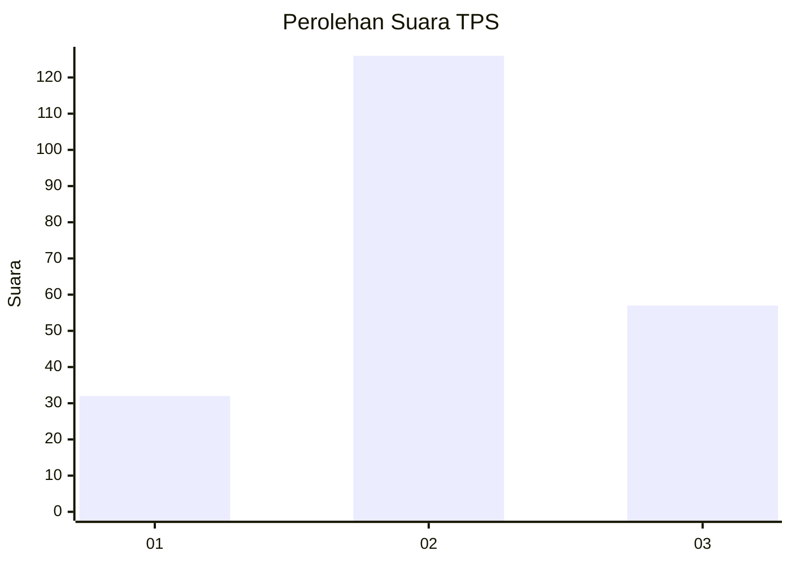
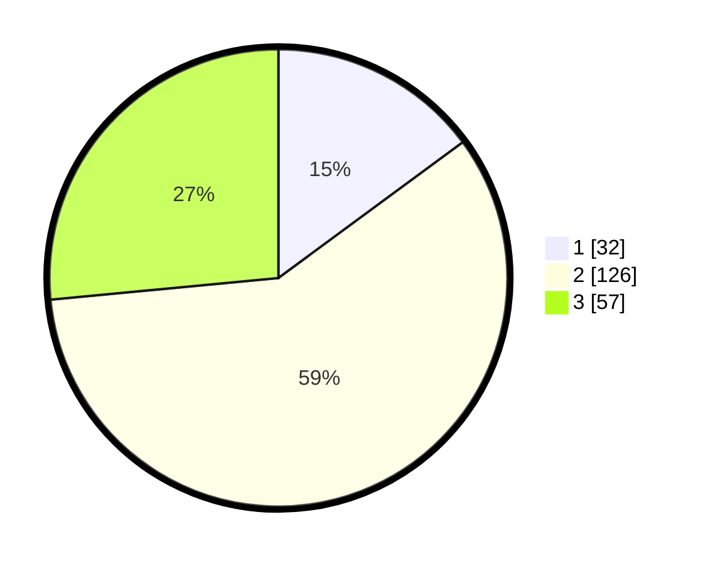

# Hasil

## Grafik

## Tabel

| No. | Nama Paslon    | Suara | Suara (raw) | Persentase |
|:--- |:-------------- | -----:| -----------:| ----------:|
| 1   | ANIES MUHAIMIN | 32    | [32][p-1]   | 14,88      |
| 2   | PRABOWO GIBRAN | 126   | [126][p-2]  | 58,60      |
| 3   | GANJAR MAHFUD  | 57    | [57][p-3]   | 26,51      |

[p-1]: https://github.com/gigit-pemilu/pemilu-2024/blob/main/pilpres/hitung-suara/sub/35-jawa-timur/sub/02-ponorogo/sub/10-siman/sub/2004-beton/sub/002-tps/sub/paslon-1.txt
[p-2]: https://github.com/gigit-pemilu/pemilu-2024/blob/main/pilpres/hitung-suara/sub/35-jawa-timur/sub/02-ponorogo/sub/10-siman/sub/2004-beton/sub/002-tps/sub/paslon-2.txt
[p-3]: https://github.com/gigit-pemilu/pemilu-2024/blob/main/pilpres/hitung-suara/sub/35-jawa-timur/sub/02-ponorogo/sub/10-siman/sub/2004-beton/sub/002-tps/sub/paslon-3.txt

## Foto C Plano

https://sirekap-obj-formc.kpu.go.id/c6b4/pemilu/ppwp/35/02/10/20/04/3502102004002-20240219-094837--6a8e4852-6d3e-4f56-ab9a-859101f7240b.jpg

https://sirekap-obj-formc.kpu.go.id/c6b4/pemilu/ppwp/35/02/10/20/04/3502102004002-20240219-093512--d1337137-b7b3-4ed3-b9d7-d04ce072d24f.jpg

https://sirekap-obj-formc.kpu.go.id/c6b4/pemilu/ppwp/35/02/10/20/04/3502102004002-20240219-093553--374535eb-2e7b-4ec1-be9d-28130d326210.jpg

## Metadata

| Key        | Value               |
| ---------- | ------------------- |
| Time Stamp | 2024-02-19 11:00:00 |

