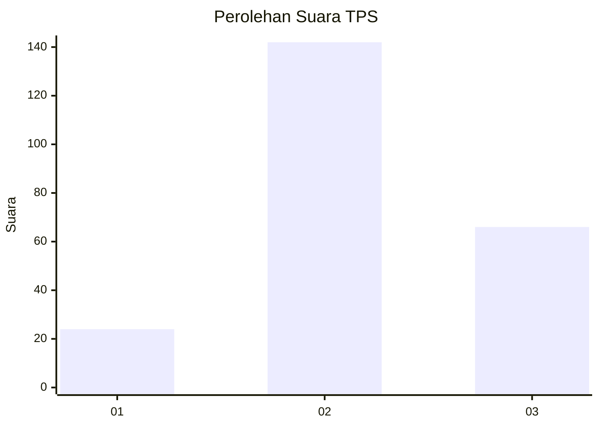
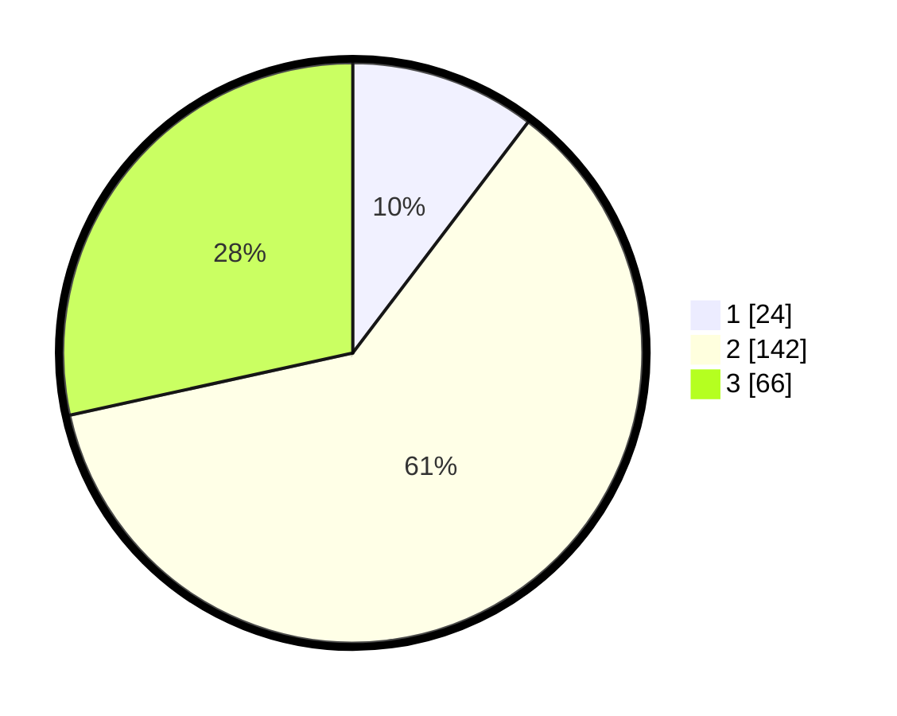

# Hasil

## Grafik

## Tabel

| No. | Nama Paslon    | Suara | Suara (raw) | Persentase |
|:--- |:-------------- | -----:| -----------:| ----------:|
| 1   | ANIES MUHAIMIN | 24    | [24][p-1]   | 10,34      |
| 2   | PRABOWO GIBRAN | 142   | [142][p-2]  | 61,21      |
| 3   | GANJAR MAHFUD  | 66    | [66][p-3]   | 28,45      |

[p-1]: https://github.com/gigit-pemilu/pemilu-2024/blob/main/pilpres/hitung-suara/sub/35-jawa-timur/sub/02-ponorogo/sub/10-siman/sub/2005-sekaran/sub/001-tps/sub/paslon-1.txt
[p-2]: https://github.com/gigit-pemilu/pemilu-2024/blob/main/pilpres/hitung-suara/sub/35-jawa-timur/sub/02-ponorogo/sub/10-siman/sub/2005-sekaran/sub/001-tps/sub/paslon-2.txt
[p-3]: https://github.com/gigit-pemilu/pemilu-2024/blob/main/pilpres/hitung-suara/sub/35-jawa-timur/sub/02-ponorogo/sub/10-siman/sub/2005-sekaran/sub/001-tps/sub/paslon-3.txt

## Foto C Plano

https://sirekap-obj-formc.kpu.go.id/e486/pemilu/ppwp/35/02/10/20/05/3502102005001-20240219-125058--03427898-0245-4e49-b12a-1499a3ffb88e.jpg

https://sirekap-obj-formc.kpu.go.id/e486/pemilu/ppwp/35/02/10/20/05/3502102005001-20240219-134518--fab13d07-eb13-46da-9cc1-e2d4dbfd02ba.jpg

https://sirekap-obj-formc.kpu.go.id/e486/pemilu/ppwp/35/02/10/20/05/3502102005001-20240215-011725--80bf1f39-d0f1-4e8c-a002-d4fbff43ae3c.jpg

## Metadata

| Key        | Value               |
| ---------- | ------------------- |
| Time Stamp | 2024-02-19 17:00:00 |

