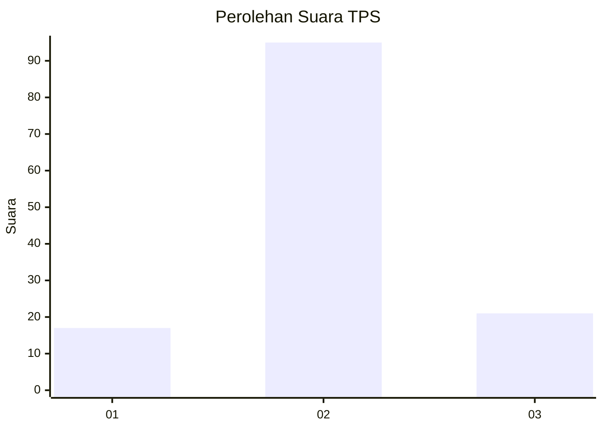

# Hasil

## Grafik

## Tabel

| No. | Nama Paslon    | Suara | Suara (raw) | Persentase |
|:--- |:-------------- | -----:| -----------:| ----------:|
| 1   | ANIES MUHAIMIN | 17    | [17][p-1]   | 12,78      |
| 2   | PRABOWO GIBRAN | 95    | [95][p-2]   | 71,43      |
| 3   | GANJAR MAHFUD  | 21    | [21][p-3]   | 15,79      |

[p-1]: https://github.com/gigit-pemilu/pemilu-2024/blob/main/pilpres/hitung-suara/sub/35-jawa-timur/sub/02-ponorogo/sub/10-siman/sub/2009-jarak/sub/007-tps/sub/paslon-1.txt
[p-2]: https://github.com/gigit-pemilu/pemilu-2024/blob/main/pilpres/hitung-suara/sub/35-jawa-timur/sub/02-ponorogo/sub/10-siman/sub/2009-jarak/sub/007-tps/sub/paslon-2.txt
[p-3]: https://github.com/gigit-pemilu/pemilu-2024/blob/main/pilpres/hitung-suara/sub/35-jawa-timur/sub/02-ponorogo/sub/10-siman/sub/2009-jarak/sub/007-tps/sub/paslon-3.txt

## Foto C Plano

https://sirekap-obj-formc.kpu.go.id/6315/pemilu/ppwp/35/02/10/20/09/3502102009007-20240214-204633--a9b9c504-d5b1-46b3-bc59-dcb91839059b.jpg

https://sirekap-obj-formc.kpu.go.id/6315/pemilu/ppwp/35/02/10/20/09/3502102009007-20240214-204859--85281543-5a25-49be-9b66-af921cf049e7.jpg

https://sirekap-obj-formc.kpu.go.id/6315/pemilu/ppwp/35/02/10/20/09/3502102009007-20240214-205026--5ac7c8fb-f949-42f3-a4ab-c75944e281ef.jpg

## Metadata

| Key        | Value               |
| ---------- | ------------------- |
| Time Stamp | 2024-02-16 16:25:10 |

