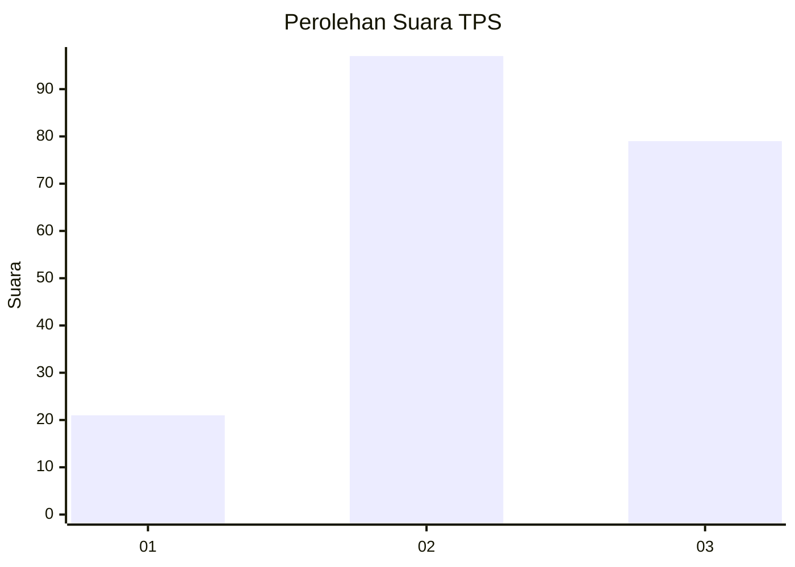
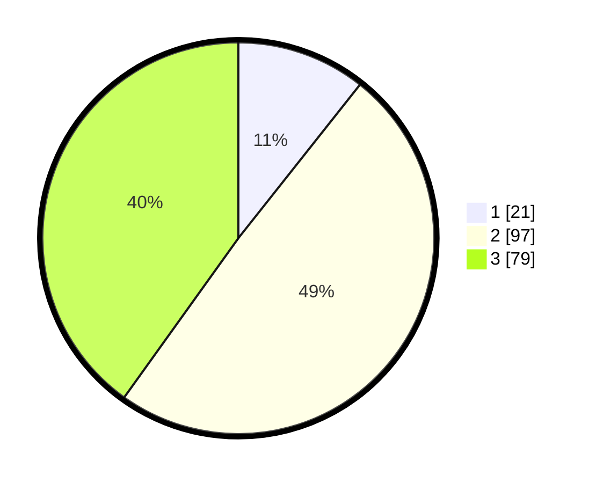

# Hasil

## Grafik

## Tabel

| No. | Nama Paslon    | Suara | Suara (raw) | Persentase |
|:--- |:-------------- | -----:| -----------:| ----------:|
| 1   | ANIES MUHAIMIN | 21    | [21][p-1]   | 10,66      |
| 2   | PRABOWO GIBRAN | 97    | [97][p-2]   | 49,24      |
| 3   | GANJAR MAHFUD  | 79    | [79][p-3]   | 40,10      |

[p-1]: https://github.com/gigit-pemilu/pemilu-2024/blob/main/pilpres/hitung-suara/sub/35-jawa-timur/sub/02-ponorogo/sub/10-siman/sub/2011-pijeran/sub/001-tps/sub/paslon-1.txt
[p-2]: https://github.com/gigit-pemilu/pemilu-2024/blob/main/pilpres/hitung-suara/sub/35-jawa-timur/sub/02-ponorogo/sub/10-siman/sub/2011-pijeran/sub/001-tps/sub/paslon-2.txt
[p-3]: https://github.com/gigit-pemilu/pemilu-2024/blob/main/pilpres/hitung-suara/sub/35-jawa-timur/sub/02-ponorogo/sub/10-siman/sub/2011-pijeran/sub/001-tps/sub/paslon-3.txt

## Foto C Plano

https://sirekap-obj-formc.kpu.go.id/7774/pemilu/ppwp/35/02/10/20/11/3502102011001-20240214-233515--767671d7-93ed-4d9e-92c5-b9e2c5fa20e8.jpg

https://sirekap-obj-formc.kpu.go.id/7774/pemilu/ppwp/35/02/10/20/11/3502102011001-20240214-233520--56c915e4-86b9-47a4-badf-d5cd3c6e5226.jpg

https://sirekap-obj-formc.kpu.go.id/7774/pemilu/ppwp/35/02/10/20/11/3502102011001-20240214-233524--103e099a-109c-4bd3-a194-0d9958bedc85.jpg

## Metadata

| Key        | Value               |
| ---------- | ------------------- |
| Time Stamp | 2024-02-16 13:00:29 |

