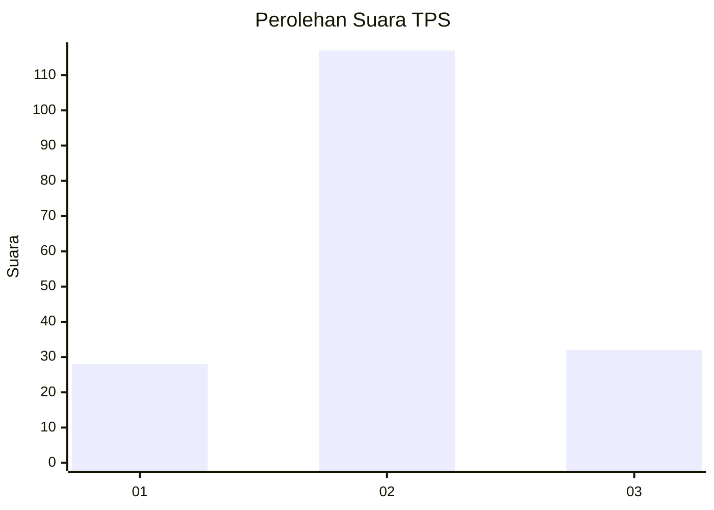
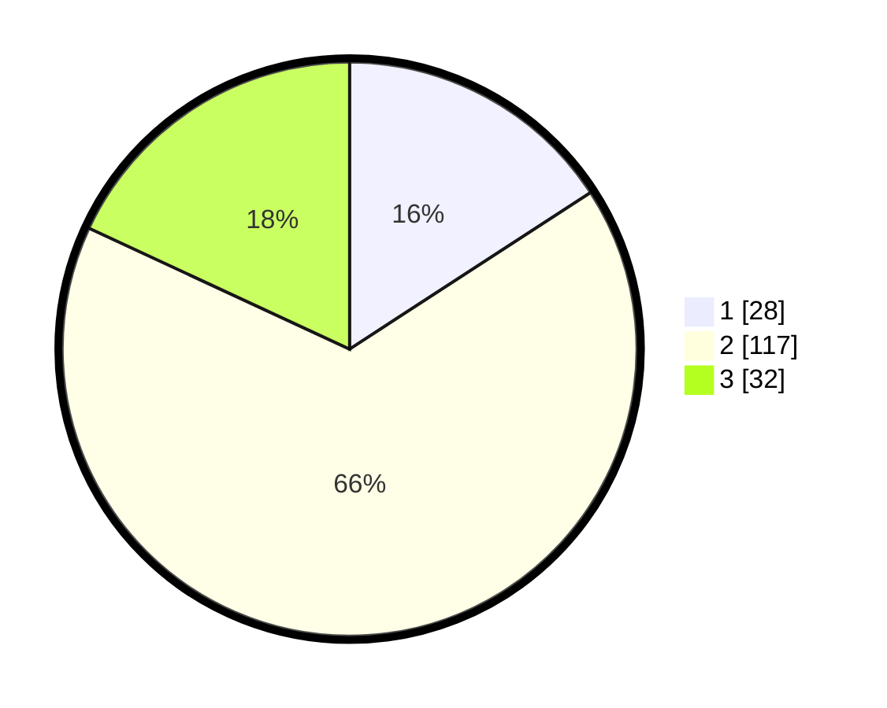

# Hasil

## Grafik

## Tabel

| No. | Nama Paslon    | Suara | Suara (raw) | Persentase |
|:--- |:-------------- | -----:| -----------:| ----------:|
| 1   | ANIES MUHAIMIN | 28    | [28][p-1]   | 15,82      |
| 2   | PRABOWO GIBRAN | 117   | [117][p-2]  | 66,10      |
| 3   | GANJAR MAHFUD  | 32    | [32][p-3]   | 18,08      |

[p-1]: https://github.com/gigit-pemilu/pemilu-2024/blob/main/pilpres/hitung-suara/sub/35-jawa-timur/sub/02-ponorogo/sub/10-siman/sub/2011-pijeran/sub/007-tps/sub/paslon-1.txt
[p-2]: https://github.com/gigit-pemilu/pemilu-2024/blob/main/pilpres/hitung-suara/sub/35-jawa-timur/sub/02-ponorogo/sub/10-siman/sub/2011-pijeran/sub/007-tps/sub/paslon-2.txt
[p-3]: https://github.com/gigit-pemilu/pemilu-2024/blob/main/pilpres/hitung-suara/sub/35-jawa-timur/sub/02-ponorogo/sub/10-siman/sub/2011-pijeran/sub/007-tps/sub/paslon-3.txt

## Foto C Plano

https://sirekap-obj-formc.kpu.go.id/ab5f/pemilu/ppwp/35/02/10/20/11/3502102011007-20240216-055247--84c10523-075a-41e2-adfe-af359be2b63b.jpg

https://sirekap-obj-formc.kpu.go.id/ab5f/pemilu/ppwp/35/02/10/20/11/3502102011007-20240217-091244--7c7a7935-4bf5-4430-9aaa-dbdb6b65b6b1.jpg

https://sirekap-obj-formc.kpu.go.id/ab5f/pemilu/ppwp/35/02/10/20/11/3502102011007-20240219-083219--65ad7f39-689a-4822-a722-2dd75b005f78.jpg

## Metadata

| Key        | Value               |
| ---------- | ------------------- |
| Time Stamp | 2024-02-19 09:00:00 |

