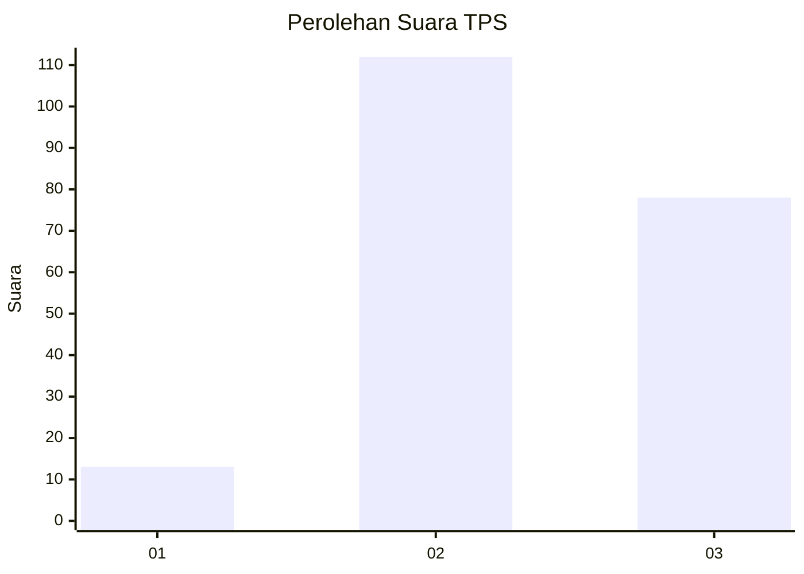
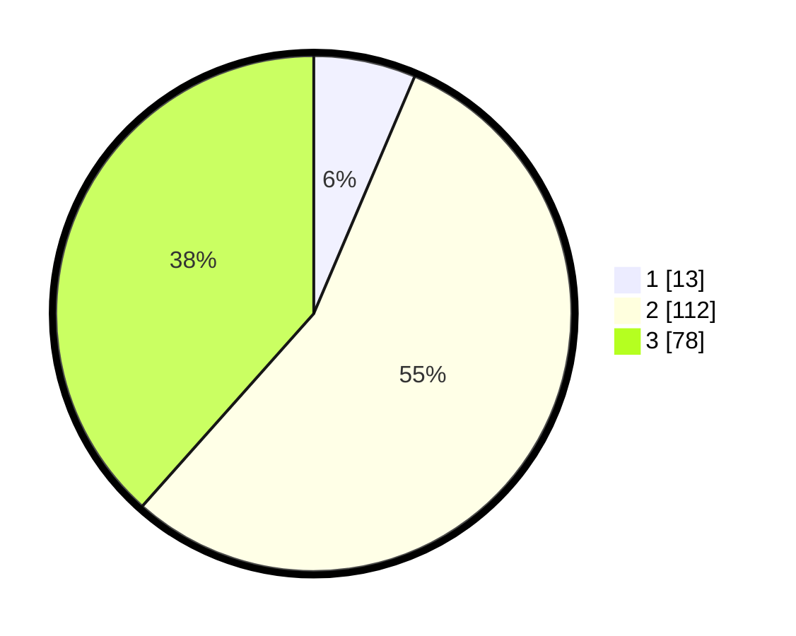

# Hasil

## Grafik

## Tabel

| No. | Nama Paslon    | Suara | Suara (raw) | Persentase |
|:--- |:-------------- | -----:| -----------:| ----------:|
| 1   | ANIES MUHAIMIN | 13    | [13][p-1]   | 6,40       |
| 2   | PRABOWO GIBRAN | 112   | [112][p-2]  | 55,17      |
| 3   | GANJAR MAHFUD  | 78    | [78][p-3]   | 38,42      |

[p-1]: https://github.com/gigit-pemilu/pemilu-2024/blob/main/pilpres/hitung-suara/sub/35-jawa-timur/sub/02-ponorogo/sub/10-siman/sub/2013-siman/sub/002-tps/sub/paslon-1.txt
[p-2]: https://github.com/gigit-pemilu/pemilu-2024/blob/main/pilpres/hitung-suara/sub/35-jawa-timur/sub/02-ponorogo/sub/10-siman/sub/2013-siman/sub/002-tps/sub/paslon-2.txt
[p-3]: https://github.com/gigit-pemilu/pemilu-2024/blob/main/pilpres/hitung-suara/sub/35-jawa-timur/sub/02-ponorogo/sub/10-siman/sub/2013-siman/sub/002-tps/sub/paslon-3.txt

## Foto C Plano

https://sirekap-obj-formc.kpu.go.id/5b4a/pemilu/ppwp/35/02/10/20/13/3502102013002-20240220-073810--3dc47c09-eb9c-41b5-a5a1-4c13f09d6b70.jpg

https://sirekap-obj-formc.kpu.go.id/5b4a/pemilu/ppwp/35/02/10/20/13/3502102013002-20240219-194125--29d86d39-7c1c-4081-9aa0-09374a1a7c60.jpg

https://sirekap-obj-formc.kpu.go.id/5b4a/pemilu/ppwp/35/02/10/20/13/3502102013002-20240219-201510--44de8b0d-b064-46cf-8846-a2bf158e0de7.jpg

## Metadata

| Key        | Value               |
| ---------- | ------------------- |
| Time Stamp | 2024-02-20 16:00:00 |

