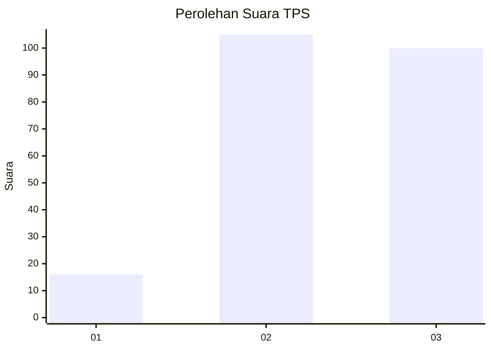
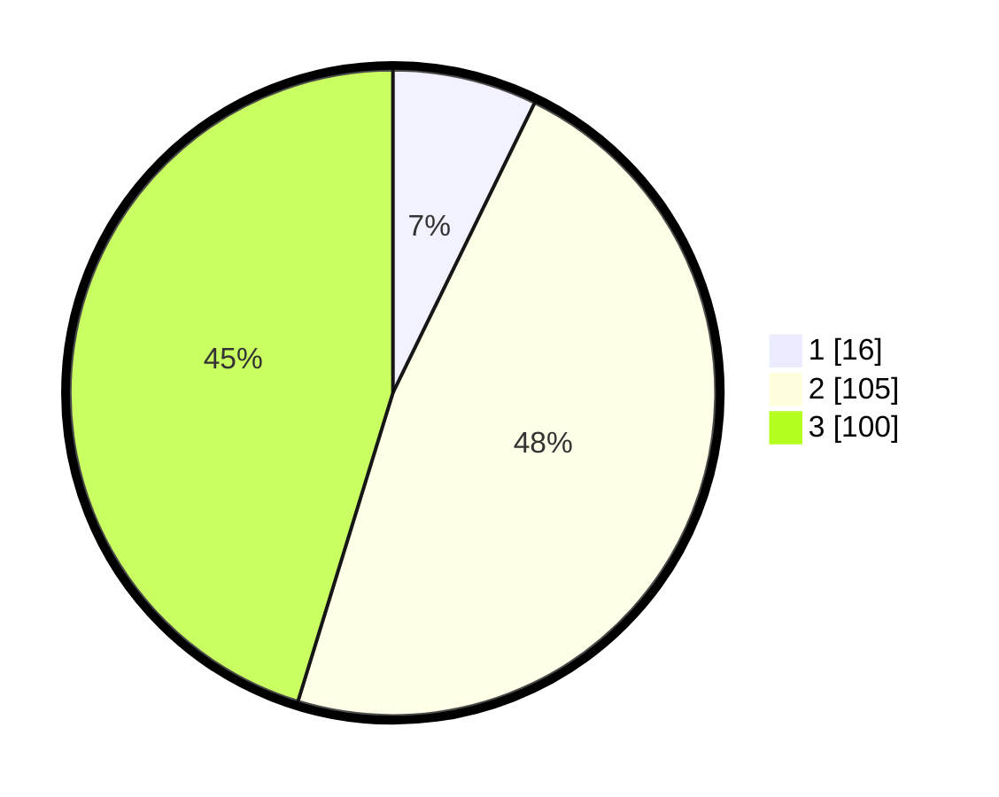

# Hasil

## Grafik

## Tabel

| No. | Nama Paslon    | Suara | Suara (raw) | Persentase |
|:--- |:-------------- | -----:| -----------:| ----------:|
| 1   | ANIES MUHAIMIN | 16    | [16][p-1]   | 7,24       |
| 2   | PRABOWO GIBRAN | 105   | [105][p-2]  | 47,51      |
| 3   | GANJAR MAHFUD  | 100   | [100][p-3]  | 45,25      |

[p-1]: https://github.com/gigit-pemilu/pemilu-2024/blob/main/pilpres/hitung-suara/sub/35-jawa-timur/sub/02-ponorogo/sub/10-siman/sub/2016-tajug/sub/004-tps/sub/paslon-1.txt
[p-2]: https://github.com/gigit-pemilu/pemilu-2024/blob/main/pilpres/hitung-suara/sub/35-jawa-timur/sub/02-ponorogo/sub/10-siman/sub/2016-tajug/sub/004-tps/sub/paslon-2.txt
[p-3]: https://github.com/gigit-pemilu/pemilu-2024/blob/main/pilpres/hitung-suara/sub/35-jawa-timur/sub/02-ponorogo/sub/10-siman/sub/2016-tajug/sub/004-tps/sub/paslon-3.txt

## Foto C Plano

https://sirekap-obj-formc.kpu.go.id/e3e5/pemilu/ppwp/35/02/10/20/16/3502102016004-20240214-235734--8901b268-9960-4479-be6b-5a671b2740f6.jpg

https://sirekap-obj-formc.kpu.go.id/e3e5/pemilu/ppwp/35/02/10/20/16/3502102016004-20240215-000126--e546edb5-b5a0-4f23-8a2a-04f5c8575397.jpg

https://sirekap-obj-formc.kpu.go.id/e3e5/pemilu/ppwp/35/02/10/20/16/3502102016004-20240215-000433--a1e41439-83f6-4d74-8386-490e452e855e.jpg

## Metadata

| Key        | Value               |
| ---------- | ------------------- |
| Time Stamp | 2024-02-15 23:29:50 |

