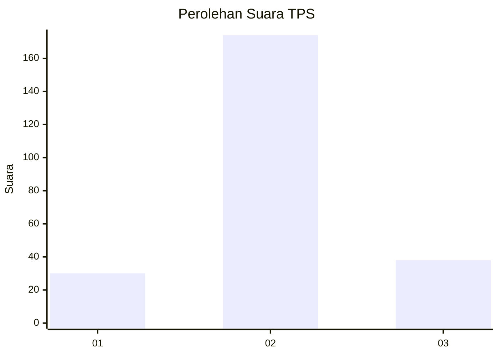
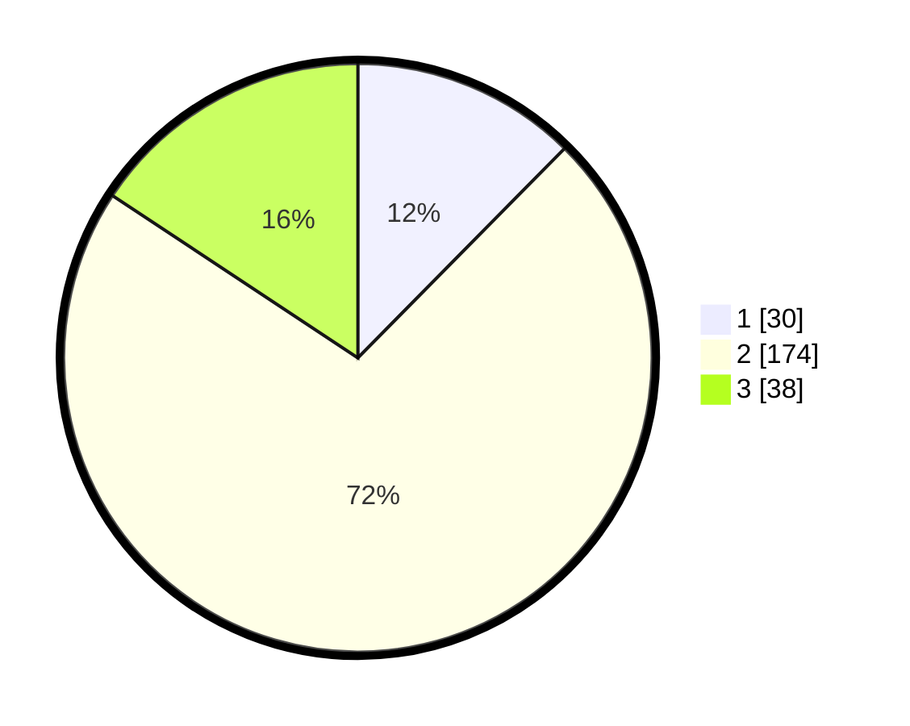

# Hasil

## Grafik

## Tabel

| No. | Nama Paslon    | Suara | Suara (raw) | Persentase |
|:--- |:-------------- | -----:| -----------:| ----------:|
| 1   | ANIES MUHAIMIN | 30    | [30][p-1]   | 12,40      |
| 2   | PRABOWO GIBRAN | 174   | [174][p-2]  | 71,90      |
| 3   | GANJAR MAHFUD  | 38    | [38][p-3]   | 15,70      |

[p-1]: https://github.com/gigit-pemilu/pemilu-2024-35-jawa-timur/blob/main/pilpres/hitung-suara/sub/35-jawa-timur/sub/02-ponorogo/sub/11-balong/sub/2007-ngumpul/sub/006-tps/sub/paslon-1.txt
[p-2]: https://github.com/gigit-pemilu/pemilu-2024-35-jawa-timur/blob/main/pilpres/hitung-suara/sub/35-jawa-timur/sub/02-ponorogo/sub/11-balong/sub/2007-ngumpul/sub/006-tps/sub/paslon-2.txt
[p-3]: https://github.com/gigit-pemilu/pemilu-2024-35-jawa-timur/blob/main/pilpres/hitung-suara/sub/35-jawa-timur/sub/02-ponorogo/sub/11-balong/sub/2007-ngumpul/sub/006-tps/sub/paslon-3.txt

## Foto C Plano

https://sirekap-obj-formc.kpu.go.id/23d2/pemilu/ppwp/35/02/11/20/07/3502112007006-20240220-210945--1fbd01f6-2fa5-4b62-ad4f-50b8032d8f18.jpg

https://sirekap-obj-formc.kpu.go.id/23d2/pemilu/ppwp/35/02/11/20/07/3502112007006-20240223-154046--5d4b9f2d-450b-43f1-82d2-1ade7c999bdd.jpg

https://sirekap-obj-formc.kpu.go.id/23d2/pemilu/ppwp/35/02/11/20/07/3502112007006-20240223-232503--e598966f-ac4e-42f9-a008-0d33eb61e736.jpg

## Metadata

| Key        | Value               |
| ---------- | ------------------- |
| Time Stamp | 2024-02-24 22:31:28 |

