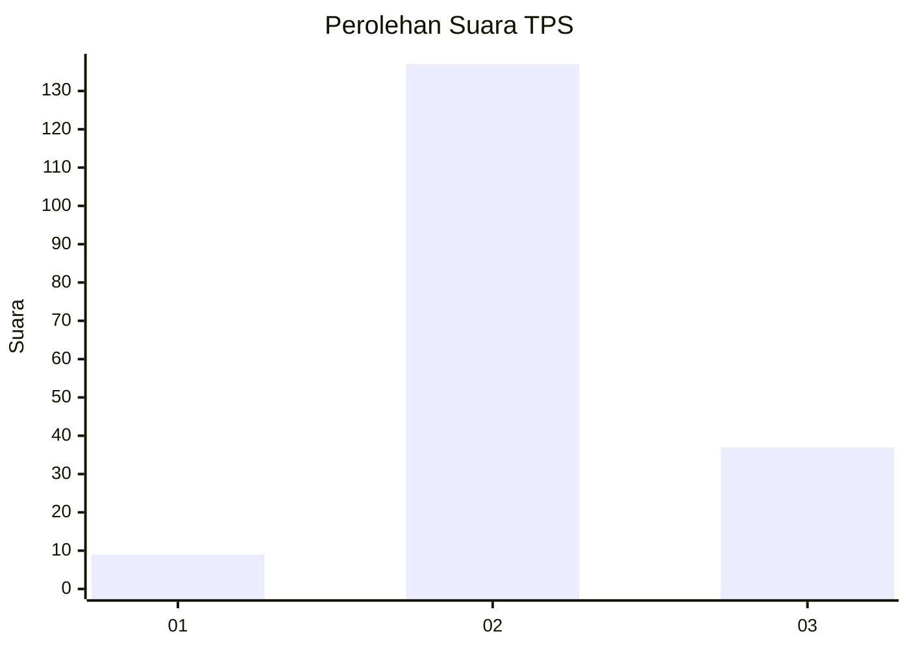

# Hasil

## Grafik

## Tabel

| No. | Nama Paslon    | Suara | Suara (raw) | Persentase |
|:--- |:-------------- | -----:| -----------:| ----------:|
| 1   | ANIES MUHAIMIN | 9     | [9][p-1]    | 4,92       |
| 2   | PRABOWO GIBRAN | 137   | [137][p-2]  | 74,86      |
| 3   | GANJAR MAHFUD  | 37    | [37][p-3]   | 20,22      |

[p-1]: https://github.com/gigit-pemilu/pemilu-2024/blob/main/pilpres/hitung-suara/sub/35-jawa-timur/sub/02-ponorogo/sub/12-kauman/sub/2014-plosojenar/sub/009-tps/sub/paslon-1.txt
[p-2]: https://github.com/gigit-pemilu/pemilu-2024/blob/main/pilpres/hitung-suara/sub/35-jawa-timur/sub/02-ponorogo/sub/12-kauman/sub/2014-plosojenar/sub/009-tps/sub/paslon-2.txt
[p-3]: https://github.com/gigit-pemilu/pemilu-2024/blob/main/pilpres/hitung-suara/sub/35-jawa-timur/sub/02-ponorogo/sub/12-kauman/sub/2014-plosojenar/sub/009-tps/sub/paslon-3.txt

## Foto C Plano

https://sirekap-obj-formc.kpu.go.id/8750/pemilu/ppwp/35/02/12/20/14/3502122014009-20240215-020130--7337ffda-8c8e-4886-b3b5-f4264ff7a7ae.jpg

https://sirekap-obj-formc.kpu.go.id/8750/pemilu/ppwp/35/02/12/20/14/3502122014009-20240215-020225--5cfcebe8-e514-4c89-ab46-8b8270834d8c.jpg

https://sirekap-obj-formc.kpu.go.id/8750/pemilu/ppwp/35/02/12/20/14/3502122014009-20240215-000501--ba1c8d35-c286-4c39-b0bd-378dafa4f5cf.jpg

## Metadata

| Key        | Value               |
| ---------- | ------------------- |
| Time Stamp | 2024-02-15 15:00:29 |

