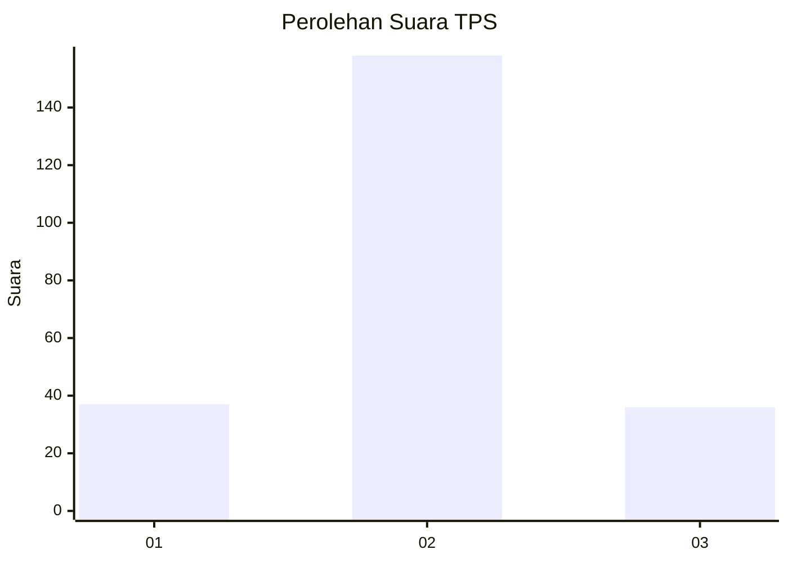
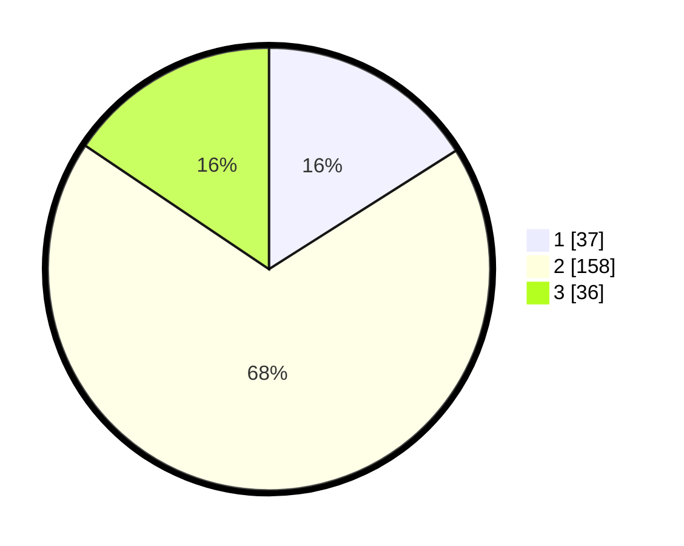

# Hasil

## Grafik

## Tabel

| No. | Nama Paslon    | Suara | Suara (raw) | Persentase |
|:--- |:-------------- | -----:| -----------:| ----------:|
| 1   | ANIES MUHAIMIN | 37    | [37][p-1]   | 16,02      |
| 2   | PRABOWO GIBRAN | 158   | [158][p-2]  | 68,40      |
| 3   | GANJAR MAHFUD  | 36    | [36][p-3]   | 15,58      |

[p-1]: https://github.com/gigit-pemilu/pemilu-2024-35-jawa-timur/blob/main/pilpres/hitung-suara/sub/35-jawa-timur/sub/02-ponorogo/sub/12-kauman/sub/2015-carat/sub/009-tps/sub/paslon-1.txt
[p-2]: https://github.com/gigit-pemilu/pemilu-2024-35-jawa-timur/blob/main/pilpres/hitung-suara/sub/35-jawa-timur/sub/02-ponorogo/sub/12-kauman/sub/2015-carat/sub/009-tps/sub/paslon-2.txt
[p-3]: https://github.com/gigit-pemilu/pemilu-2024-35-jawa-timur/blob/main/pilpres/hitung-suara/sub/35-jawa-timur/sub/02-ponorogo/sub/12-kauman/sub/2015-carat/sub/009-tps/sub/paslon-3.txt

## Foto C Plano

https://sirekap-obj-formc.kpu.go.id/e621/pemilu/ppwp/35/02/12/20/15/3502122015009-20240218-154328--7051c494-082d-44a3-80e7-ee58e1d2b6fa.jpg

https://sirekap-obj-formc.kpu.go.id/e621/pemilu/ppwp/35/02/12/20/15/3502122015009-20240218-155104--11b1dbac-5e3e-45d2-afe8-d62abca6233f.jpg

https://sirekap-obj-formc.kpu.go.id/e621/pemilu/ppwp/35/02/12/20/15/3502122015009-20240218-155548--76446f6b-2c1b-4b46-ada7-ca9a2586269c.jpg

## Metadata

| Key        | Value               |
| ---------- | ------------------- |
| Time Stamp | 2024-02-19 06:16:00 |

