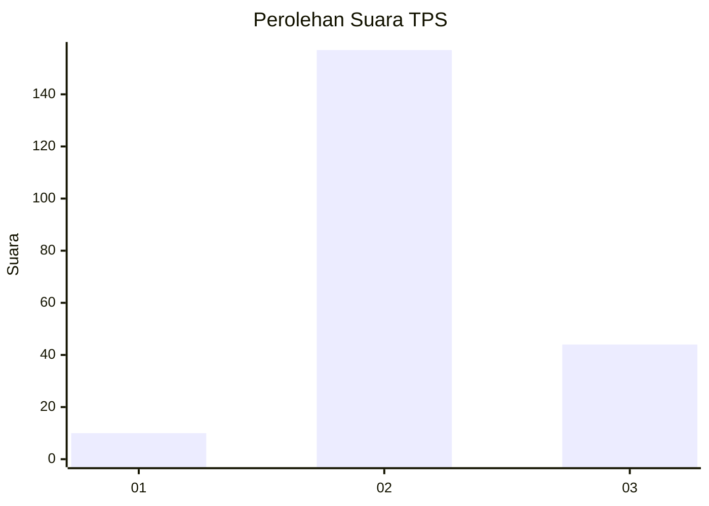

# Hasil

## Grafik

## Tabel

| No. | Nama Paslon    | Suara | Suara (raw) | Persentase |
|:--- |:-------------- | -----:| -----------:| ----------:|
| 1   | ANIES MUHAIMIN | 10    | [10][p-1]   | 4,74       |
| 2   | PRABOWO GIBRAN | 157   | [157][p-2]  | 74,41      |
| 3   | GANJAR MAHFUD  | 44    | [44][p-3]   | 20,85      |

[p-1]: https://github.com/gigit-pemilu/pemilu-2024-35-jawa-timur/blob/main/pilpres/hitung-suara/sub/35-jawa-timur/sub/02-ponorogo/sub/12-kauman/sub/2016-kauman/sub/007-tps/sub/paslon-1.txt
[p-2]: https://github.com/gigit-pemilu/pemilu-2024-35-jawa-timur/blob/main/pilpres/hitung-suara/sub/35-jawa-timur/sub/02-ponorogo/sub/12-kauman/sub/2016-kauman/sub/007-tps/sub/paslon-2.txt
[p-3]: https://github.com/gigit-pemilu/pemilu-2024-35-jawa-timur/blob/main/pilpres/hitung-suara/sub/35-jawa-timur/sub/02-ponorogo/sub/12-kauman/sub/2016-kauman/sub/007-tps/sub/paslon-3.txt

## Foto C Plano

https://sirekap-obj-formc.kpu.go.id/de88/pemilu/ppwp/35/02/12/20/16/3502122016007-20240222-092839--92551112-bb6f-474f-8680-8b8fd7f2c666.jpg

https://sirekap-obj-formc.kpu.go.id/de88/pemilu/ppwp/35/02/12/20/16/3502122016007-20240222-093028--b5a79cf6-7281-4fc4-b705-6ee26bc446ae.jpg

https://sirekap-obj-formc.kpu.go.id/de88/pemilu/ppwp/35/02/12/20/16/3502122016007-20240222-093025--5fca8228-3e77-49c9-8bc0-9a421112e465.jpg

## Metadata

| Key        | Value               |
| ---------- | ------------------- |
| Time Stamp | 2024-02-25 16:00:00 |

