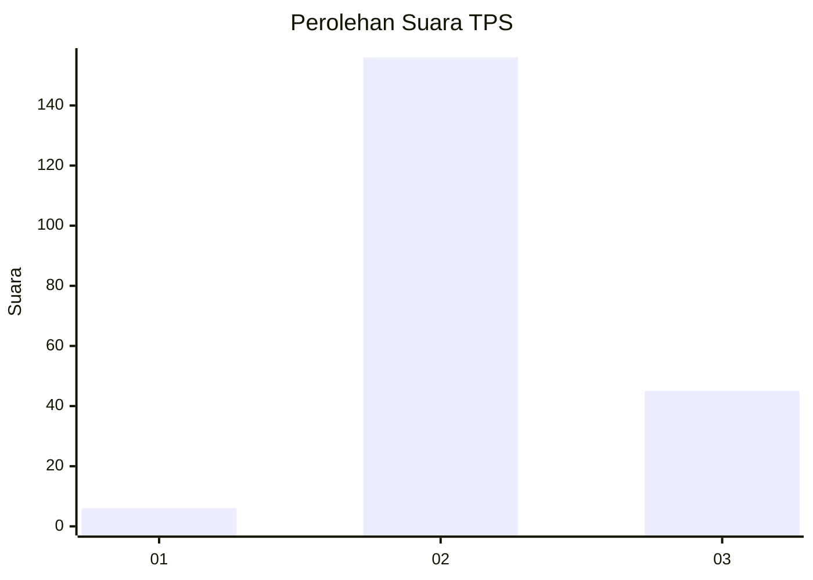

# Hasil

## Grafik

## Tabel

| No. | Nama Paslon    | Suara | Suara (raw) | Persentase |
|:--- |:-------------- | -----:| -----------:| ----------:|
| 1   | ANIES MUHAIMIN | 6     | [6][p-1]    | 2,90       |
| 2   | PRABOWO GIBRAN | 156   | [156][p-2]  | 75,36      |
| 3   | GANJAR MAHFUD  | 45    | [45][p-3]   | 21,74      |

[p-1]: https://github.com/gigit-pemilu/pemilu-2024-35-jawa-timur/blob/main/pilpres/hitung-suara/sub/35-jawa-timur/sub/02-ponorogo/sub/13-badegan/sub/2010-badegan/sub/001-tps/sub/paslon-1.txt
[p-2]: https://github.com/gigit-pemilu/pemilu-2024-35-jawa-timur/blob/main/pilpres/hitung-suara/sub/35-jawa-timur/sub/02-ponorogo/sub/13-badegan/sub/2010-badegan/sub/001-tps/sub/paslon-2.txt
[p-3]: https://github.com/gigit-pemilu/pemilu-2024-35-jawa-timur/blob/main/pilpres/hitung-suara/sub/35-jawa-timur/sub/02-ponorogo/sub/13-badegan/sub/2010-badegan/sub/001-tps/sub/paslon-3.txt

## Foto C Plano

https://sirekap-obj-formc.kpu.go.id/79de/pemilu/ppwp/35/02/13/20/10/3502132010001-20240214-234008--19e0d573-b9de-4e30-9a8d-d22633fa1020.jpg

https://sirekap-obj-formc.kpu.go.id/79de/pemilu/ppwp/35/02/13/20/10/3502132010001-20240214-234025--a49dc9da-7f11-4fed-b879-9df49154489c.jpg

https://sirekap-obj-formc.kpu.go.id/79de/pemilu/ppwp/35/02/13/20/10/3502132010001-20240214-234224--b56df957-33d3-462c-b807-e499f3c7f1c3.jpg

## Metadata

| Key        | Value               |
| ---------- | ------------------- |
| Time Stamp | 2024-02-15 09:00:24 |

