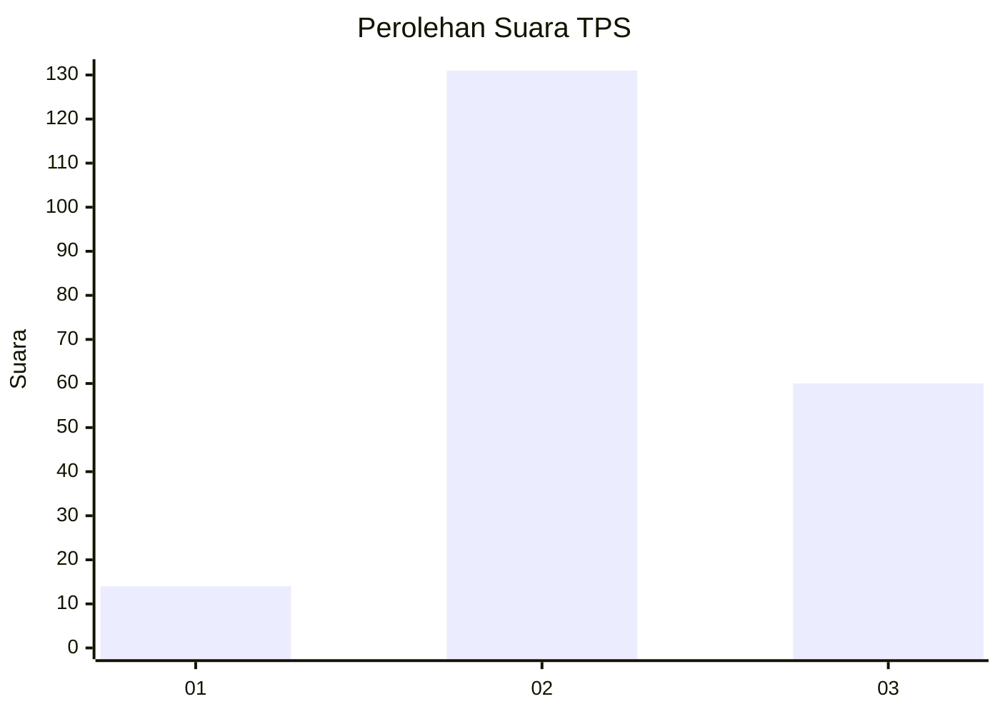
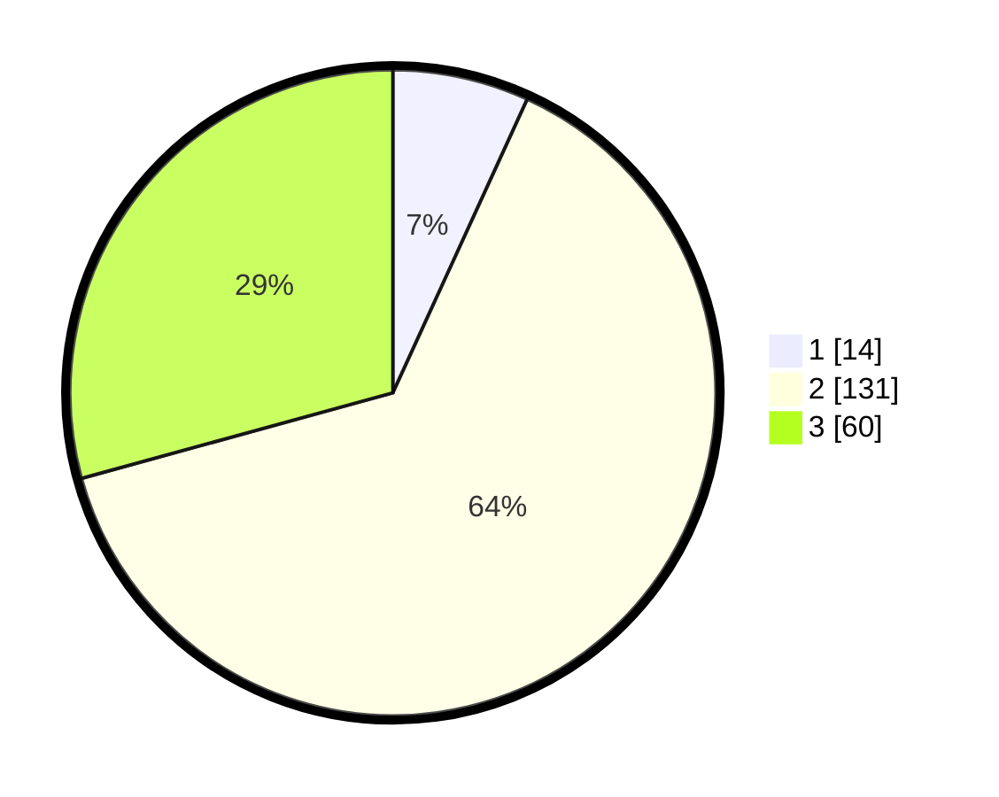

# Hasil

## Grafik

## Tabel

| No. | Nama Paslon    | Suara | Suara (raw) | Persentase |
|:--- |:-------------- | -----:| -----------:| ----------:|
| 1   | ANIES MUHAIMIN | 14    | [14][p-1]   | 6,83       |
| 2   | PRABOWO GIBRAN | 131   | [131][p-2]  | 63,90      |
| 3   | GANJAR MAHFUD  | 60    | [60][p-3]   | 29,27      |

[p-1]: https://github.com/gigit-pemilu/pemilu-2024/blob/main/pilpres/hitung-suara/sub/35-jawa-timur/sub/02-ponorogo/sub/14-sampung/sub/2003-jenangan/sub/003-tps/sub/paslon-1.txt
[p-2]: https://github.com/gigit-pemilu/pemilu-2024/blob/main/pilpres/hitung-suara/sub/35-jawa-timur/sub/02-ponorogo/sub/14-sampung/sub/2003-jenangan/sub/003-tps/sub/paslon-2.txt
[p-3]: https://github.com/gigit-pemilu/pemilu-2024/blob/main/pilpres/hitung-suara/sub/35-jawa-timur/sub/02-ponorogo/sub/14-sampung/sub/2003-jenangan/sub/003-tps/sub/paslon-3.txt

## Foto C Plano

https://sirekap-obj-formc.kpu.go.id/9c41/pemilu/ppwp/35/02/14/20/03/3502142003003-20240214-213959--7214fcc3-bb2e-4204-94c6-4b3437992e9b.jpg

https://sirekap-obj-formc.kpu.go.id/9c41/pemilu/ppwp/35/02/14/20/03/3502142003003-20240214-214251--3d924d28-8249-4d36-9f1d-77493956485f.jpg

https://sirekap-obj-formc.kpu.go.id/9c41/pemilu/ppwp/35/02/14/20/03/3502142003003-20240214-214453--a87bbd6e-3cde-4bcf-b1c5-7d760250892c.jpg

## Metadata

| Key        | Value               |
| ---------- | ------------------- |
| Time Stamp | 2024-02-19 06:16:00 |

## DATA PEMILIH TETAP

Jumlah pemilih dalam DPT: **293**.
 * L: **139**.
 * P: **154**.

## DATA PENGGUNA HAK PILIH

Jumlah pengguna hak pilih dalam DPT: **236**.
 * L: **102**.
 * P: **134**.

Jumlah pengguna hak pilih dalam DPTb: **0**.
 * L: **0**.
 * P: **0**.

Jumlah pengguna hak pilih dalam DPK: **3**.
 * L: **3**.
 * P: **0**.

Jumlah pengguna hak pilih: **239**.
 * L: **105**.
 * P: **134**.

## JUMLAH SUARA SAH DAN TIDAK SAH

JUMLAH SELURUH SUARA SAH: **205**.

JUMLAH SUARA TIDAK SAH: **34**.

JUMLAH SELURUH SUARA SAH DAN SUARA TIDAK SAH: **239**.

