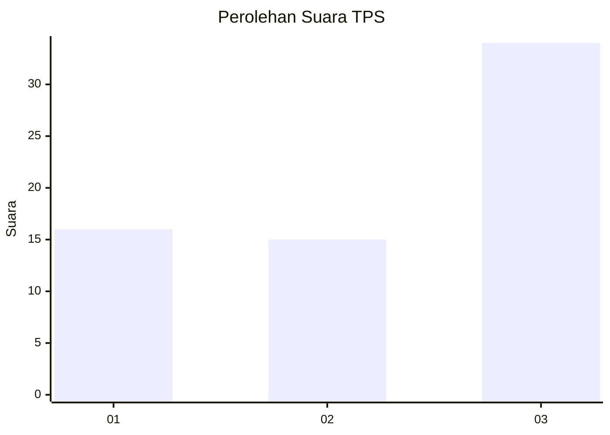
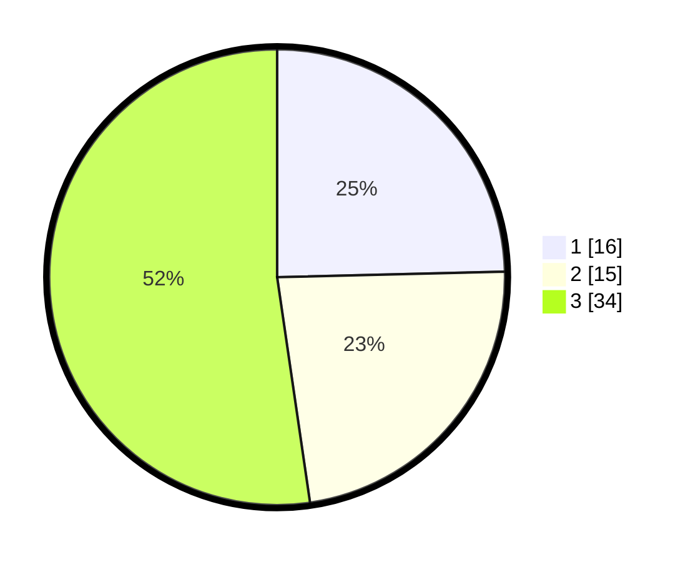

# Hasil

## Grafik

## Tabel

| No. | Nama Paslon    | Suara | Suara (raw) | Persentase |
|:--- |:-------------- | -----:| -----------:| ----------:|
| 1   | ANIES MUHAIMIN | 16    | [16][p-1]   | 24,62      |
| 2   | PRABOWO GIBRAN | 15    | [15][p-2]   | 23,08      |
| 3   | GANJAR MAHFUD  | 34    | [34][p-3]   | 52,31      |

[p-1]: https://github.com/gigit-pemilu/pemilu-2024/blob/main/pilpres/hitung-suara/sub/35-jawa-timur/sub/02-ponorogo/sub/14-sampung/sub/2007-pagerukir/sub/007-tps/sub/paslon-1.txt
[p-2]: https://github.com/gigit-pemilu/pemilu-2024/blob/main/pilpres/hitung-suara/sub/35-jawa-timur/sub/02-ponorogo/sub/14-sampung/sub/2007-pagerukir/sub/007-tps/sub/paslon-2.txt
[p-3]: https://github.com/gigit-pemilu/pemilu-2024/blob/main/pilpres/hitung-suara/sub/35-jawa-timur/sub/02-ponorogo/sub/14-sampung/sub/2007-pagerukir/sub/007-tps/sub/paslon-3.txt

## Foto C Plano

https://sirekap-obj-formc.kpu.go.id/82a9/pemilu/ppwp/35/02/14/20/07/3502142007007-20240215-031406--39b0155f-b3ea-496e-82bf-0bb018012aaa.jpg

https://sirekap-obj-formc.kpu.go.id/82a9/pemilu/ppwp/35/02/14/20/07/3502142007007-20240214-205644--176ef5a8-f150-42dd-8e23-d4f40d1bb5ea.jpg

https://sirekap-obj-formc.kpu.go.id/82a9/pemilu/ppwp/35/02/14/20/07/3502142007007-20240215-031553--c8c9e75e-f58d-4798-9528-768eac34b5e3.jpg

## Metadata

| Key        | Value               |
| ---------- | ------------------- |
| Time Stamp | 2024-02-19 06:16:00 |

## DATA PEMILIH TETAP

Jumlah pemilih dalam DPT: **95**.
 * L: **53**.
 * P: **42**.

## DATA PENGGUNA HAK PILIH

Jumlah pengguna hak pilih dalam DPT: **69**.
 * L: **35**.
 * P: **34**.

Jumlah pengguna hak pilih dalam DPTb: **0**.
 * L: **0**.
 * P: **0**.

Jumlah pengguna hak pilih dalam DPK: **0**.
 * L: **0**.
 * P: **0**.

Jumlah pengguna hak pilih: **69**.
 * L: **35**.
 * P: **34**.

## JUMLAH SUARA SAH DAN TIDAK SAH

JUMLAH SELURUH SUARA SAH: **65**.

JUMLAH SUARA TIDAK SAH: **4**.

JUMLAH SELURUH SUARA SAH DAN SUARA TIDAK SAH: **69**.

