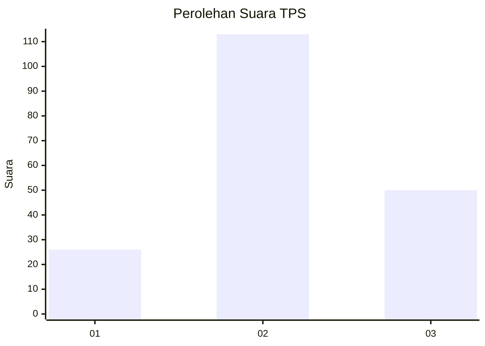
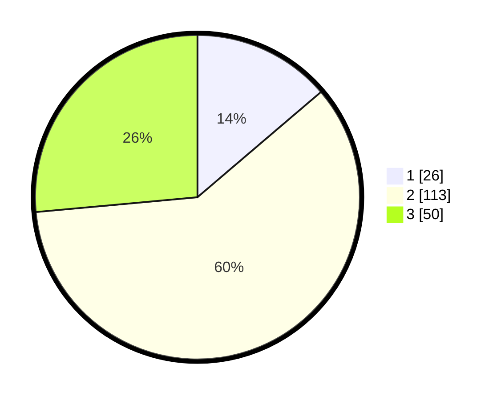

# Hasil

## Grafik

## Tabel

| No. | Nama Paslon    | Suara | Suara (raw) | Persentase |
|:--- |:-------------- | -----:| -----------:| ----------:|
| 1   | ANIES MUHAIMIN | 26    | [26][p-1]   | 13,76      |
| 2   | PRABOWO GIBRAN | 113   | [113][p-2]  | 59,79      |
| 3   | GANJAR MAHFUD  | 50    | [50][p-3]   | 26,46      |

[p-1]: https://github.com/gigit-pemilu/pemilu-2024-35-jawa-timur/blob/main/pilpres/hitung-suara/sub/35-jawa-timur/sub/02-ponorogo/sub/14-sampung/sub/2008-kunti/sub/008-tps/sub/paslon-1.txt
[p-2]: https://github.com/gigit-pemilu/pemilu-2024-35-jawa-timur/blob/main/pilpres/hitung-suara/sub/35-jawa-timur/sub/02-ponorogo/sub/14-sampung/sub/2008-kunti/sub/008-tps/sub/paslon-2.txt
[p-3]: https://github.com/gigit-pemilu/pemilu-2024-35-jawa-timur/blob/main/pilpres/hitung-suara/sub/35-jawa-timur/sub/02-ponorogo/sub/14-sampung/sub/2008-kunti/sub/008-tps/sub/paslon-3.txt

## Foto C Plano

https://sirekap-obj-formc.kpu.go.id/7afe/pemilu/ppwp/35/02/14/20/08/3502142008008-20240220-104846--e00db6de-52ad-4a26-b19a-c4f26499cba1.jpg

https://sirekap-obj-formc.kpu.go.id/7afe/pemilu/ppwp/35/02/14/20/08/3502142008008-20240214-221244--e602cb93-1007-431d-92dc-8a0db2fae675.jpg

https://sirekap-obj-formc.kpu.go.id/7afe/pemilu/ppwp/35/02/14/20/08/3502142008008-20240214-221734--e91950a8-0b6d-4d35-a7d8-ee706712d598.jpg

## Metadata

| Key        | Value               |
| ---------- | ------------------- |
| Time Stamp | 2024-02-20 11:00:00 |

