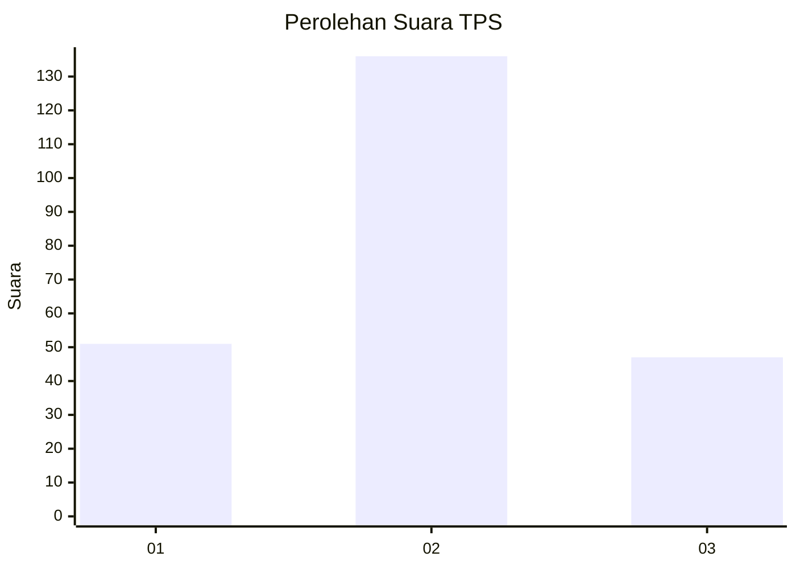
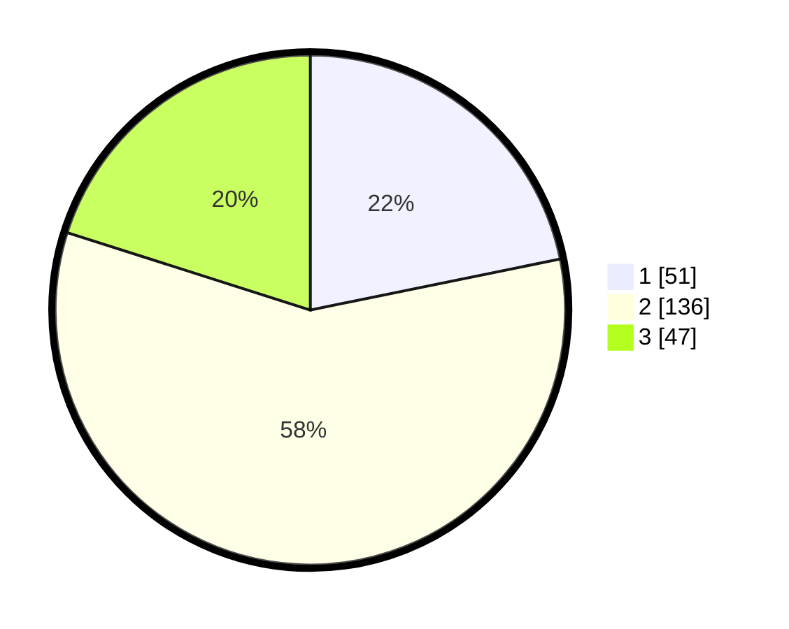

# Hasil

## Grafik

## Tabel

| No. | Nama Paslon    | Suara | Suara (raw) | Persentase |
|:--- |:-------------- | -----:| -----------:| ----------:|
| 1   | ANIES MUHAIMIN | 51    | [51][p-1]   | 21,79      |
| 2   | PRABOWO GIBRAN | 136   | [136][p-2]  | 58,12      |
| 3   | GANJAR MAHFUD  | 47    | [47][p-3]   | 20,09      |

[p-1]: https://github.com/gigit-pemilu/pemilu-2024/blob/main/pilpres/hitung-suara/sub/35-jawa-timur/sub/02-ponorogo/sub/15-sukorejo/sub/2001-sukorejo/sub/003-tps/sub/paslon-1.txt
[p-2]: https://github.com/gigit-pemilu/pemilu-2024/blob/main/pilpres/hitung-suara/sub/35-jawa-timur/sub/02-ponorogo/sub/15-sukorejo/sub/2001-sukorejo/sub/003-tps/sub/paslon-2.txt
[p-3]: https://github.com/gigit-pemilu/pemilu-2024/blob/main/pilpres/hitung-suara/sub/35-jawa-timur/sub/02-ponorogo/sub/15-sukorejo/sub/2001-sukorejo/sub/003-tps/sub/paslon-3.txt

## Foto C Plano

https://sirekap-obj-formc.kpu.go.id/f5ae/pemilu/ppwp/35/02/15/20/01/3502152001003-20240219-135610--6d66f8e7-bedb-47ec-bcaf-c4d48fd5d777.jpg

https://sirekap-obj-formc.kpu.go.id/f5ae/pemilu/ppwp/35/02/15/20/01/3502152001003-20240219-140950--a4fc1178-c0bf-4509-a97d-2e506a6ee6d5.jpg

https://sirekap-obj-formc.kpu.go.id/f5ae/pemilu/ppwp/35/02/15/20/01/3502152001003-20240219-143422--881b2991-6608-4b7a-986f-a7ff130b9569.jpg

## Metadata

| Key        | Value               |
| ---------- | ------------------- |
| Time Stamp | 2024-02-19 17:00:00 |

## DATA PEMILIH TETAP

Jumlah pemilih dalam DPT: **294**.
 * L: **143**.
 * P: **151**.

## DATA PENGGUNA HAK PILIH

Jumlah pengguna hak pilih dalam DPT: **241**.
 * L: **114**.
 * P: **127**.

Jumlah pengguna hak pilih dalam DPTb: **0**.
 * L: **0**.
 * P: **0**.

Jumlah pengguna hak pilih dalam DPK: **1**.
 * L: **0**.
 * P: **1**.

Jumlah pengguna hak pilih: **242**.
 * L: **114**.
 * P: **128**.

## JUMLAH SUARA SAH DAN TIDAK SAH

JUMLAH SELURUH SUARA SAH: **234**.

JUMLAH SUARA TIDAK SAH: **8**.

JUMLAH SELURUH SUARA SAH DAN SUARA TIDAK SAH: **242**.

