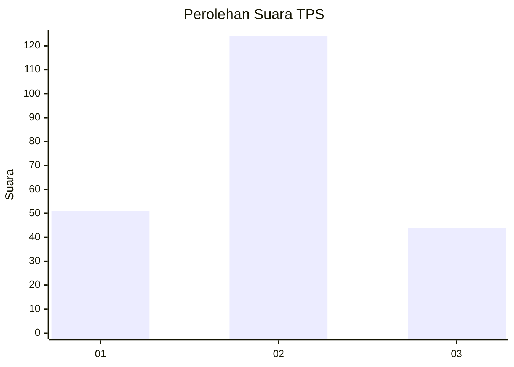
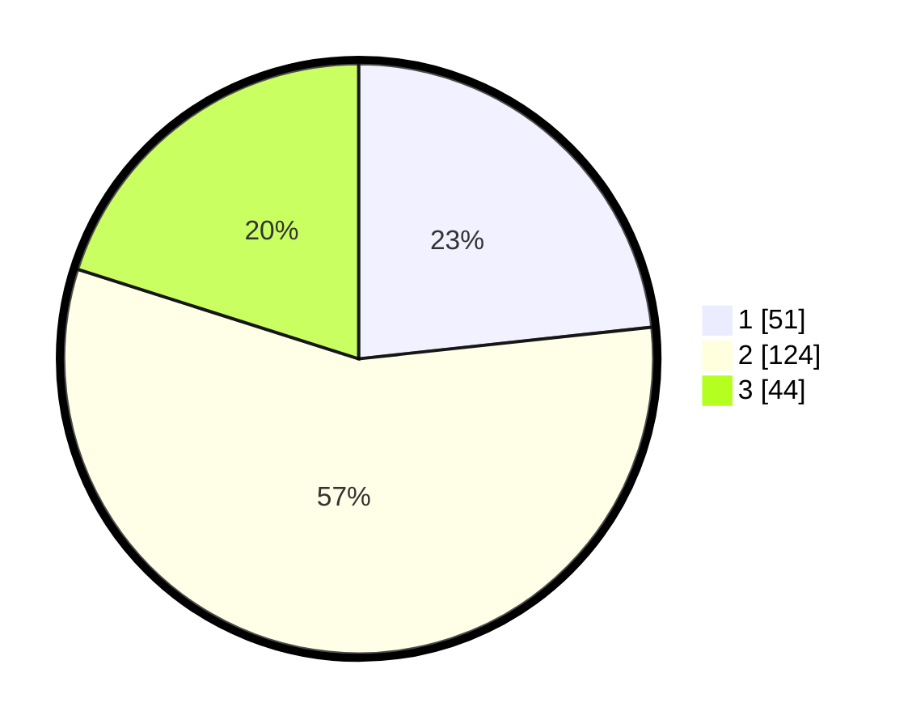

# Hasil

## Grafik

## Tabel

| No. | Nama Paslon    | Suara | Suara (raw) | Persentase |
|:--- |:-------------- | -----:| -----------:| ----------:|
| 1   | ANIES MUHAIMIN | 51    | [51][p-1]   | 23,29      |
| 2   | PRABOWO GIBRAN | 124   | [124][p-2]  | 56,62      |
| 3   | GANJAR MAHFUD  | 44    | [44][p-3]   | 20,09      |

[p-1]: https://github.com/gigit-pemilu/pemilu-2024-35-jawa-timur/blob/main/pilpres/hitung-suara/sub/35-jawa-timur/sub/02-ponorogo/sub/15-sukorejo/sub/2002-bangunrejo/sub/009-tps/sub/paslon-1.txt
[p-2]: https://github.com/gigit-pemilu/pemilu-2024-35-jawa-timur/blob/main/pilpres/hitung-suara/sub/35-jawa-timur/sub/02-ponorogo/sub/15-sukorejo/sub/2002-bangunrejo/sub/009-tps/sub/paslon-2.txt
[p-3]: https://github.com/gigit-pemilu/pemilu-2024-35-jawa-timur/blob/main/pilpres/hitung-suara/sub/35-jawa-timur/sub/02-ponorogo/sub/15-sukorejo/sub/2002-bangunrejo/sub/009-tps/sub/paslon-3.txt

## Foto C Plano

https://sirekap-obj-formc.kpu.go.id/6c0e/pemilu/ppwp/35/02/15/20/02/3502152002009-20240214-184918--183566c3-e7b5-43ad-9eab-24028e415564.jpg

https://sirekap-obj-formc.kpu.go.id/6c0e/pemilu/ppwp/35/02/15/20/02/3502152002009-20240214-185527--1a33043a-8a38-44b7-8be4-285b3a79efdd.jpg

https://sirekap-obj-formc.kpu.go.id/6c0e/pemilu/ppwp/35/02/15/20/02/3502152002009-20240214-185803--b5f46ca8-d145-4442-a4d6-c8a3ab1b1477.jpg

## Metadata

| Key        | Value               |
| ---------- | ------------------- |
| Time Stamp | 2024-02-14 21:46:01 |

## DATA PEMILIH TETAP

Jumlah pemilih dalam DPT: **279**.
 * L: **137**.
 * P: **142**.

## DATA PENGGUNA HAK PILIH

Jumlah pengguna hak pilih dalam DPT: **220**.
 * L: **116**.
 * P: **104**.

Jumlah pengguna hak pilih dalam DPTb: **8**.
 * L: **8**.
 * P: **0**.

Jumlah pengguna hak pilih dalam DPK: **2**.
 * L: **2**.
 * P: **0**.

Jumlah pengguna hak pilih: **230**.
 * L: **126**.
 * P: **104**.

## JUMLAH SUARA SAH DAN TIDAK SAH

JUMLAH SELURUH SUARA SAH: **219**.

JUMLAH SUARA TIDAK SAH: **11**.

JUMLAH SELURUH SUARA SAH DAN SUARA TIDAK SAH: **230**.

