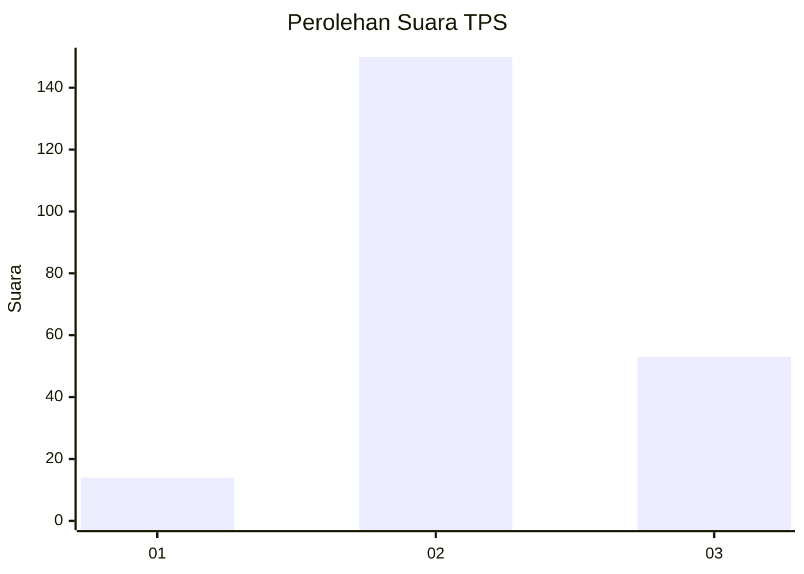
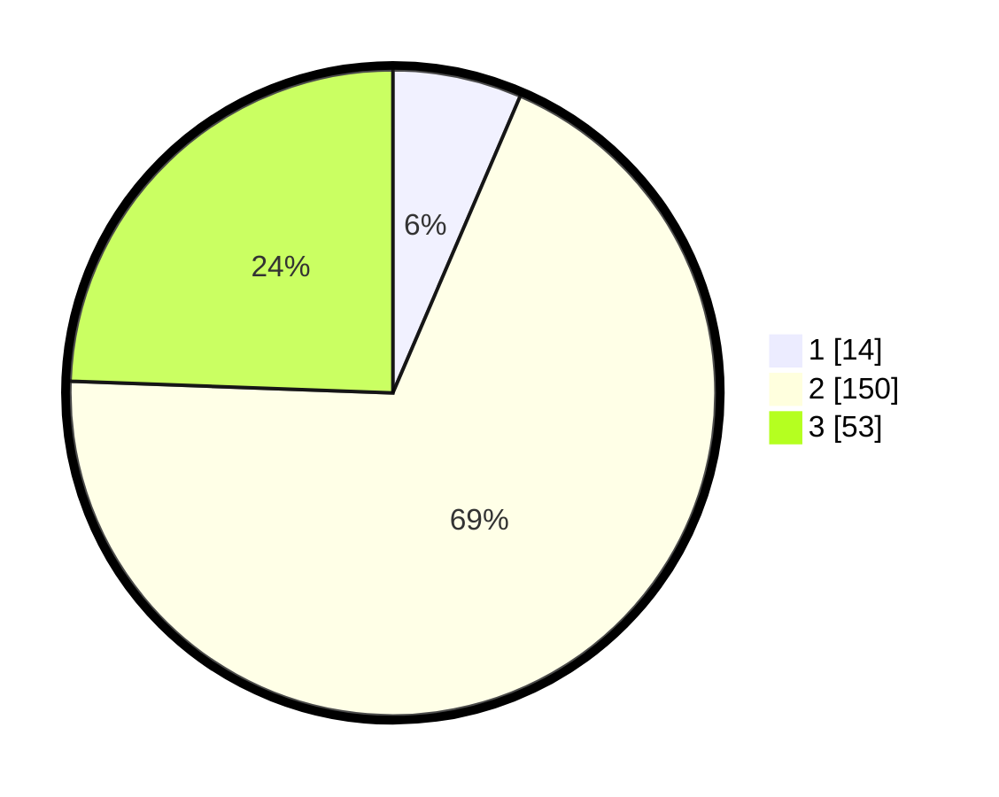

# Hasil

## Grafik

## Tabel

| No. | Nama Paslon    | Suara | Suara (raw) | Persentase |
|:--- |:-------------- | -----:| -----------:| ----------:|
| 1   | ANIES MUHAIMIN | 14    | [14][p-1]   | 6,45       |
| 2   | PRABOWO GIBRAN | 150   | [150][p-2]  | 69,12      |
| 3   | GANJAR MAHFUD  | 53    | [53][p-3]   | 24,42      |

[p-1]: https://github.com/gigit-pemilu/pemilu-2024-35-jawa-timur/blob/main/pilpres/hitung-suara/sub/35-jawa-timur/sub/02-ponorogo/sub/15-sukorejo/sub/2002-bangunrejo/sub/011-tps/sub/paslon-1.txt
[p-2]: https://github.com/gigit-pemilu/pemilu-2024-35-jawa-timur/blob/main/pilpres/hitung-suara/sub/35-jawa-timur/sub/02-ponorogo/sub/15-sukorejo/sub/2002-bangunrejo/sub/011-tps/sub/paslon-2.txt
[p-3]: https://github.com/gigit-pemilu/pemilu-2024-35-jawa-timur/blob/main/pilpres/hitung-suara/sub/35-jawa-timur/sub/02-ponorogo/sub/15-sukorejo/sub/2002-bangunrejo/sub/011-tps/sub/paslon-3.txt

## Foto C Plano

https://sirekap-obj-formc.kpu.go.id/f82a/pemilu/ppwp/35/02/15/20/02/3502152002011-20240214-235958--9c32137d-1f1f-4297-ae27-3df84018c09b.jpg

https://sirekap-obj-formc.kpu.go.id/f82a/pemilu/ppwp/35/02/15/20/02/3502152002011-20240215-000040--c4ea1629-da2c-43d3-a984-5e58b7dad0f8.jpg

https://sirekap-obj-formc.kpu.go.id/f82a/pemilu/ppwp/35/02/15/20/02/3502152002011-20240215-000155--c6d992ec-fe7b-4ced-ba1a-2ac3bc60c274.jpg

## Metadata

| Key        | Value               |
| ---------- | ------------------- |
| Time Stamp | 2024-02-15 15:00:29 |

