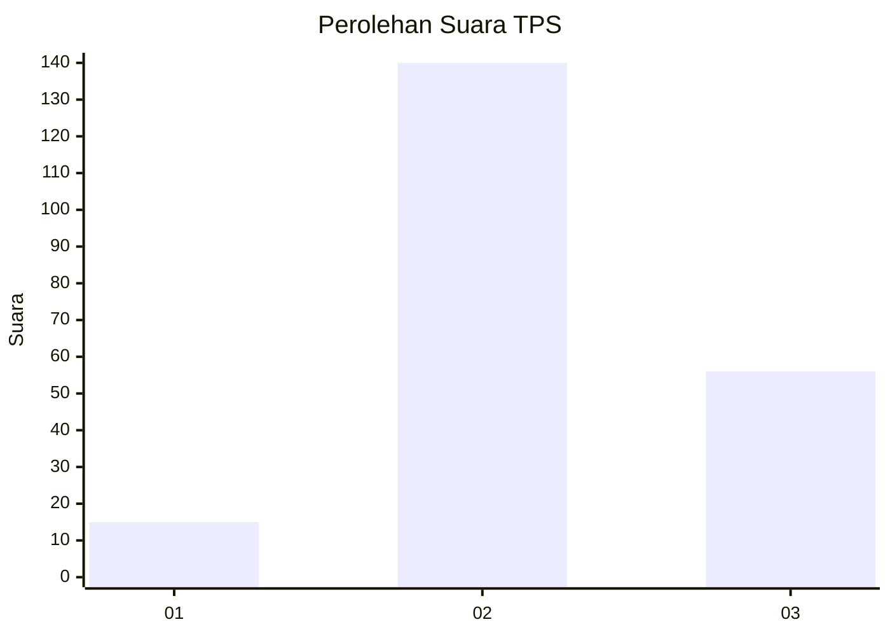

# Hasil

## Grafik

## Tabel

| No. | Nama Paslon    | Suara | Suara (raw) | Persentase |
|:--- |:-------------- | -----:| -----------:| ----------:|
| 1   | ANIES MUHAIMIN | 15    | [15][p-1]   | 7,11       |
| 2   | PRABOWO GIBRAN | 140   | [140][p-2]  | 66,35      |
| 3   | GANJAR MAHFUD  | 56    | [56][p-3]   | 26,54      |

[p-1]: https://github.com/gigit-pemilu/pemilu-2024/blob/main/pilpres/hitung-suara/sub/35-jawa-timur/sub/02-ponorogo/sub/16-babadan/sub/2004-japan/sub/003-tps/sub/paslon-1.txt
[p-2]: https://github.com/gigit-pemilu/pemilu-2024/blob/main/pilpres/hitung-suara/sub/35-jawa-timur/sub/02-ponorogo/sub/16-babadan/sub/2004-japan/sub/003-tps/sub/paslon-2.txt
[p-3]: https://github.com/gigit-pemilu/pemilu-2024/blob/main/pilpres/hitung-suara/sub/35-jawa-timur/sub/02-ponorogo/sub/16-babadan/sub/2004-japan/sub/003-tps/sub/paslon-3.txt

## Foto C Plano

https://sirekap-obj-formc.kpu.go.id/bd08/pemilu/ppwp/35/02/16/20/04/3502162004003-20240217-145946--88b42d01-464e-4077-a2e0-ff0e11eed234.jpg

https://sirekap-obj-formc.kpu.go.id/bd08/pemilu/ppwp/35/02/16/20/04/3502162004003-20240217-150122--71ad69ff-0d57-45d2-9509-3701c0da2b84.jpg

## Metadata

| Key        | Value               |
| ---------- | ------------------- |
| Time Stamp | 2024-02-17 16:00:02 |

