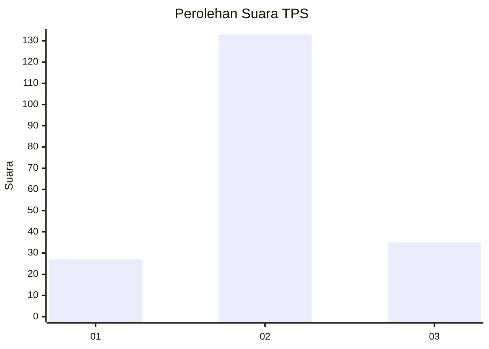
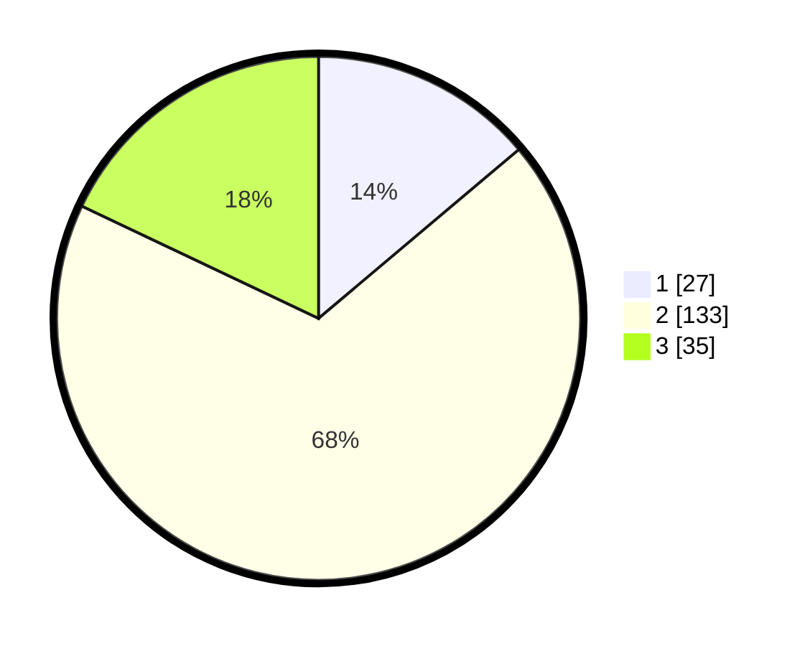

# Hasil

## Grafik

## Tabel

| No. | Nama Paslon    | Suara | Suara (raw) | Persentase |
|:--- |:-------------- | -----:| -----------:| ----------:|
| 1   | ANIES MUHAIMIN | 27    | [27][p-1]   | 13,85      |
| 2   | PRABOWO GIBRAN | 133   | [133][p-2]  | 68,21      |
| 3   | GANJAR MAHFUD  | 35    | [35][p-3]   | 17,95      |

[p-1]: https://github.com/gigit-pemilu/pemilu-2024/blob/main/pilpres/hitung-suara/sub/35-jawa-timur/sub/02-ponorogo/sub/17-ponorogo/sub/1003-pakunden/sub/004-tps/sub/paslon-1.txt
[p-2]: https://github.com/gigit-pemilu/pemilu-2024/blob/main/pilpres/hitung-suara/sub/35-jawa-timur/sub/02-ponorogo/sub/17-ponorogo/sub/1003-pakunden/sub/004-tps/sub/paslon-2.txt
[p-3]: https://github.com/gigit-pemilu/pemilu-2024/blob/main/pilpres/hitung-suara/sub/35-jawa-timur/sub/02-ponorogo/sub/17-ponorogo/sub/1003-pakunden/sub/004-tps/sub/paslon-3.txt

## Foto C Plano

https://sirekap-obj-formc.kpu.go.id/30c1/pemilu/ppwp/35/02/17/10/03/3502171003004-20240218-082249--a1ddd540-938d-4e6a-835e-e689861c8cec.jpg

https://sirekap-obj-formc.kpu.go.id/30c1/pemilu/ppwp/35/02/17/10/03/3502171003004-20240218-083724--f6a0c79b-31d4-4cfe-9830-1aceb68590b7.jpg

https://sirekap-obj-formc.kpu.go.id/30c1/pemilu/ppwp/35/02/17/10/03/3502171003004-20240215-033814--3b1d2010-aa4f-490b-99f8-5ccb6d340cef.jpg

## Metadata

| Key        | Value               |
| ---------- | ------------------- |
| Time Stamp | 2024-02-19 06:16:00 |

