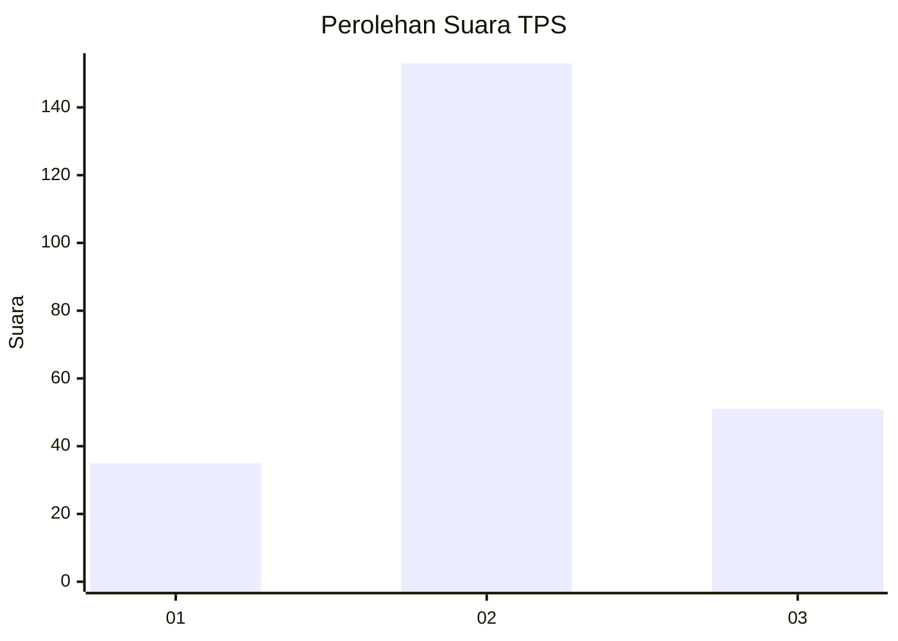
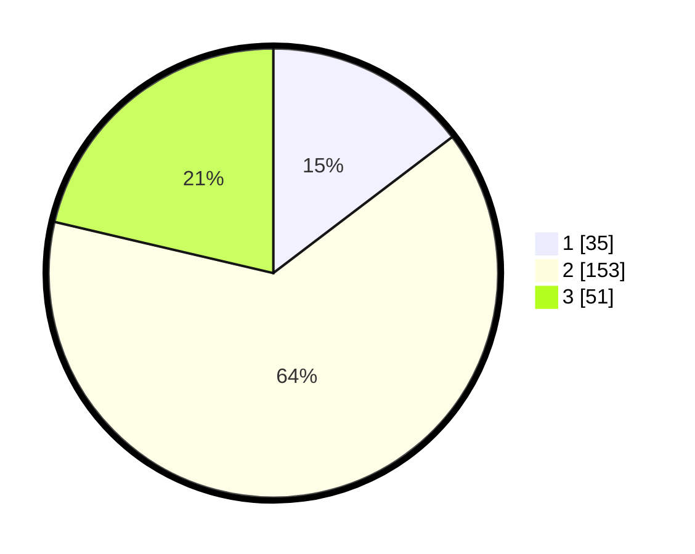

# Hasil

## Grafik

## Tabel

| No. | Nama Paslon    | Suara | Suara (raw) | Persentase |
|:--- |:-------------- | -----:| -----------:| ----------:|
| 1   | ANIES MUHAIMIN | 35    | [35][p-1]   | 14,64      |
| 2   | PRABOWO GIBRAN | 153   | [153][p-2]  | 64,02      |
| 3   | GANJAR MAHFUD  | 51    | [51][p-3]   | 21,34      |

[p-1]: https://github.com/gigit-pemilu/pemilu-2024/blob/main/pilpres/hitung-suara/sub/35-jawa-timur/sub/02-ponorogo/sub/17-ponorogo/sub/1004-kepatihan/sub/010-tps/sub/paslon-1.txt
[p-2]: https://github.com/gigit-pemilu/pemilu-2024/blob/main/pilpres/hitung-suara/sub/35-jawa-timur/sub/02-ponorogo/sub/17-ponorogo/sub/1004-kepatihan/sub/010-tps/sub/paslon-2.txt
[p-3]: https://github.com/gigit-pemilu/pemilu-2024/blob/main/pilpres/hitung-suara/sub/35-jawa-timur/sub/02-ponorogo/sub/17-ponorogo/sub/1004-kepatihan/sub/010-tps/sub/paslon-3.txt

## Foto C Plano

https://sirekap-obj-formc.kpu.go.id/0e51/pemilu/ppwp/35/02/17/10/04/3502171004010-20240215-050757--bc001aef-f238-4864-a9df-3f56ffad0a91.jpg

https://sirekap-obj-formc.kpu.go.id/0e51/pemilu/ppwp/35/02/17/10/04/3502171004010-20240215-050916--28042fb4-9a98-41f0-9ca3-6c86f7c1f812.jpg

https://sirekap-obj-formc.kpu.go.id/0e51/pemilu/ppwp/35/02/17/10/04/3502171004010-20240215-051020--fc024ece-4a3f-4fc1-ae95-8eb7aa29f6e2.jpg

## Metadata

| Key        | Value               |
| ---------- | ------------------- |
| Time Stamp | 2024-02-19 11:00:00 |

